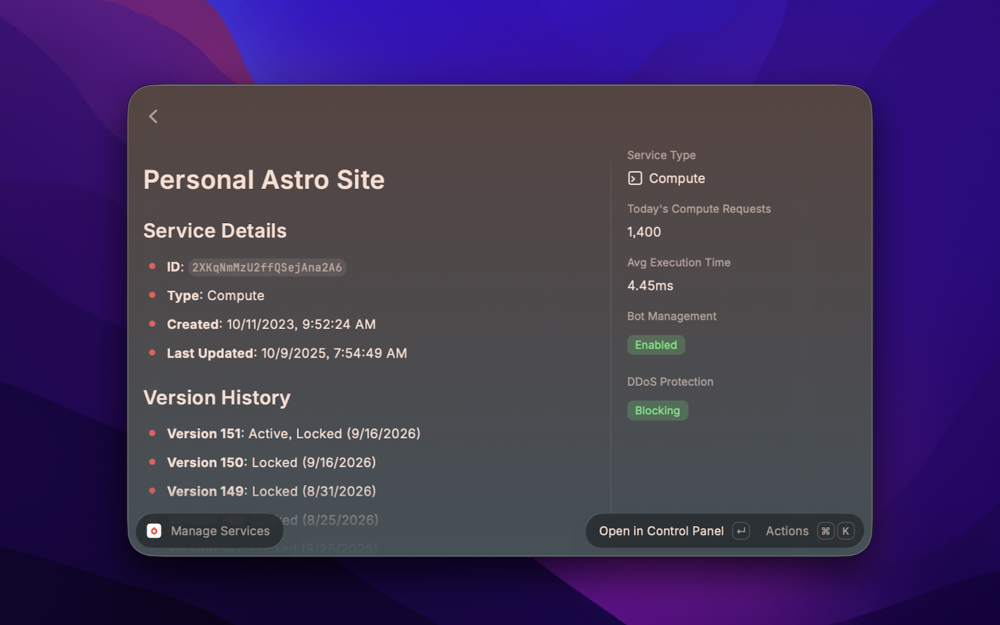
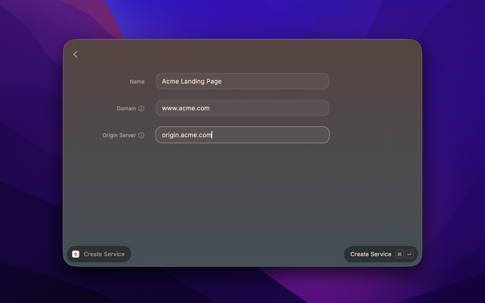
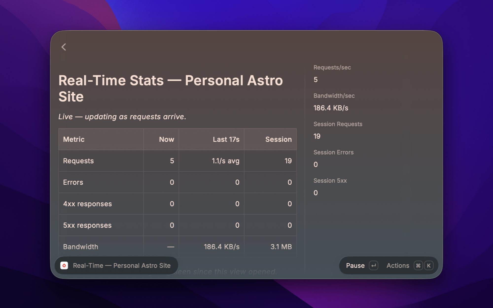
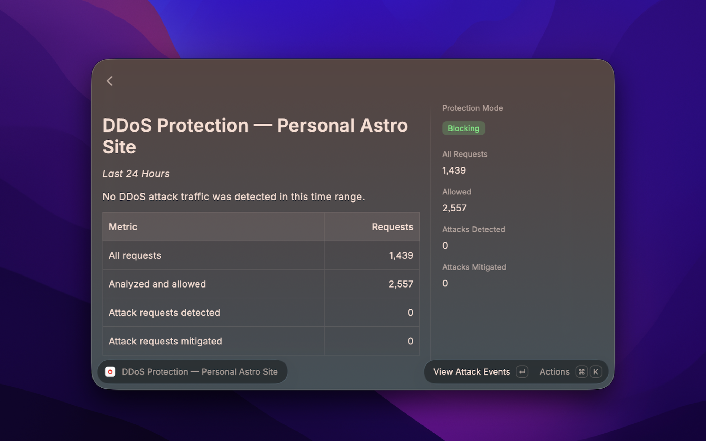
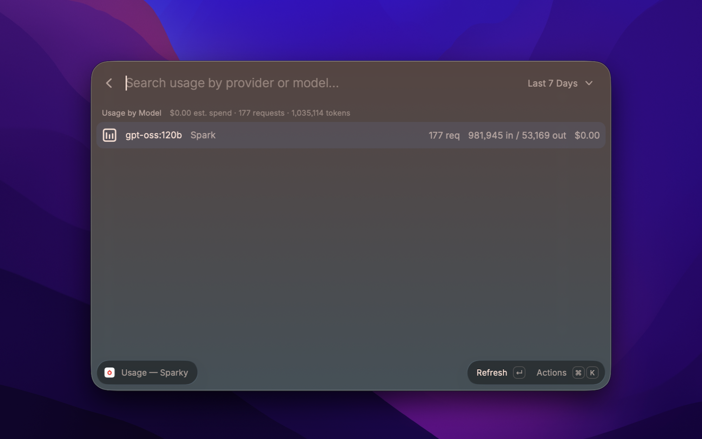

    

# Fastly

This extension lets you manage your [Fastly](https://www.fastly.com) account from Raycast: services, versions, and cache purging; data stores and ACLs; security products like Bot Management and DDoS Protection; AI Runtime Control; TLS certificates, alerts, real-time stats, the audit log, and more.

## Getting started

### Create a Fastly account

If you don't already have a Fastly account, you can get started for free by [signing up here](https://fastly.com/signup).

### Create an API token

Once you've got your account setup, head to [Account > Personal profile > API tokens](https://manage.fastly.com/account/personal/tokens). Click "Create token". Give your token a name like, "Raycast API token", use the "Automation token" type, set the scope to "Global API access" (`global`) and "Read-only access" (`global:read`). You'll want to set access to "All services" and set an expiration you're comfortable with (when it expires you'll just need to create a new one).

**Input your API token**
You'll be prompted by Raycast to input your API token when attempting to use the Fastly Raycast extension without one. Additionally, with Raycast open, you can type `⌘ + ,` to open Raycast preferences. Within preferences, head to the Extensions tab, select Fastly by clicking on the row, then input the API token in the field to the right.

## Commands

### Manage Services

Manage services serves as a list of all your delivery and compute services, allowing you to search name or domain. From the list view, you can hit `⏎` to see service details, `⌘+⏎` opens the service in the Fastly Control Panel, `⌘+⇪+P` runs a `purge all` on that service, and `⌘+⇪+R` opens the real-time stats dashboard, while `⌘+⇪+L` opens the logs.

When selecting a specific service, you'll see service details such as today's requests, bandwidth, cache hit ratio, errors, version history, and the status of Bot Management and DDoS Protection. From there you can also manage versions (`⌘+⇪+V`) — activate or roll back with confirmation, clone a version, and diff any version against the active one (delivery services) — jump to bot traffic (`⌘+⇪+B`) or the DDoS overview (`⌘+⇪+D`), and watch real-time stats.

### Create a Service

You're able to create new delivery services right from Raycast, just give it a name, domain, and origin server. You'll see a success message and be able to quickly access its details and open it in the Fastly Control Panel.

### Purge Cache

Purge a single URL (with or without the scheme), one or more surrogate keys on a service, or a service's entire cache. URL and key purges support soft purge, which marks content stale instead of removing it. Purging everything prompts for confirmation since it can significantly increase origin load.

### Watch Real-Time Stats

Pick a service and watch live traffic: requests per second, rolling hit ratio, bandwidth, errors, and 4xx/5xx counts, plus running totals for everything seen while the view is open — handy while shipping a change or riding out an incident. Also available from any service's detail view.

### Manage Service Add-Ons

Pick a service and see every product from the enablement API — Image Optimizer, Brotli, Fanout, WebSockets, Origin/Domain Inspector, Log Explorer & Insights, Bot Management, and DDoS Protection — with enable/disable toggles. Every toggle prompts for confirmation since paid products can affect billing.

### Manage TLS Certificates

All TLS certificates and managed subscriptions in one list, sorted soonest-expiring first. Certificates expiring within 30 days get an orange tag, within 14 days (or already expired) a red one. Subscriptions show their issuance state and certificate authority.

### View Alerts

Fastly alert definitions and firing history. The Definitions view shows each alert's source, metric, threshold, and service; switch the dropdown to History to see when alerts fired and whether they're still active.

### Manage Data Stores

Access and manage all your Fastly data stores in one place. Browse KV Stores, Config Stores, and Secret Stores with full CRUD operations. From any store list, you can `⏎` to view entries, `⌘+N` to create new items, and `⌘+K` to access quick actions like export.

### Manage Access Control Lists

Quickly block IPs and manage access control lists for security response. Search across all ACLs by service or name, then `⏎` to view entries. Use `⌘+N` to rapidly add IPs during security incidents, with support for CIDR blocks and bulk imports. Each entry shows whether it allows or blocks traffic, with `⌘+E` to edit and `⌘+⌫` to remove entries.

### View Audit Log

Monitor account activity and investigate changes with comprehensive audit logging. Filter events by time range, user, event type, or service to track purges, configuration changes, ACL modifications, and user actions. From the event list, `⏎` shows full details including before/after state, while `⌘+F` lets you search across descriptions and resources. Export filtered events for compliance reporting or security investigations.

### Manage Bot Management

See which services have Bot Management enabled and review detected bot traffic. `⏎` on an enabled service shows bot detections by type (AI crawlers, search engine crawlers, headless browsers, and more) plus challenge outcomes for the last 24 hours or 7 days. You can also enable or disable Bot Management per service — both prompt for confirmation since they affect billing and traffic handling.

### Manage DDoS Protection

See which services have DDoS Protection enabled and control how it responds. Switch a service between log mode (visibility only) and block mode (active mitigation) — both prompt for confirmation. `⏎` on a protected service opens a DDoS overview (all/allowed/detected/mitigated request counts for the last 24 hours or 7 days); from there or the action panel you can browse attack events and rules. The rules view aggregates mitigation rules across recent events — account-wide with `⌘+⇪+U` or scoped to a service — with search, an action filter, first/last seen, and per-rule action changes (default, block, log, or off) in real time during an incident.

### AI Runtime Control

Manage Fastly AI Runtime Control from four commands:

- **Manage AI Runtime Control Virtual Keys**: create, edit, rotate, and delete the virtual keys your applications use to send AI traffic through the Fastly AI Gateway. Set per-key rate limits (requests or tokens per minute), toggle the AI Firewall (log or block), and configure provider failover order with `⌘+⇪+F`. New and rotated keys show their access token once, with a copy action.
- **Manage AI Runtime Control Providers**: connect AI providers (with API key or, for Bedrock, an AWS IAM role), choose the allowed models, and update or remove connections.
- **View AI Runtime Control Usage**: usage metrics aggregated by provider and model — estimated spend, requests, input/output tokens, and AI Firewall violations — over the last day, week, or month. Also reachable per key and per provider via the View Usage action.
- **View AI Runtime Control Sessions**: browse session logs, including per-session token counts and full request/response payloads.

These commands require an account with AI Runtime Control enabled.

### Invite Team Member

Need to quickly invite someone to your Fastly account? Use the Invite Team Member command to invite a colleague using name, email, and assigning a role.

### Fastly Docs

In the Fastly Docs command, you'll see a quick list of the most popular and helpful resources for working with Fastly. A getting started guide, API and CLI references, as well as some product guides are right at your fingertips.

### Get Support

Need to open a ticket or check on an existing one? Need to check the status page, or want to contribute to the Community Forum? We got you. Use the Get Support command for quick access to these handy pages.
