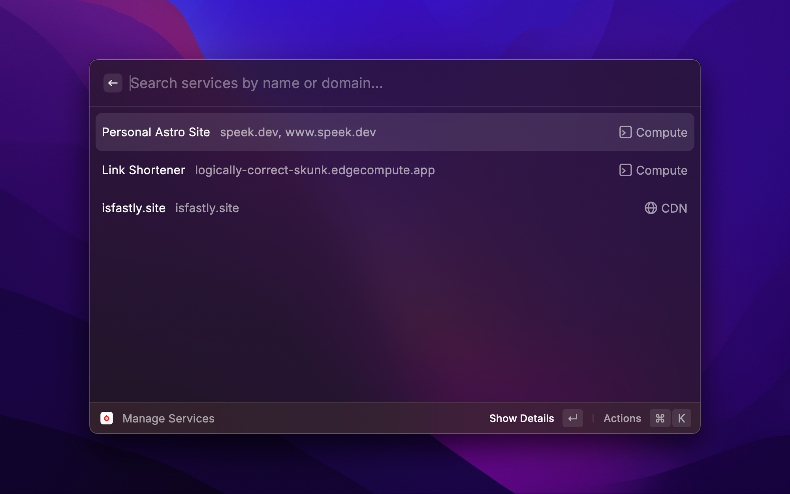
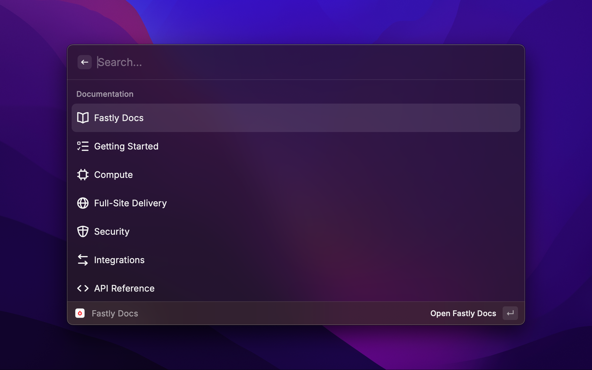

# Fastly

This extension allows to search your [Fastly](https://www.fastly.com) services and domains, invite team members, create CDN services, get quick access to resources, and more.

## Getting started

### Create a Fastly account

If you don't already have a Fastly account, you can get started for free by [signing up here](https://fastly.com/signup).

### Create an API token

Once you've got your account setup, head to [Account > Personal profile > API tokens](https://manage.fastly.com/account/personal/tokens). Click "Create token". Give your token a name like, "Raycast API token", use the "Automation token" type, set the scope to "Global API access" (`global`) and "Read-only access" (`global:read`). You'll want to set access to "All services" and set an expiration you're comfortable with (when it expires you'll just need to create a new one).

**Input your API token**
You'll be prompted by Raycast to input your API token when attempting to use the Fastly Raycast extension without one. Additionally, with Raycast open, you can type `⌘ + ,` to open Raycast preferences. Within preferences, head to the Extensions tab, select Fastly by clicking on the row, then input the API token in the field to the right.

## Commands

### Manage Services

Manage services serves as a list of all your delivery and compute services, allowing you to search name or domain. From the list view, you can hit `⏎` to see service details, `⌘+⏎` opens the service in the Fastly Control Panel, `⌘+⇪+P` runs a `purge all` on that service, and `⌘+⇪+R` opens the real-time stats dashboard, while `⌘+⇪+L` opens the logs.

When selecting a specific service, you'll see service details such as today's requests, bandwidth, cache hit ratio, errors, version history, etc. You'll also be able to use all the same shortcuts to open in the Fastly Control Panel, run a `purge all`, etc. from this view.

### Create a Service

You're able to create new delivery services right from Raycast, just give it a name, domain, and origin server. You'll see a success message and be able to quickly access its details and open it in the Fastly Control Panel.

### Invite Team Member

Need to quickly invite someone to your Fastly account? Use the Invite Team Member command to invite a colleague using name, email, and assigning a role.

### Fastly Docs

In the Fastly Docs command, you'll see a quick list of the most popular and helpful resources for working with Fastly. A getting started guide, API and CLI references, as well as some product guides are right at your fingertips.

### Get Support

Need to open a ticket or check on an existing one? Need to check the status page, or want to contribute to the Community Forum? We got you. Use the Get Support command for quick access to these handy pages.

