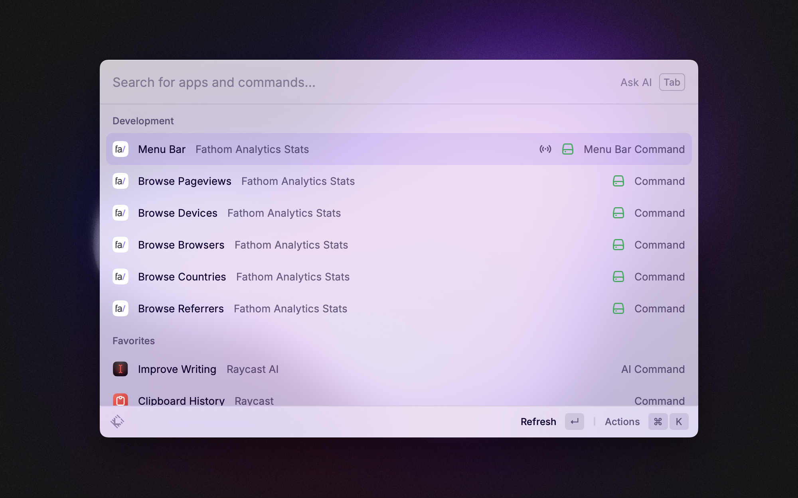

# Fathom Analytics Stats
A Raycast extension to browse your website analytics coming from Fathom.

| Commands           | Description                                            |
| :---               | :---                                                   |
| `Menu Bar`         | Display your current pageviews and referrers           |
| `Browse Pageviews` | Display your most viewed pages                         |
| `Browse Referrers` | Display your referrers                                 |
| `Browse Browsers`  | Display your visitor browsers                          |
| `Browse Countries` | Display your visitor countries                         |
| `Browse Devices`   | Display your visitor devices (desktop, tablet, mobile) |

Each aggregation of page views is sorted in descending order, with a relative percentage to the total.

Each command comes with a time range option, which can be set to: `Today`, `Yesterday`, `Last 7 Days`, `Last 30 Days`, `This Month`, `Last Month`, `This Year`, `Last Year`, `All Time`.

Note that `Menu Bar` is refreshed every minute.

## Installation
1. Clone the repository.
2. Install dependencies with `npm install`.
3. Build the extension with `npm run build`.
4. Open the extension with Raycast.

## Setup
1. Obtain an API token and site ID from [Fathom Analytics](usefathom.com).
2. Add the API token and site ID to the extension preferences in Raycast.

## Usage
1. Open Raycast.
2. Type `fathom` to see the list of available commands.
3. Select a command and press `Enter` to execute it.

## Troubleshooting
For now, Fathom's API is rate limited to 10 requests per minute on aggregations — for the commands, and currents — for the menu bar. If you exceed this limit, you will receive a (nicely designed) toast error. If you receive this error, please wait a minute before trying again.

Also, the `aggregation` API endpoint is only accurate on data from March 2021. Learn more about it [here](https://usefathom.com/api#aggregation).

## Contributing
Pull requests are welcome. For major changes, please open an issue first to discuss what you would like to change.

## License
[MIT](LICENSE)
