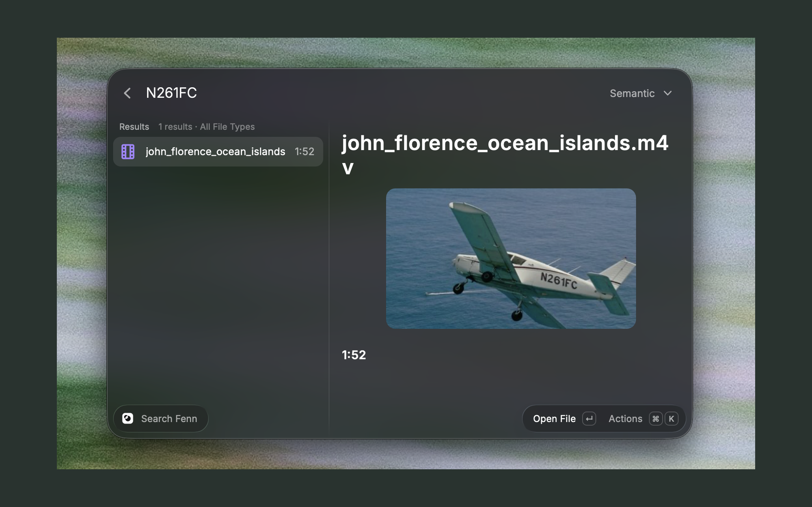
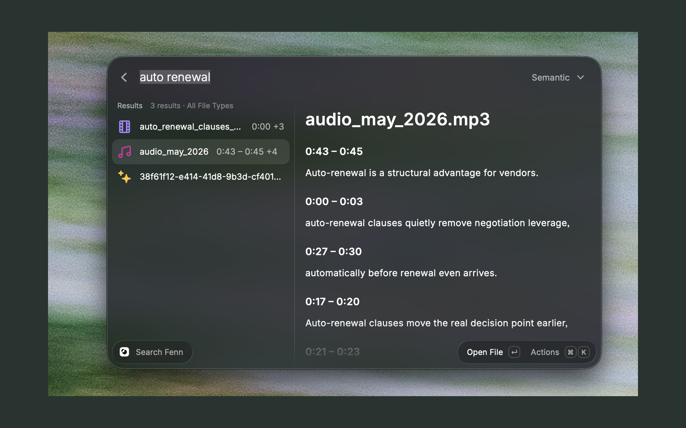
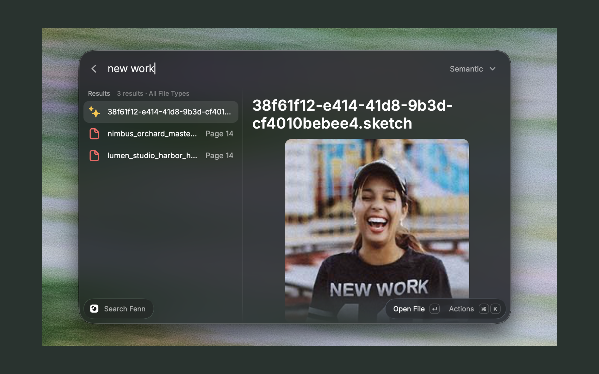

# Fenn Search

Find text visible in a video, words spoken in an audio recording, and content inside Sketch files without leaving Raycast.

Search your Fenn index by meaning, keywords, exact phrases, or filename. See matching pages, timestamps, transcript excerpts, and available image previews directly in your results.

**Requires [Fenn 1.3.3 or newer](https://download.usefenn.com), running on your Mac with a valid Fenn license and indexed files.** Fenn is a paid app; this extension does not include a Fenn license. Raycast Pro is not required.

[Download Fenn](https://download.usefenn.com) · [Learn about Fenn](https://usefenn.com) · [Get a license](https://usefenn.com/#pricing)

## Find content inside your files

### Text visible in videos

Find a moment by the text that appears on screen. In this example, searching `N261FC` finds the plane's registration in a video, with a matching timestamp at **1:52**.

### Spoken words in audio

Search what was said in a recording and read matching transcript excerpts with their time ranges. Here, `auto renewal` finds spoken passages in `audio_may_2026.mp3`.

### Content inside Sketch files

Find a Sketch file by text in its visual content. Searching `new work` returns a `.sketch` file whose preview contains those words on a T-shirt.

You can also search PDFs, Word documents, spreadsheets, code, Apple Notes, and other supported formats indexed by Fenn.

## Get started

1. [Download the latest Fenn](https://download.usefenn.com), open the disk image, and drag Fenn into Applications. If updating, quit the old Fenn app before replacing it, then open the updated app.
2. Activate Fenn with the license key from your purchase email. Wait for verification and finish Fenn's setup.
3. Choose a small folder during setup and let Fenn finish indexing. Add more later in **Sources → Folders → Add index folder**. Choose formats in **Sources → File Types**, and configure supported app sources such as Apple Notes in **Sources → Apps**. Allow the permissions Fenn requests for your chosen sources.
4. Keep Fenn running, open **Search Fenn** in Raycast, and enter a query. Leave **Fenn API Token** empty for normal setup; the connection is configured automatically. This preference is not for your Fenn license key.

Images, audio, and video require Fenn's Default model. Fast Mode searches text only. Selecting a file-type filter in Raycast searches your existing index; it does not index additional files.

## Search your way

Choose a mode from the dropdown beside the search field (**⌘P**):

| Mode     | Use it to                                                          |
| -------- | ------------------------------------------------------------------ |
| Discover | See separate Exact, Filename, Keyword, and Semantic result groups. |
| Semantic | Find content by meaning.                                           |
| Keyword  | Find content containing your search terms.                         |
| Hybrid   | Combine keyword and semantic search.                               |
| Exact    | Find an exact phrase.                                              |
| Filename | Find files by name.                                                |

- **Filter File Types…** (**⌘⇧F**) narrows the search to one or more formats. Selecting PDF and Audio includes either type; an empty selection searches all types.
- Select a file to see its matching pages, slides, sheets, code lines, or audio/video timestamps and available excerpts. An available file preview appears once above the matches.
- **Show File Information** / **Hide File Information** (**⌘I**) toggles format, path, mode, filters, and match count. Information is hidden by default to give the results more room.
- **Open File** opens the original file in its normal application. **Copy Match Details** copies the matching locations and excerpts, and **Show in Finder** reveals the file.

Search mode and file-type selections are remembered between launches. Queries and search results are not saved by the extension.

## Help and troubleshooting

Open the in-extension setup guide with **⌘⇧H**. After opening, updating, or activating Fenn, retry with **⌘⇧R**.

| If you see…                    | What to do                                                                                                                               |
| ------------------------------ | ---------------------------------------------------------------------------------------------------------------------------------------- |
| Install Fenn to Get Started    | Choose **Download Fenn**, install version 1.3.3 or newer, and finish setup.                                                              |
| Open Fenn to Search            | Open Fenn, wait for startup, and keep it running while searching.                                                                        |
| Update Fenn to Continue        | Choose **Download Latest Fenn**, install the update, then quit and reopen Fenn.                                                          |
| Activate Fenn to Search        | Open Fenn and activate your license using the key from your purchase email.                                                              |
| Fenn Is Verifying Your License | Wait for verification to finish in Fenn, then retry.                                                                                     |
| Reconnect Fenn                 | Clear any old **Fenn API Token** override in Extension Settings, open Fenn, and retry.                                                   |
| Fenn Is Optimizing Its Index   | Wait for optimization to finish, then retry.                                                                                             |
| No Matches                     | Check your enabled folders and formats in Fenn's Sources, wait for indexing, and try clearing filters or using Filename or Keyword mode. |

## Scope and privacy

This version searches Fenn's file index. Screen memory is not included. Each search returns up to 20 files per result group and up to 50 matching locations per file. These are ranked matches, not every occurrence. Available excerpts may be shortened.

The image is the file's single returned preview; the extension does not request a separate image for every matching page or timestamp. Opening a file does not jump to a matching page or timestamp.

The extension connects to Fenn on your Mac. It does not upload files, send analytics, or use Raycast AI. Indexing and processing follow your Fenn configuration. The connection is authenticated automatically using Fenn's local token, and normal Fenn license checks apply.

For local development and validation, see [DEVELOPMENT.md](DEVELOPMENT.md).
