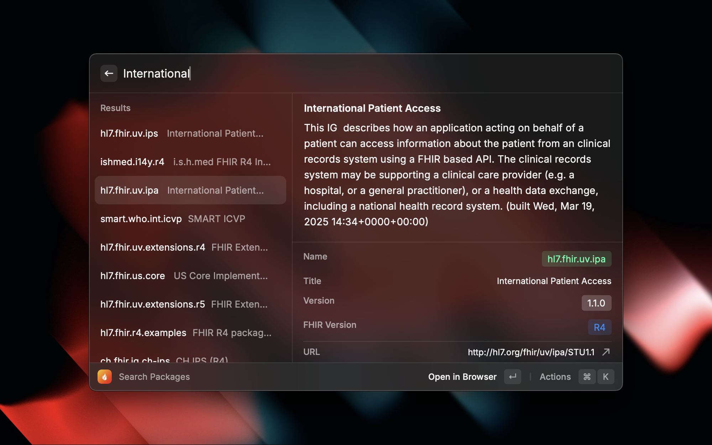

# Raycast on FHIR

A Raycast extension that provides comprehensive tooling to help developers and healthcare professionals work with the FHIR (Fast Healthcare Interoperability Resources) standard.

## Features

### ✅ Current Features

- 🔍 **FHIR Resources Documentation** - Browse documentation from any FHIR specifications with instant search
- 📦 **FHIR Package Management** - Search, discover, and pin FHIR implementation guides and packages from the official registry
- 🏷️ **Resource Details** - View comprehensive information including status, descriptions, URLs, and technical details for any FHIR resource
- ⭐ **Favorite Resources** - Pin frequently used resources for quick access across all your pinned packages
- 🎯 **Smart Search** - Fuzzy search with resource type weighting (StructureDefinitions, ValueSets, CodeSystems prioritized)

### 🚧 Planned Features

- ✅ **FHIR Validator** - Validate FHIR resources against specifications with detailed error reporting

## Installation

Install from the [Raycast Store](https://raycast.com/loris/fhir) or clone this repository and build locally.

## Usage

### Search Documentation

1. Open Raycast (`⌘ + Space`)
2. Type "Search Documentation"
3. Select a package from the dropdown (Core packages are always available)
4. Search through resources with instant results
5. Pin frequently used resources for quick access

### Search Packages

1. Open Raycast and type "Search Packages"
2. Search for FHIR implementation guides and packages
3. Pin useful packages to make them available in documentation search
4. Browse package details and visit official documentation

## About FHIR

[FHIR (Fast Healthcare Interoperability Resources)](https://hl7.org/fhir/) is a standard for health information exchange, developed by HL7. It defines a set of resources and APIs for healthcare data interoperability, making it easier to build healthcare applications and share patient data securely.

## Contributing

Contributions are welcome! Feel free to:

- Report bugs or request features
- Suggest improvements to the search experience
- Propose new FHIR-related functionality

## License

MIT License - see LICENSE file for details.

---

_This extension is not officially affiliated with HL7 or the FHIR specification. FHIR® is a registered trademark of HL7._
