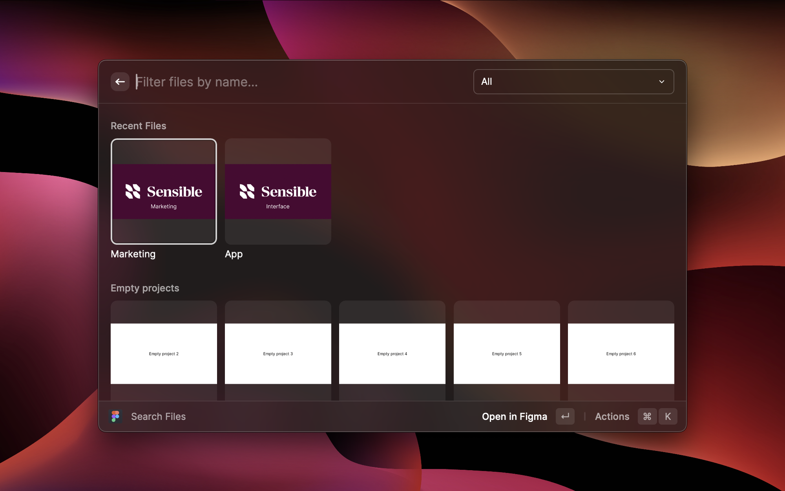

# Figma file search

Figma file search helps you quickly open a Figma file from anywhere on your mac. It's packed with features like,

1. Browsing multiple teams of the same organisation
2. Starring files to the top for quick access to frequently accessed figma files
3. Support for opening a specific branch of a file
4. Support for opening a specific page of a file
5. Menu Bar command for quick access to files

Note - Currently, this extension only works with team accounts. Draft files are not supported due to a Figma API limitation. Figma slides are not supported for the same reason, so you won't see them in Raycast.

## Setting up the Extension

1. Locate your team ID/s. Do this by visiting Figma.com and click the team name you wish to use. In the URL, copy the ID that comes BETWEEN the word `/team/` and BEFORE your actual team name, or `/all-projects`. You can also right-click on the team name in the Figma Desktop app sidebar and copy the link.

> Example - https://www.figma.com/files/team/12345678987654321/NameOfTeam...

The extension supports multiple teams. If you have more than one team, separate the IDs with a comma when entering them in the preferences.

> Example - 12345678987654321,98765432123456789

2. Paste your team IDs into the Raycast preferences field for this extension, it will be the first screen you'll see when you launch any command.

3. On the second screen, Raycast will ask you to sign in with Figma. Clicking on the button will redirect you to your web browser, where you can sign in and give access to your Figma files to Raycast.
