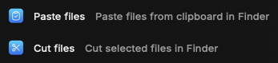

# File Cutter

A [Raycast](https://www.raycast.com/) extension to cut files and paste them in Finder window.



# Development

1. Clone the repository.
2. Install the dependencies with:
    ```bash
    npm install
    ```
3. Run the project with:
    ```bash
    npm run dev
    ```

# Contributing

If you want to contribute to this extension, please visit this website https://developers.raycast.com/basics/contribute-to-an-extension
