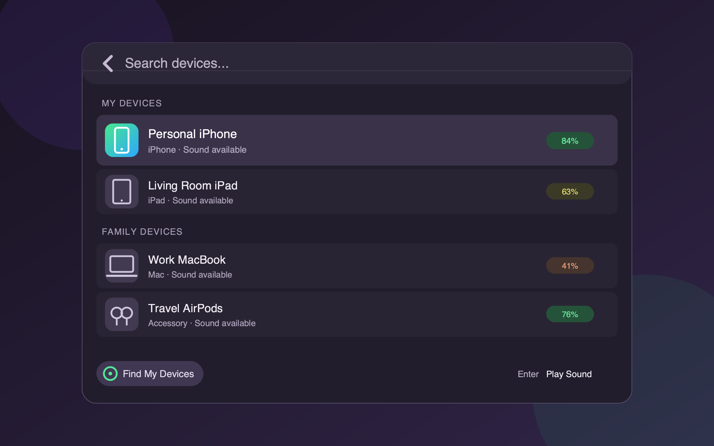

# Find My Devices for Raycast

Find My Devices lists Apple devices that are available to your Apple Account. Select a device to send a Play Sound request.

## Features

- List your devices and eligible Family Sharing devices.
- Group devices by owner when Apple supplies owner data.
- Press Enter to send a Play Sound request.
- View the device type, battery level, and sound availability.
- Refresh the device list with `Command-R`.
- Open Find My on iCloud.com.
- Clear the saved web session from the action panel.

## Requirements

- macOS
- Raycast
- Python 3.10 or later, or `uv`
- An Apple Account with Find My enabled
- Internet access during setup and use

## Install from source

1. Clone this repository.
2. Run `npm install`.
3. Run `npm run dev`.
4. Enter your Apple Account email in the extension preference.
5. Run **Find My Devices**.
6. Select **Install Helper and Sign In**.
7. Complete the local Terminal sign-in.
8. Return to Raycast and select **Refresh Devices**.

Setup creates a private Python environment in the Raycast extension support directory. It installs PyiCloud 2.6.5 and its dependencies from PyPI with the exact hashes in `assets/pyicloud-requirements.txt`.

## Controls

- `Enter`: Play Sound
- `Command-R`: Refresh devices
- `Command-O`: Open Find My on iCloud.com
- `Command-Shift-C`: Copy the device identifier

## Privacy and authentication

The Apple password and verification code are entered only in a local Terminal window. Raycast does not receive or store them. The authentication helper disables Keychain access. It stores only the resulting iCloud web session in the Raycast extension support directory.

The saved session can have access to more iCloud web data than Find My. Use **Sign Out and Clear Session** when you no longer need the extension. The extension does not send account data, device data, or analytics to the project author.

The restricted Python bridge supports only these operations:

- List devices.
- Play a sound on one exact device identifier.
- Sign out and remove the local session.

It does not implement Lost Mode, device erase, messages, or location display.

## Important limits

This project uses PyiCloud and private Apple iCloud web endpoints. It is not an official Apple API. Apple can change or disable the endpoints at any time.

Apple's iCloud terms restrict automated access to the service. Review the current terms before use. Use this project only if your use is permitted by the terms and applicable law.

Friends who share a location in the People tab do not share device controls. The extension can list only your devices and eligible Family Sharing devices.

## Build and checks

- `npm run build`: Create a distribution build and run TypeScript checks.
- `npm run lint`: Run Raycast manifest, ESLint, icon, and formatting checks.
- `npm run fix-lint`: Apply supported lint and formatting fixes.

## Acknowledgments

- [PyiCloud](https://github.com/timlaing/pyicloud) provides the iCloud web client under the MIT License.
- Apple, Find My, and related marks belong to Apple Inc. This project is not affiliated with or endorsed by Apple.

## License

The source code is available under the MIT License. See `LICENSE`.
