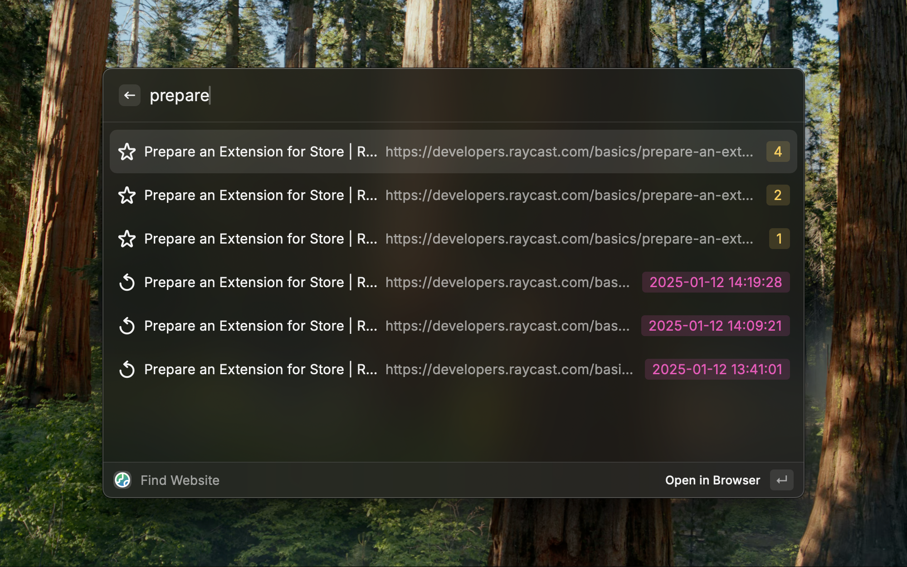

# Find Website

This extension queries your last visited and most visited webites so you can quickly get to where you want to go.

Doesn't matter if it's that pull request you've been working on, that article you've been reading or a Jira ticket you've been assigned to. Just type a few characters and you are there.

> [!IMPORTANT]
> If you use Google Chrome and have multiple profiles be sure to set your profile's directory so that the extension can find history data. You can find this by visiting `chrome://version`.

Supported browsers:
- Google Chrome
- Arc
- Orion
