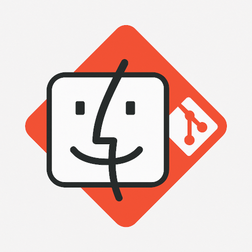

# Find Your Repo

<div align="center">
  
  
  **通过 git 地址快速查找本地仓库的 Raycast 扩展**
  
  
  
  
</div>

## 🎯 项目背景

在日常开发中，我们经常会遇到这样的问题：

> 很多项目 clone 之后，改了几次代码之后，基本就不会再打开了。再次需要的时候，又找不到项目在本地的位置，只记得 git 地址。

Find Your Repo 就是为了解决这个痛点而生的 Raycast 扩展。只需要输入 git 地址，就能快速定位到本地对应的项目目录。

## ✨ 功能特性

### 🔍 智能匹配
- 支持多种 git 地址格式（HTTPS、SSH）
- 自动处理 `.git` 后缀
- 智能忽略协议差异进行匹配

### 🗂️ 灵活搜索
- 可配置搜索深度（默认 3 层）
- 自定义排除目录列表
- 支持从指定目录开始搜索

### 🎨 优雅界面
- 符合 Raycast 设计理念的现代化 UI
- 实时搜索反馈
- 详细的仓库信息展示

### 🚀 快速操作
- 一键在 Finder 中打开项目
- 直接在终端中打开目录
- 快速复制项目路径到剪贴板

## 📦 安装

### 方式一：通过 Raycast Store（推荐）
1. 打开 Raycast
2. 搜索 "Find Your Repo"
3. 点击安装

### 方式二：本地开发安装
```bash
# 克隆项目
git clone https://github.com/wan-kong/find-your-repo.git
cd find-your-repo

# 安装依赖
npm install

# 开发模式运行
npm run dev

# 构建项目
npm run build
```

## 🚀 使用方法

### 基本使用
1. 在 Raycast 中输入 `find repo` 或 `Find Your Repo`
2. 输入 git 地址，例如：
   - `https://github.com/microsoft/vscode.git`
   - `git@github.com:microsoft/vscode.git`
   - `https://gitlab.com/group/project`
3. 扩展会自动搜索并展示匹配的本地仓库
4. 选择想要的仓库，进行后续操作

### 支持的操作
- **在 Finder 中打开**：直接打开项目目录
- **在终端中打开**：在终端中进入项目目录
- **复制路径**：将项目路径复制到剪贴板
- **重新搜索**：返回搜索界面

## ⚙️ 配置选项

在 Raycast 的扩展设置中可以配置以下选项：

### 搜索路径
- **默认值**：`~`（用户主目录）
- **说明**：设置搜索仓库的根目录路径

### 搜索深度
- **默认值**：`3`
- **说明**：设置递归搜索的最大深度层级

### 排除目录
- **默认值**：`node_modules,.venv,venv,__pycache__,.next,dist,build`
- **说明**：设置要排除的目录名称，用逗号分隔

## 🛠️ 技术实现

### 核心算法
1. **URL 标准化**：统一不同格式的 git 地址
2. **递归搜索**：在指定深度内遍历目录结构
3. **Git 配置解析**：读取 `.git/config` 文件获取 remote 信息
4. **智能匹配**：比较输入地址与本地仓库的 remote 地址

### 技术栈
- **框架**：Raycast API
- **语言**：TypeScript
- **工具**：Node.js 文件系统 API
- **UI**：React + Raycast UI 组件

### 项目结构
```
src/
├── index.tsx          # 主界面组件
├── git.ts            # Git 相关工具函数
├── repo.ts           # 仓库搜索逻辑
└── utils.ts          # 通用工具函数
```

## 🔧 开发指南

### 环境要求
- Node.js 20+
- npm 或 pnpm
- Raycast

### 开发流程
```bash
# 安装依赖
npm install

# 启动开发模式
npm run dev

# 代码检查
npm run lint

# 修复代码格式
npm run fix-lint

# 构建项目
npm run build
```


## 📄 许可证

本项目采用 [MIT 许可证](LICENSE)。
