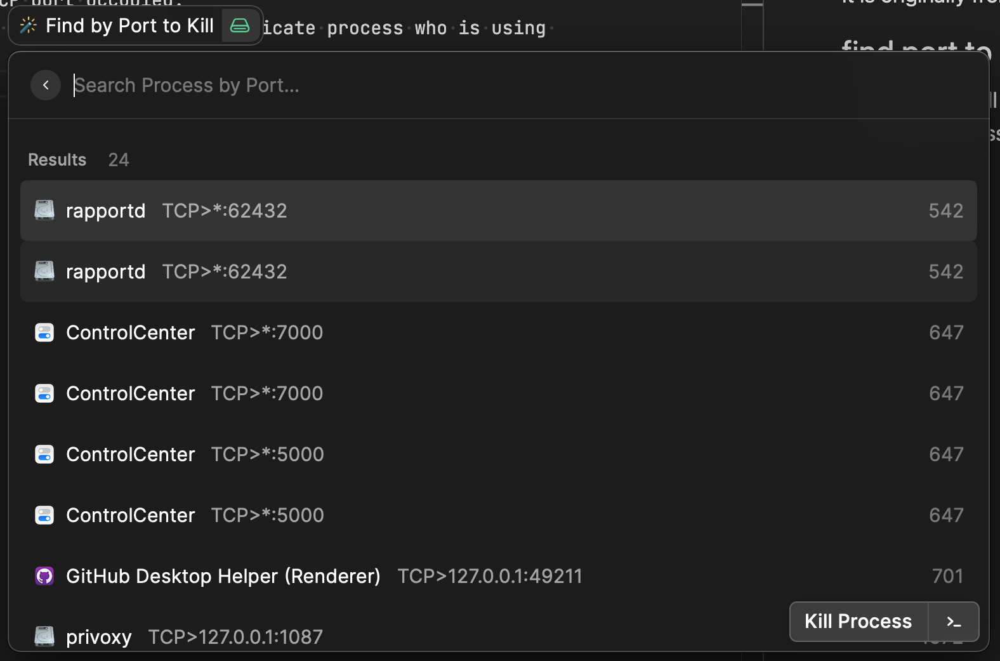
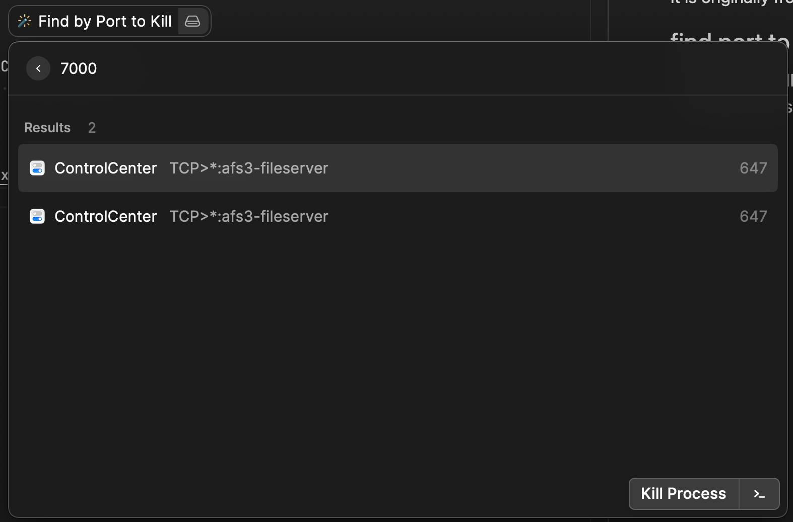
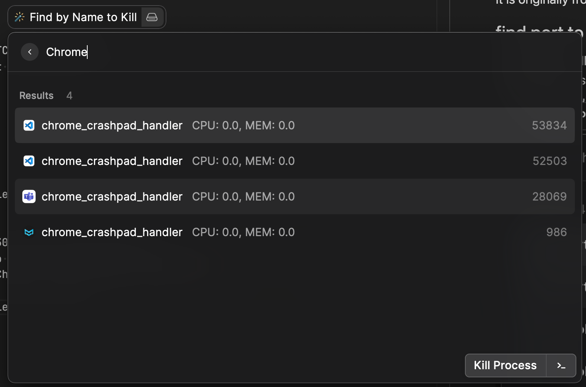

# Find to Kill (find2kill) Raycast Extension

This extension has two `command`:

* find port to kill
* find process name to kill

It is originally from my find2kill `Alfread` workflow - `fport` & `fproc`.

## find port to kill

By default, it will show all processes with TCP port occupied.
And in list view, then you can input the port information to find dedicate process who is using this port.
If no port found, return `no result`.

Then you can use `enter` to terminate the selected process, or `cmd + enter` to get full command line of process into clipboard.

## find process to kill

By default, it will list all processes (top 30) order by CPU usage (%).
You can type some text as filter condition to find out the process, for example `'Chrome'`, which will show all process information contains 'Chrome' keyword (case insensitive).

Then you can use `enter` to terminate the selected process.

Then you can use `enter` to terminate the selected process, or `cmd + enter` to get full command line of process into clipboard.