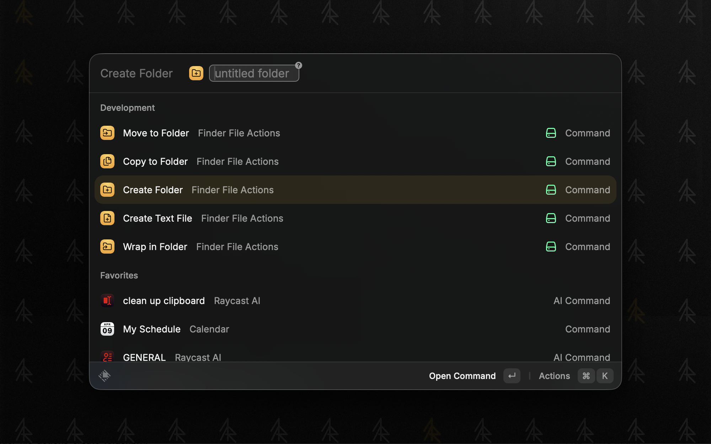
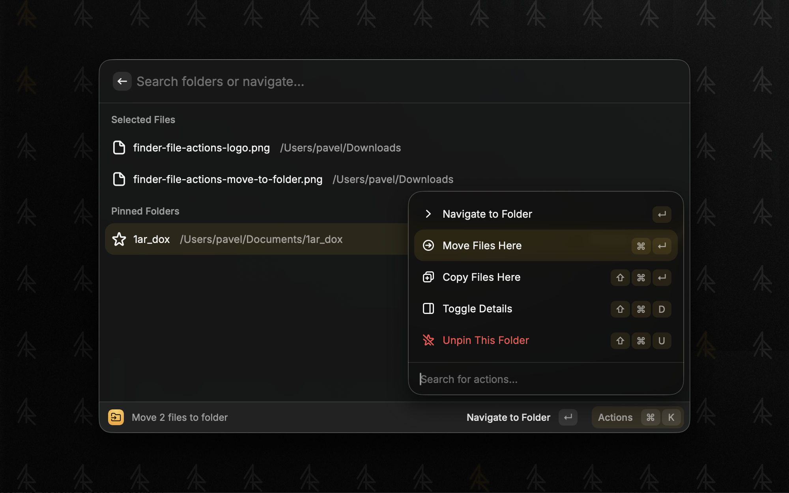
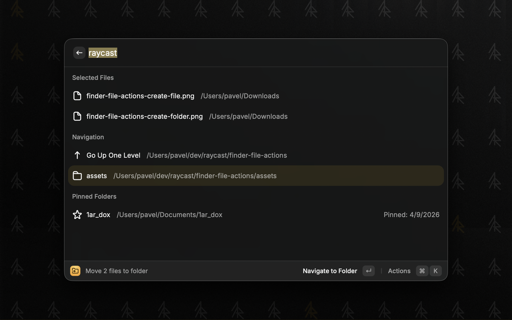
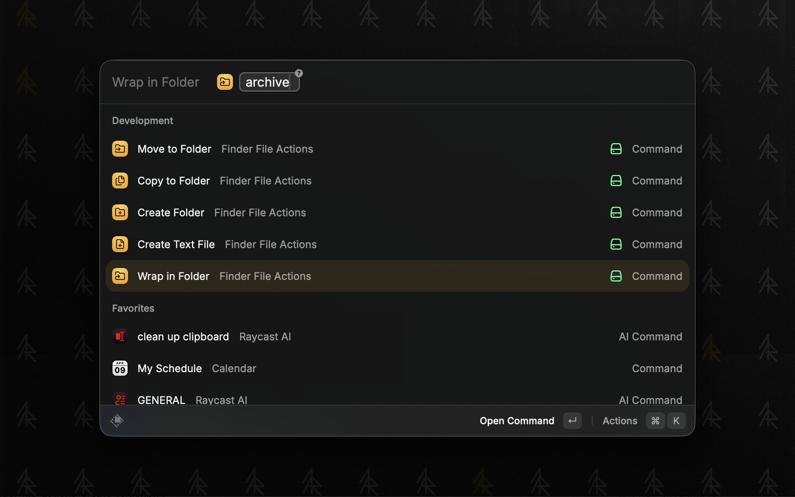
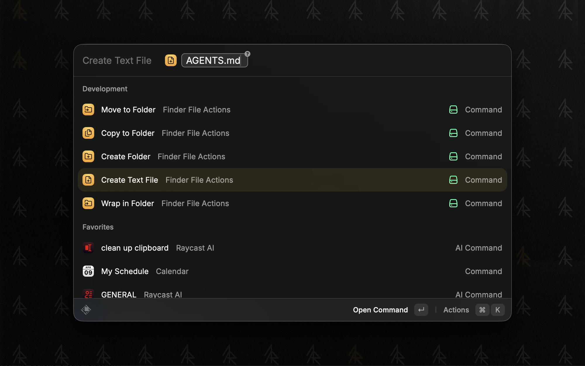

# Finder File Actions

File operations for macOS Finder via [Raycast](https://raycast.com).

[Install from the Raycast Store](https://www.raycast.com/pa1ar/finder-file-actions)

## Commands

### Move to Folder

Move selected Finder files to any folder via Spotlight search.

- Spotlight search to find any folder on your Mac
- Navigate into subfolders, go up levels
- Pin frequently used folders
- Recent folders remembered
- Batch operations with multiple files
- Streaming for large files (10MB+) with progress tracking

### Copy to Folder

Same as Move to Folder, but copies instead of moving.

### Create Folder

Create a new folder in the current Finder directory. Optional name argument (defaults to "untitled folder"). Follows macOS naming convention for duplicates ("name", "name 2", "name 3").

### Wrap in Folder

Create a new folder and move the selected Finder files into it.

### Create Text File

Create a text file with an optional filename. Names without an extension default to `.txt`. Auto-fills with clipboard content when available.

## Keyboard Shortcuts

- `Enter` - navigate to folder
- `Cmd+Return` - move files here
- `Cmd+Shift+Return` - copy files here
- `Cmd+Shift+D` - toggle details
- `Cmd+Shift+P` - pin/unpin folder
- `Cmd+Shift+R` - remove from recent

## Install

[Raycast Store](https://www.raycast.com/pa1ar/finder-file-actions) or search "Finder File Actions" in Raycast.

## Credits

Folder search adapted from [Folder Search](https://www.raycast.com/GastroGeek/folder-search) by [GastroGeek](https://www.raycast.com/GastroGeek).
