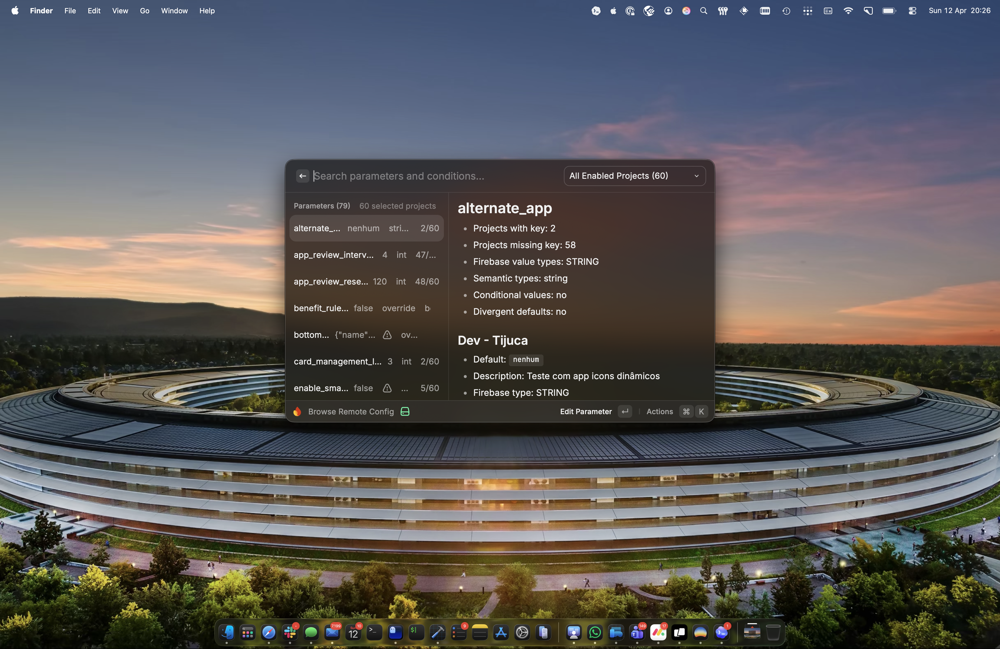
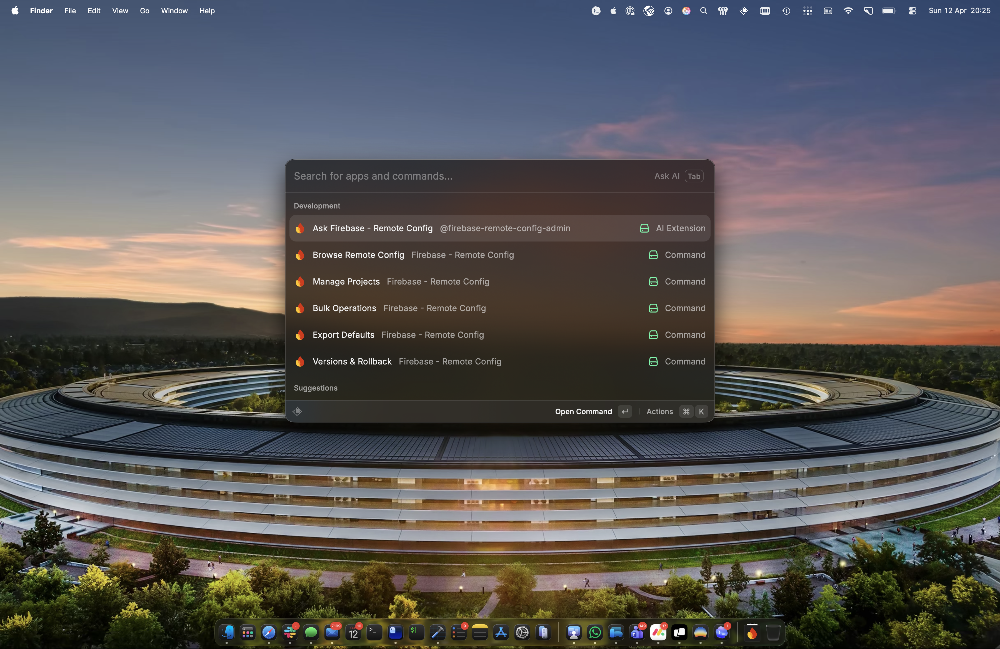
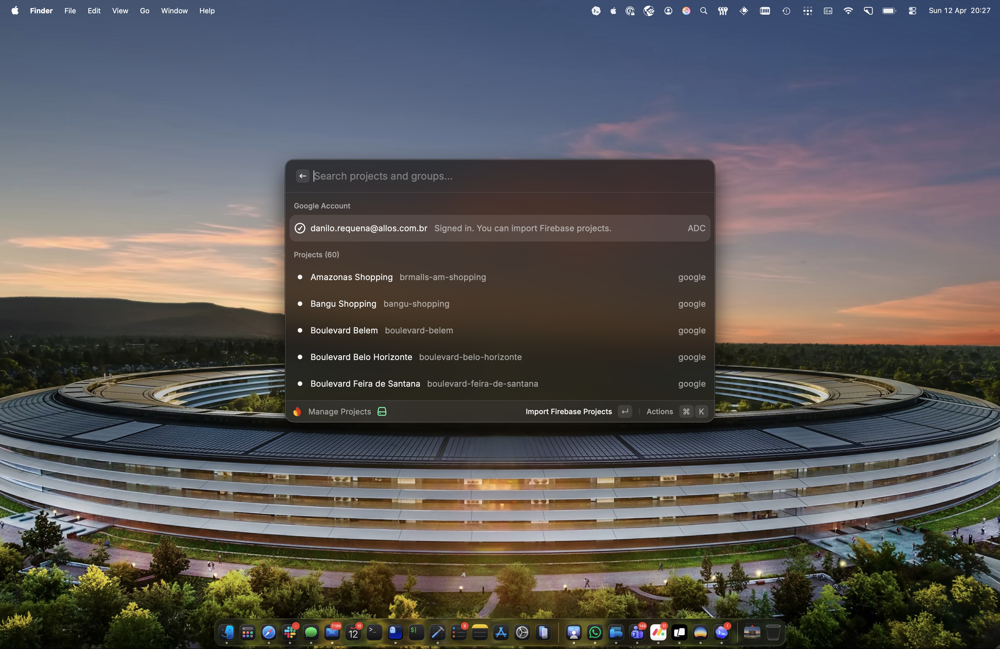
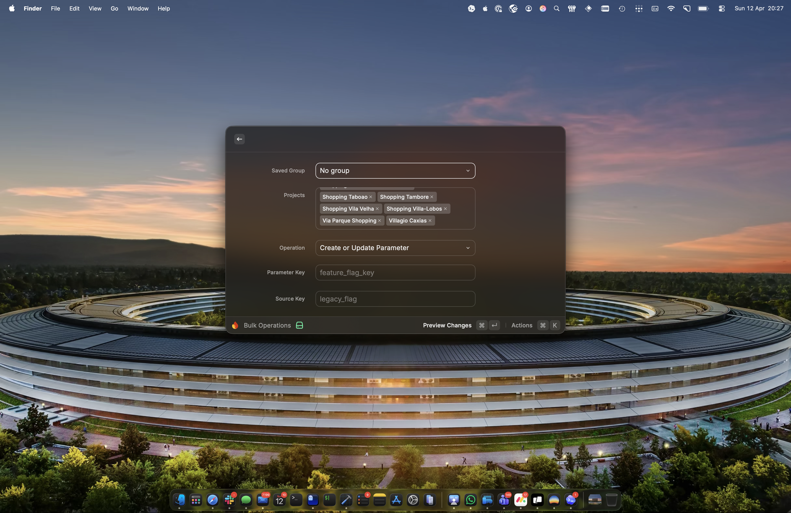

# Firebase - Remote Config

Inspect, compare, edit, publish, and roll back Firebase Remote Config parameters and conditions across multiple projects — all from Raycast.



## Features

- **Browse Remote Config** — View all parameters and conditions across your Firebase projects in a single list. Filter by project or group. See divergent defaults, conditional overrides, and value types at a glance.
- **Bulk Operations** — Create, update, or delete parameters and conditions across multiple projects at once. Preview every change before publishing.
- **Versions & Rollback** — List recent Remote Config versions for any project and roll back to a previous version with one click.
- **Export Defaults** — Download Remote Config defaults in JSON, PLIST, or XML format.
- **AI Chat Integration** — Ask questions and make changes via Raycast AI Chat (e.g. "which projects have the flag ocr_enabled?", "set checkout_v2 to true in all projects"). Write operations require confirmation before executing.
- **Project Groups** — Organize your Firebase projects into groups for quick filtering and scoped operations.

## Getting Started

You need at least one Firebase project connected to start using this extension. There are three authentication methods available — pick whichever fits your workflow.

### Option 1: Application Default Credentials (ADC) — Easiest

If you have the `gcloud` CLI installed:

1. Run this command in your terminal:
   ```
   gcloud auth application-default login
   ```
2. Open **Manage Projects** in Raycast
3. Click **Import Firebase Projects** — all Firebase projects you have access to will be imported automatically

This is the simplest setup. ADC credentials are stored at `~/.config/gcloud/application_default_credentials.json` and the extension detects them automatically.

> **Tip:** If ADC gets into a bad state, run `gcloud auth application-default revoke` followed by `gcloud auth application-default login` to reset.

### Option 2: Service Account JSON

For automated or team setups where you have a Firebase service account key file:

1. Download a service account JSON file from the [Firebase Console](https://console.firebase.google.com/) (Project Settings > Service accounts > Generate new private key)
2. Save it to a secure location (e.g. `~/secrets/firebase-prod.json`)
3. Open **Manage Projects** in Raycast and click **Add Project**
4. Enter the Firebase Project ID and Display Name
5. Set the **Service Account JSON Path** to the file you saved (e.g. `~/secrets/firebase-prod.json`)

If all your projects share the same service account, you can set the **Shared Service Account JSON Path** in extension preferences instead of configuring each project individually.

### Option 3: Google OAuth

For browser-based Google sign-in:

1. Create an OAuth 2.0 Client ID in [Google Cloud Console](https://console.cloud.google.com/apis/credentials) (type: iOS, bundle ID: `com.raycast`)
2. Set the **Google OAuth Client ID** in extension preferences
3. Open **Manage Projects** and click **Sign In With Google**
4. Authorize in your browser, then click **Import Firebase Projects**

## Commands

| Command | Description |
|---|---|
| **Browse Remote Config** | Inspect parameters and conditions across multiple projects |
| **Manage Projects** | Add, edit, delete, and import Firebase projects. Organize projects into groups. Test connections. |
| **Bulk Operations** | Preview and publish parameter or condition changes across projects |
| **Versions & Rollback** | List published versions and roll back a project template |
| **Export Defaults** | Download Remote Config defaults in JSON, PLIST, or XML |







## AI Chat

This extension integrates with Raycast AI Chat via `@firebase-remote-config-admin`. You can ask questions in natural language:

**Read operations:**
- "List all configured projects"
- "Which projects have the flag `checkout_v2` enabled?"
- "Search for parameters containing `ocr`"
- "Compare the key `social_login_options` across all projects"
- "Show all parameters for project shopping-prod"
- "Does the condition `ios_users` exist in every project?"

**Write operations (require confirmation):**
- "Set `ocr_enabled` to `true` in all projects"
- "Delete the parameter `legacy_checkout` from the shopping group"
- "Create a condition `android_beta` with expression `device.os == 'android'`"
- "Remove the condition `old_ios_users`"

All write operations show a confirmation prompt before executing.

## Extension Preferences

| Preference | Required | Description |
|---|---|---|
| **Google OAuth Client ID** | No | OAuth 2.0 Client ID for Google sign-in. Not needed if you use ADC or service account. |
| **Shared Service Account JSON Path** | No | Fallback path to a Firebase service account JSON file, used by projects that don't have their own. |
| **Request Timeout (ms)** | No | HTTP timeout for Firebase API requests. Defaults to 20000 (20 seconds). |

## How It Works

- The extension communicates directly with the [Firebase Remote Config REST API](https://firebase.google.com/docs/remote-config/automate-rc).
- When publishing changes, the extension uses **ETags** for conflict detection. If someone else modified the template between your preview and publish, the operation reports a conflict instead of overwriting.
- Project data (IDs, display names, credential paths, groups) is stored locally in Raycast's LocalStorage. No credentials or tokens are stored — authentication is handled fresh via ADC, service account JWT, or OAuth on each request.

## Troubleshooting

**"Application Default Credentials not found"**
Run `gcloud auth application-default login` in your terminal.

**"Project has no credentialRef and no shared credential is configured"**
The project has no service account path set, and ADC/OAuth are not available. Either set a Service Account JSON Path on the project, configure the Shared Service Account JSON Path in preferences, or set up ADC.

**"Invalid credential file"**
The service account JSON file at the specified path is missing, corrupted, or doesn't contain the required `client_email` and `private_key` fields. Download a fresh key from the Firebase Console.

**"Set the Google OAuth Client ID in extension preferences"**
You're trying to use Google sign-in but haven't configured an OAuth Client ID. Either set one in preferences or use ADC/service account instead.

**Connection test fails**
In Manage Projects, select a project and use the **Test Connection** action to verify that authentication and API access work correctly. The toast message will show which auth method was used and whether the connection succeeded.
