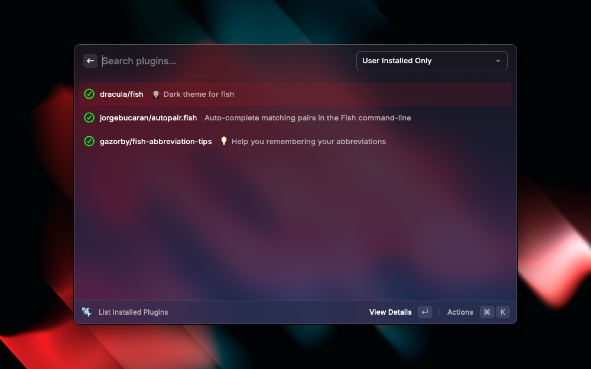
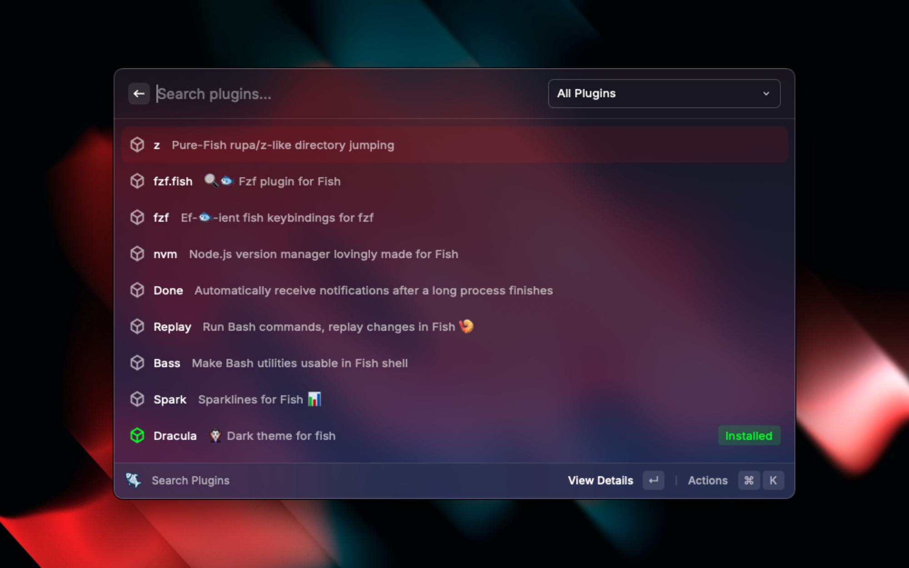
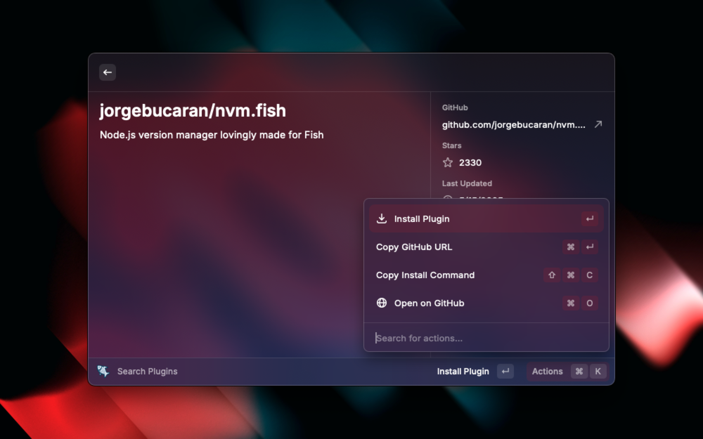

# Fisher Plugin Manager for Raycast

A Raycast extension to help you manage your Fish shell plugins with [Fisher](https://github.com/jorgebucaran/fisher).

## ✨ Features

- 🔍 **Search & Install Plugins** – Browse from a curated registry and install with one click
- 📦 **List Installed Plugins** – View all installed plugins with descriptions
- 🔧 **Update Plugins** – Update individual plugins or all at once
- ❌ **Remove Plugins** – Easily remove plugins with confirmation
- 📄 **Plugin Details** – View descriptions, GitHub links, stars, and last updated date

## 📦 Plugin Metadata

Plugin info is powered by a local JSON registry that you can update manually. It includes name, description, and GitHub repo.

## 🔒 Notes

- Core plugin `jorgebucaran/fisher` is protected from accidental removal.
- Cached metadata is stored locally and refreshed every 24 hours.

## 📷 Screenshots

---

Made with ❤️ for Fish & Raycast

---

> Want to contribute? Submit a PR with new plugins for the registry!
