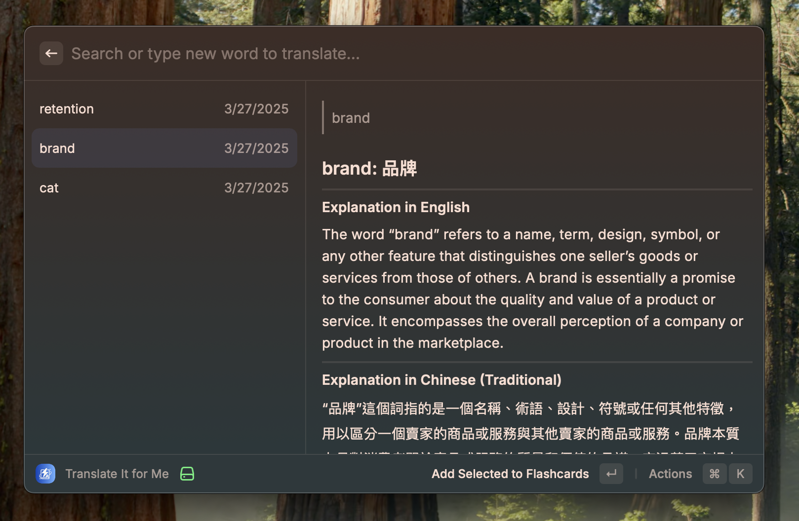

# FlashLang

A powerful Raycast extension that combines AI-powered translation with flashcard learning system.

You can search vocabulary you want to learn and add it to your flashcard deck,
then review your flashcards regularly to improve retention.

## Getting Started

1. Install the extension through Raycast
2. Set your native language and target learning language
3. Start translating words by either:
   - Using clipboard content
   - Selecting text directly
4. You can refresh the content by using `Refresh` command
5. Review your flashcards regularly to improve retention

## Usage

### Translation

- Use `Translate It for Me` command to translate text
- You can set a shortcut to open this command quickly
- View translation history and manage saved translations

### Flashcard Management

- Add important vocabulary to your flashcard deck
- Rate your proficiency level (1-5 stars)

### Review Session

- Start a review session with `Review Flashcards` command
- Rate your knowledge of each card
- Track your learning progress over time

## Requirements

- Raycast
- Internet connection for AI translation

## License

MIT
