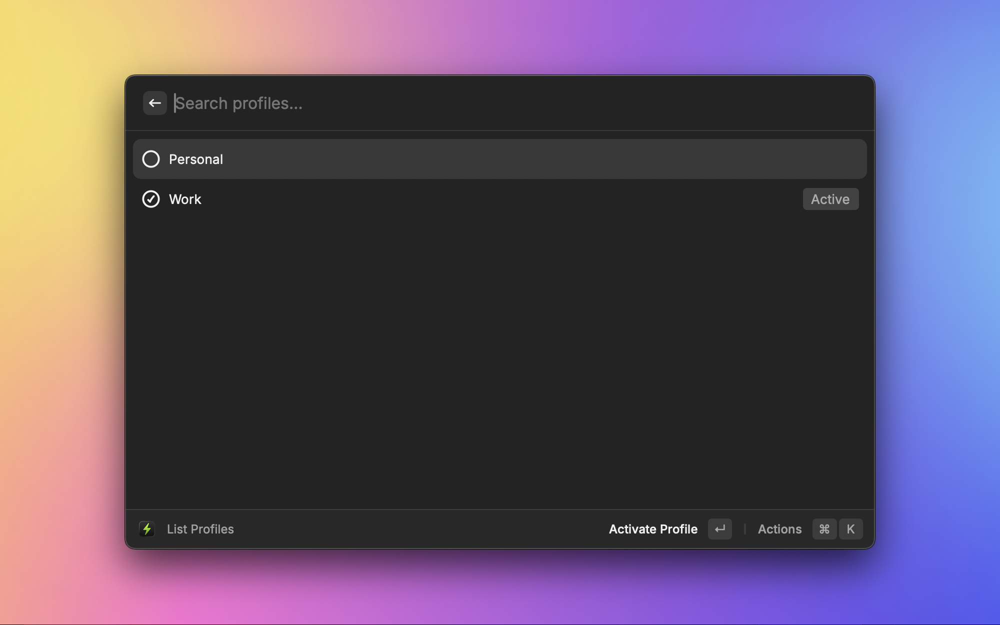
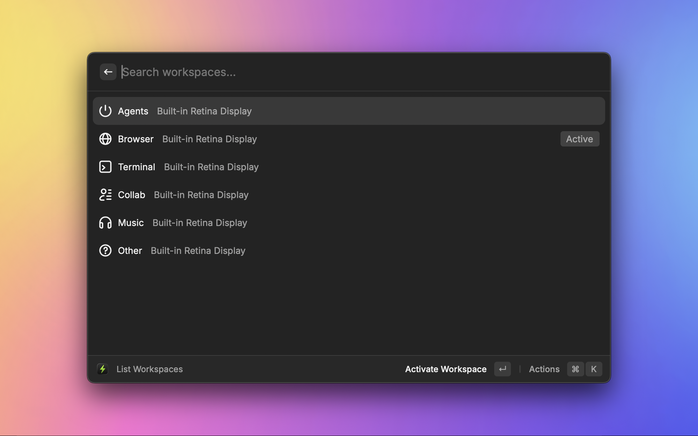
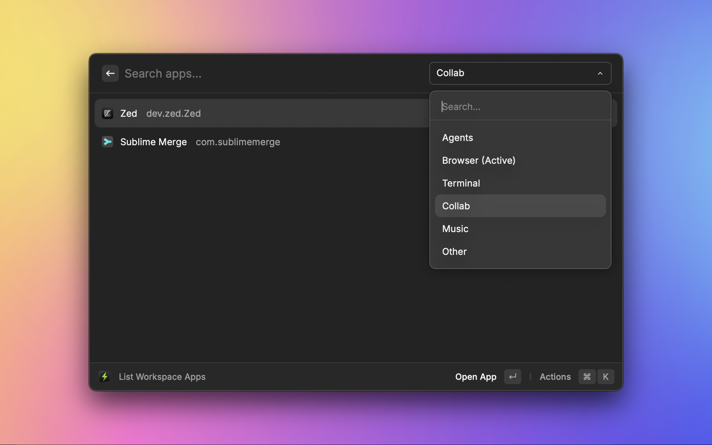
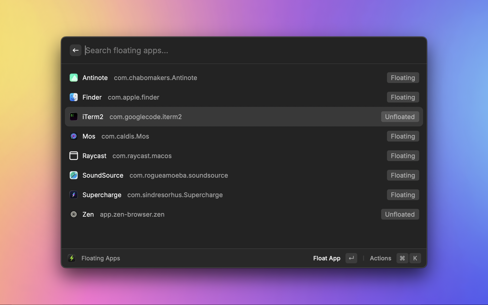
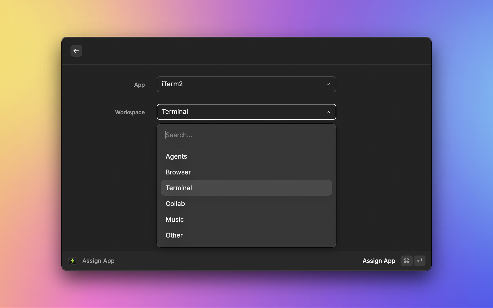
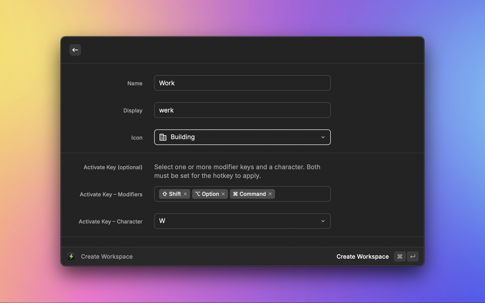

# FlashSpace Raycast Extension

Manage [FlashSpace](https://github.com/wojciech-kulik/FlashSpace) workspaces, profiles, and apps directly from Raycast.

## Features

### Workspace Management
- **List Workspaces** – View all workspaces with display assignments
- **Create Workspace** – Create new workspaces with display, icon, and hotkey options
- **Delete Workspace** – Remove workspaces with confirmation dialog
- **Update Workspace** – Modify workspace display and app settings
- **Activate Workspace** – Quick-switch to any workspace by name

### Profile Management
- **List Profiles** – View all profiles with active indicator
- **Create Profile** – Create profiles with copy and activate options
- **Delete Profile** – Remove profiles with confirmation dialog

### App Management
- **Assign App** – Assign running apps to workspaces
- **Unassign App** – Remove app assignments from all workspaces
- **Assign Visible Apps** – Bulk-assign all visible apps to a workspace
- **List Workspace Apps** – View apps assigned to each workspace
- **List Running Apps** – View all currently running apps
- **Floating Apps** – Toggle float/unfloat for apps

### Utility Commands
- **Focus Window** – Focus windows by direction or cycle through apps/windows
- **List Displays** – View connected displays with active indicator
- **Get Status** – View current active profile, workspace, app, and display
- **Hide Unassigned Apps** – Hide all apps not assigned to any workspace
- **Open FlashSpace** – Launch the FlashSpace application
- **Open Space Control** – Open FlashSpace Space Control

## Prerequisites

- [FlashSpace](https://github.com/wojciech-kulik/FlashSpace) must be installed
- The `flashspace` CLI must be available in your PATH (or configure the path in extension preferences)

## Configuration

Open extension preferences to set a custom path to the `flashspace` binary if it's not in a standard location (`/opt/homebrew/bin/flashspace` or `/usr/local/bin/flashspace`).

## Screenshots

Below are screenshots demonstrating the extension UI and some key flows.

Show Screenshots

 

<!-- Image paths are relative to this README file (flashspace/metadata/) -->

  
   
  <em>List profiles and switch between them</em>

  
   
  <em>List workspaces and switch between them</em>

  
   
  <em>List apps running in active workspace or other workspaces and switch between them.</em>

  
   
  <em>Toggle float/unfloat for running apps.</em>

  
   
  <em>Assign app to workspace.</em>

  
   
  <em>Create new workspace.</em>

