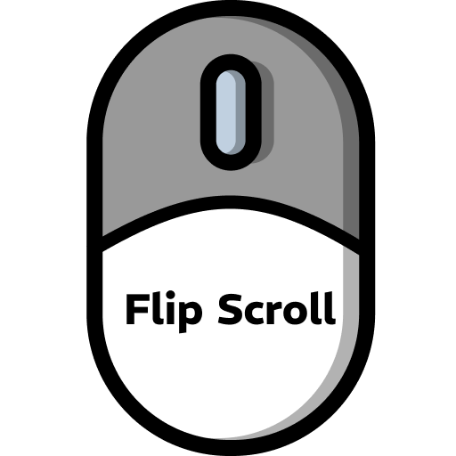

    

# Flip Scroll

Flips macOS natural scrolling on and off, so you don't have to open System Settings every
time you plug in or unplug a mouse.

## ✨ Features

- **One keypress**: assign a hotkey and flip the direction without leaving whatever you
  are doing.
- **Instant**: the new direction applies the moment you run the command — no logout, no
  Settings window opening in your face.
- **Mouse or trackpad**: works whether or not a mouse is currently connected.
- **Nothing to grant**: no Accessibility permission, no UI automation.

## ❓ What it changes

macOS keeps a single global preference for scroll direction. The Trackpad and the Mouse
panes in System Settings both read and write that same value, which is why flipping it
here works in both cases — the Mouse pane disappears when you unplug the mouse, the
preference does not.

## ⚡️ How it works

The command calls the same system function the Trackpad pane calls, so the change takes
effect immediately. Nothing opens, nothing gets clicked.
