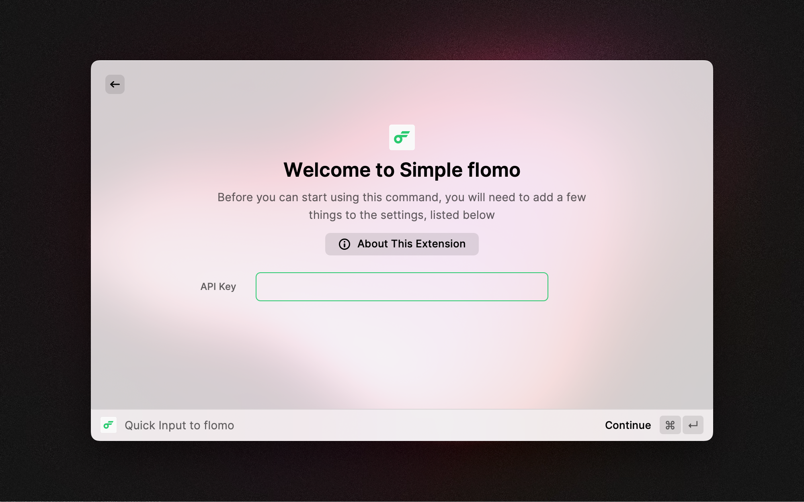
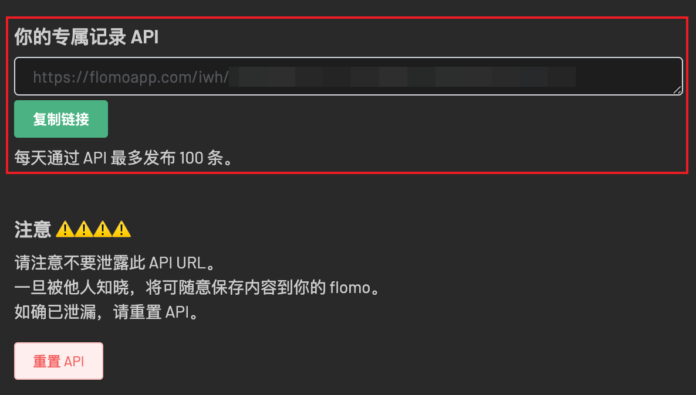
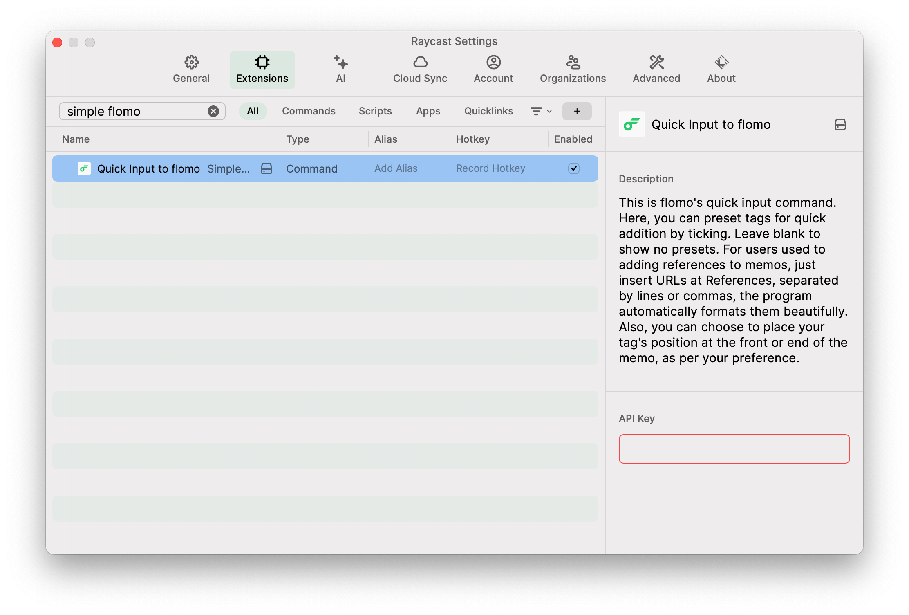

# Simple flomo

**【Keep Noting, Meaning's Floating...】**
- [flomo style Raycast theme](https://themes.ray.so?version=1&name=flomo&author=Lyson%20Ober&authorUsername=Lyson&colors=%23FFFFFF,%23FFFFFF,%23000000,%2330D07A,%2330D07A,%23F84E4E,%23F88D4E,%23FFCC47,%2330D07A,%23228CF6,%237B4EF8,%23F84EBD&appearance=light&addToRaycast)

- Directly input notes into Flomo with one click via Raycast.
- Can preset tags/group of tags, labeling quickly by simply ticking.
- Depending on preference, tags can be placed at the beginning/end of the notes.
- For those who want to track original links, you can directly input multiple links, which will be automaticallly formatted for optimal display.
---
- [flomo 风格 Raycast 主题](https://themes.ray.so?version=1&name=flomo&author=Lyson%20Ober&authorUsername=Lyson&colors=%23FFFFFF,%23FFFFFF,%23000000,%2330D07A,%2330D07A,%23F84E4E,%23F88D4E,%23FFCC47,%2330D07A,%23228CF6,%237B4EF8,%23F84EBD&appearance=light&addToRaycast)
- 直接通过 Raycast 一键输入笔记到 flomo 中
- 能够预设标签 / 标签组，直接通过勾选迅速打标签
- 可根据喜好自行选择把标签置于笔记最开头 / 末尾
- 对于有追踪原文链接的小伙伴，可以直接输入多个链接，将自动处理为良好的显示格式

## Configuration steps

- Enter the flomo API after installation.

- The flomo API can be found in the account settings of Flomo.

- If the API is set incorrectly, you can find Extensions at the top of the Raycast preferences.
- Then find Flomo, you can modify the API Key on the right.

