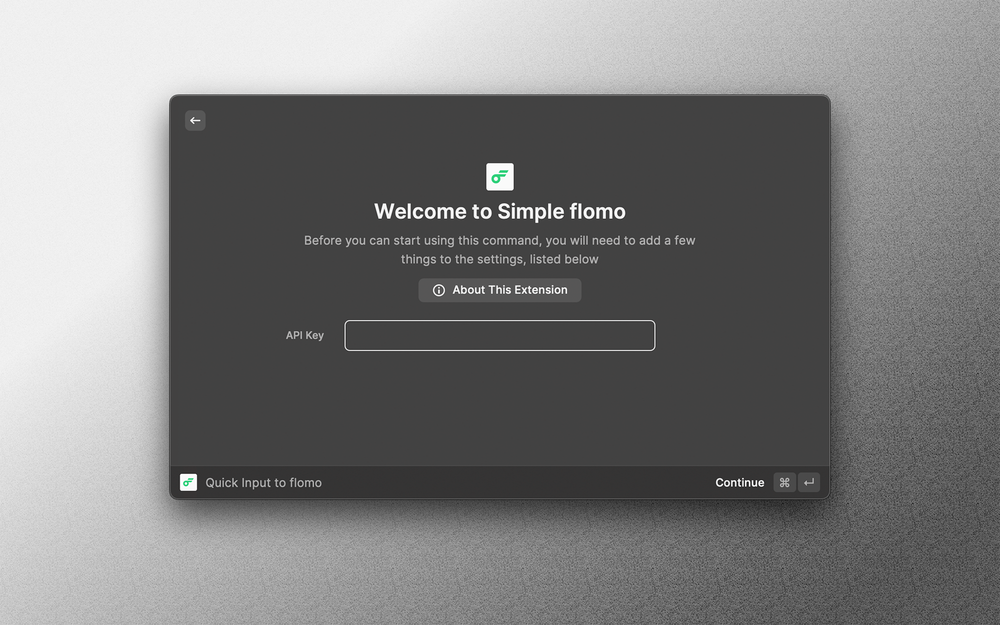
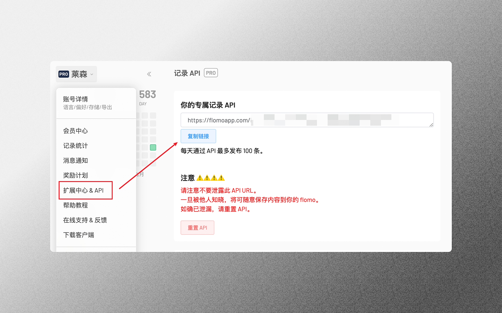
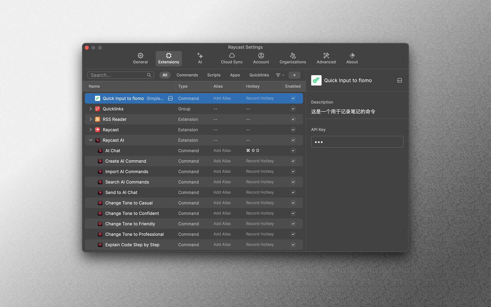

# Simple flomo

**【持续不断记录，意义自然浮现】**

- 直接通过 Raycast 一键输入笔记到 flomo 中
- 能够预设标签 / 标签组，直接通过勾选迅速打标签
- 可根据喜好自行选择把标签置于笔记最开头 / 末尾
- 对于有追踪原文链接的小伙伴，可以直接输入多个链接，将自动处理为良好的显示格式

【🌟 flomo 官网：https://flomoapp.com/】
【🌟 非官方插件，由 GPT-4 编写】

## 配置步骤
- 安装好之后输入 flomo API

- flomo API 可以在这里找到

- 如果 API 设置错误，可以在 Raycast 偏好设置里上方找到 Extensions
- 然后找到 flomo，在右边修改 API Key 即可

