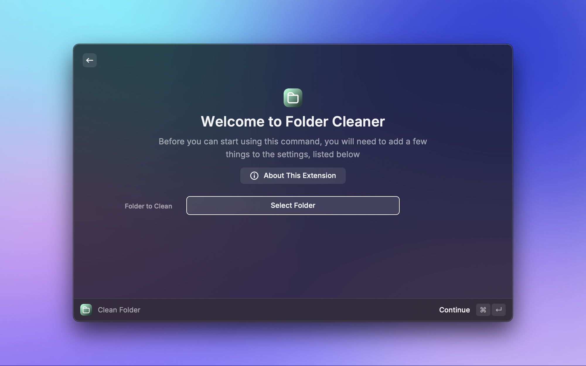
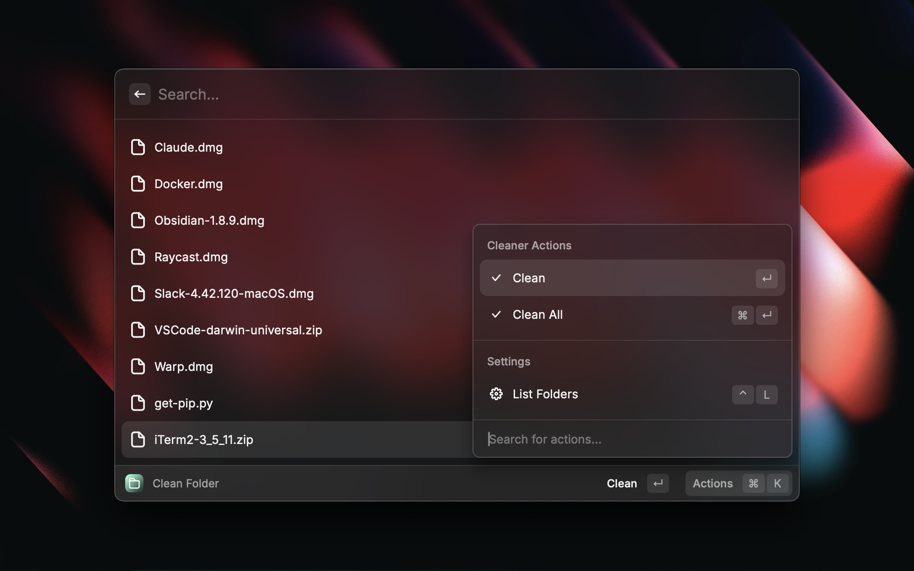

# Folder Cleaner

**Folder Cleaner** is a Raycast extension that allows users to automatically clean a specific folder. It can filter by file extension and move those files to their appropriate location.

## Screenshots

## Main features

### Choose Folder to Clean

You can choose what folder the extension will clean. This is useful especially for the `Downloads` folder.

### Setup File Locations

When cleaning a folder, you can setup where the files are moved to based on their extensions.

### Clean One or All

You have the ability to clean one or all files.
