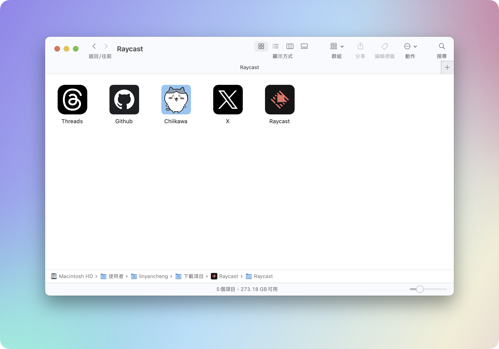

# Folder Icon Crafter

**A Raycast extension to customize your Finder folders with unique icons.**

Bring style and organization to your Finder folders effortlessly by crafting custom icons using any image of your choice.

## Features

- Custom Icons: Personalize your Finder folders with images of your choice.
- Effortless Organization: Quickly identify folders with custom visuals.
- User-Friendly Interface: Intuitive steps to transform your images into folder icons.
- Seamless Integration: Works directly within Raycast for a streamlined experience.

## Installation

- Install the Folder Icon Crafter extension from the Raycast Store.

## How to Use

1. Open Raycast and launch Folder Icon Crafter.
2. Select the folder you want to customize.
3. Choose an image from your local files.
4. Enjoy your newly crafted folder icon in Finder!
