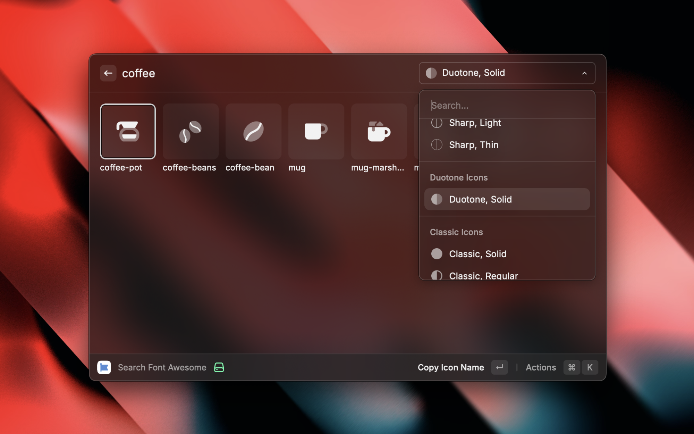

# Font Awesome

The Font Awesome extension let's you search all the free and pro icons available in the latest Font Awesome v6.7.2 release.

## Features

1. Get similar icons with the help of fuzzy search
2. Quickly copy the icon slug, FA class, SVG code, icon glyph or unicode for any icon
3. Filter and view all icon families (Classic, Sharp, Duotone) and icons styles (Solid, Regular, Light, Thin, Brands)

## Setup

The extension works out of the box for free icons, there is no need for an API Token.

In order to search for pro icons, an API token from a pro account is required. You can find the pro plans [here](https://fontawesome.com/plans).

To generate an API Token, follow these steps -

1. Sign in to your Font Awesome account
2. Go to your accounts page
3. In the general tab, scroll down to the API Tokens section and click "Create a new API Token"
4. Choose "Custom" for "Where will you use this token"
5. For scope, select the "Read kits data", "Allowed domains" and "Pro icons and metadata" options.
6. Generate the API Token and paste it in Raycast Preferences.
