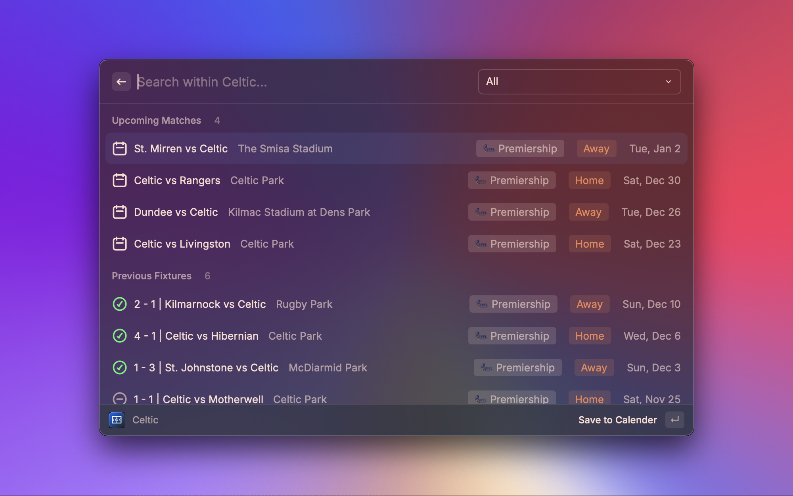
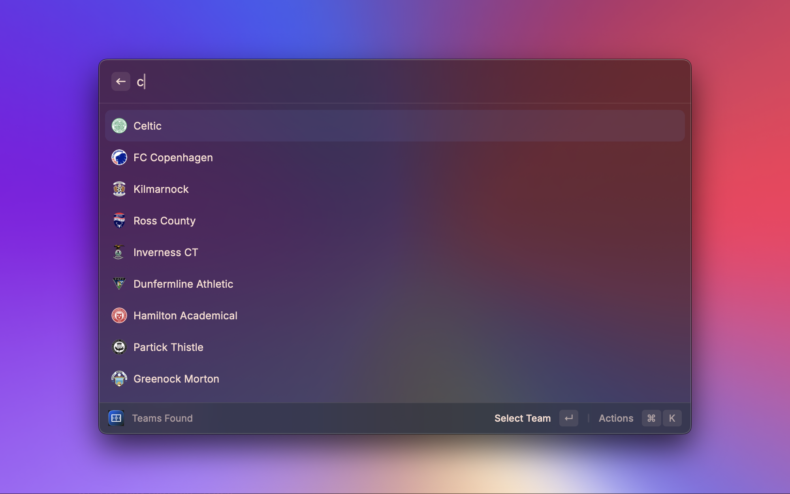
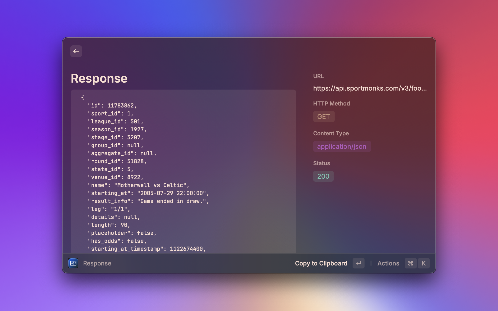
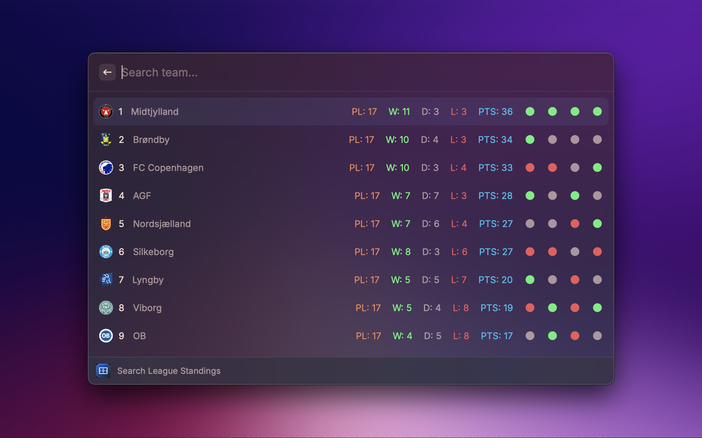

  

<h1 align="center">Footy Report</h1>

<h3 align="center">
Raycast extension to find your essential football match day info and stats
</h3>

## ⚠️ Prerequisites

This extension leverages the [SportMonks Football API](https://www.sportmonks.com/football-api/) thus requires a valid API token to authenticate requests from a personal/organization account.
You can begin by registering an account under a free plan tier [here](https://my.sportmonks.com/login) to get things running!

> [!NOTE]  
> Bear in mind under the free tier plan, you have limited access to the amount of leagues that can be requested.

## Commands

### Search Team

Search a football team by name and display all relevant data regarding recent results, upcoming fixtures and squad stats.

### Test API

Trigger a simple API endpoint test using a SportsMonk API token to identify a successful response or not

### Search League Standings

View league standing by displaying position, points, wins, draws and losses

### Search League Stats

🛠️ Under development

## Preferences

All preferences can be customized through `Raycast Settings > Extensions > Footy Report`

| Name            | Description                                                                  | Default Value | Required |
| --------------- | ---------------------------------------------------------------------------- | ------------- | -------- |
| `API Key`       | SportMonks API token used to fetch all relevant football data                |               | `true`   |
| `Calendar Name` | Name of the calendar on Calendar.app you wish to save upcoming fixture dates | `Calendar`    | `true`   |
