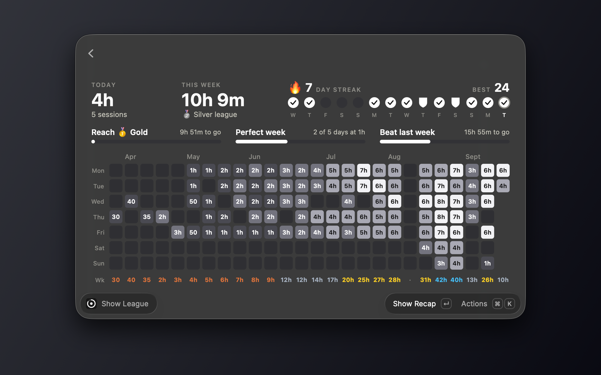

# Foqus League

Stats for Raycast Focus. Hours, streaks, weekly leagues and a shareable recap. Everything stays on your Mac.

## Setup

Keep the Menu Bar Stats command turned on. It counts your Focus sessions for you. If you turn it off, sessions you finish in the meantime are missed.

## Your data

Your sessions are saved on your Mac as plain files. No account, and nothing goes online.

To move to a new Mac, use Export Sessions here, then Import Sessions there. Importing only adds what is missing and never deletes anything.

## Support

Found a problem? Use Report Bug on the store page, or [open an issue](https://github.com/raycast/extensions/issues/new/choose).

Foqus League is free. If it helps you focus, [buy me a coffee](https://buymeacoffee.com/filipimiparebine).
