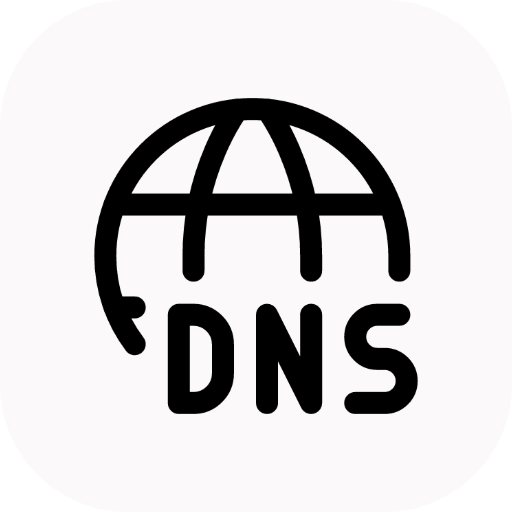

    

# FreeDNS

This is a Raycast extension for FreeDNS (https://freedns.afraid.org/). It uses the **ASCII** API (not **XML**) to fetch your records and allows you to change the associated addresses.

## 🚀 Getting Started

1. **Install extension**: Click the `Install Extension` button in the top right of [this page](https://www.raycast.com/xmok/freedns) OR `install` via Raycast Store

2. **Enter your Credentials**: The first time you use the extension, you'll need to enter your 'FreeDNS' Credentials:

    a. Username
    
    b. Password

## 🙏 Acknowledgements

- `freedns-api` (for ASCII API usage) - https://github.com/J-Chaniotis/freedns-api