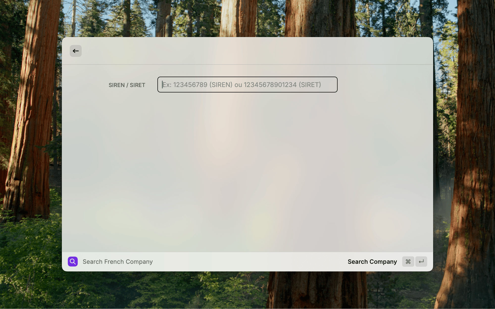
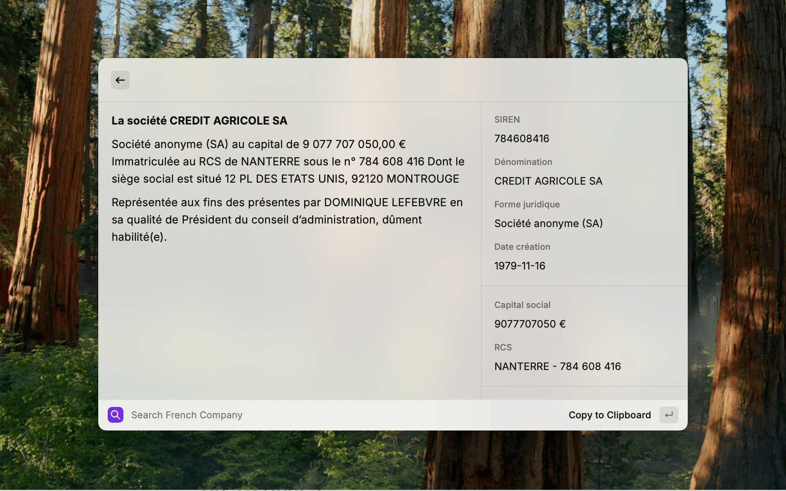
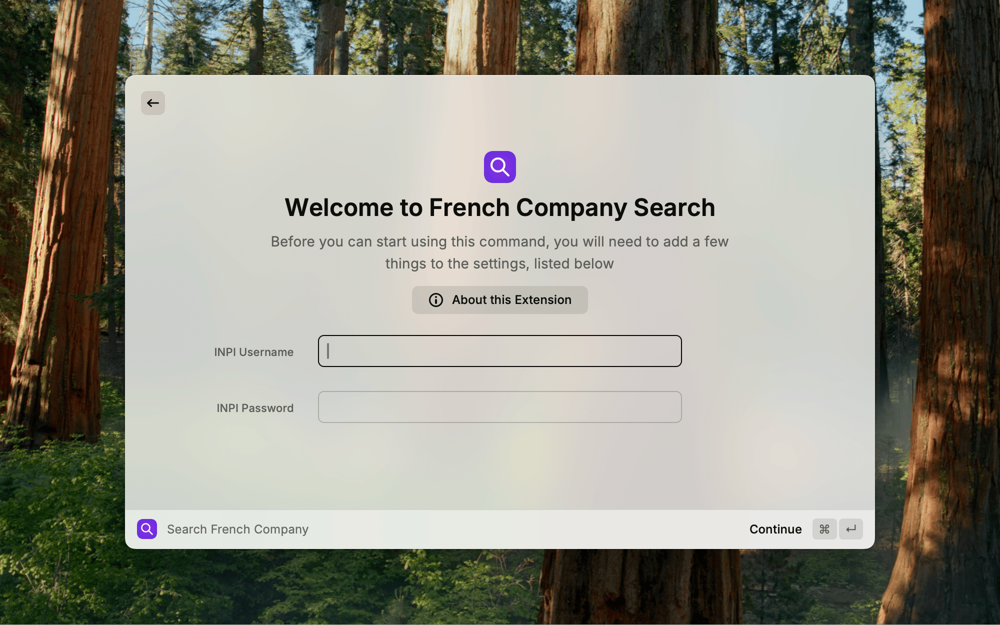

# Company Search (INPI) for Raycast

- [English](#english)
- [Français](#français)


## English

> [!IMPORTANT]
> This extension was developed entirely with the assistance of **Claude Code** and **Gemini CLI**, with no real coding skills from the author. Use at your own risk.

This Raycast extension allows you to quickly search for legal and financial information about a French company using its SIREN or SIRET number. It connects directly to the INPI API to provide up-to-date and reliable data.

### 🚀 Installation

#### Prerequisites

- [Raycast](https://raycast.com) installed on macOS
- Node.js 16+ and npm (for development)
- INPI account with API access

#### Installation from Raycast Store

_[Instructions to come once the extension is published]_

#### Development Installation

1. Clone this repository:
   ```bash
   git clone https://github.com/fma16/french-company-search.git
   cd french-company-search
   ```

2. Install dependencies:
   ```bash
   npm install
   ```

3. Import the extension into Raycast:
   ```bash
   npm run dev
   ```

### ⚙️ Configuration

#### Getting INPI Credentials

1. **Create an INPI Account**

    - Go to [data.inpi.fr](https://data.inpi.fr/content/editorial/Acces_API_Entreprises)

    - Create an account if you don't have one

    - Log in to your personal space

2. **Request API Access**

    - In your personal space, navigate to the API section

    - Request access to the National Register of Companies API

    - Wait for approval

3. **Retrieve Your Credentials**

    - Once access is approved, note your username (email) and password

    - These credentials will be required to configure the extension

#### Configure the Extension in Raycast

1. Launch Raycast and search for "Search Company"

2. On first use, Raycast will automatically open the preferences

3. Enter your INPI credentials:

    - **INPI Username**: Your INPI login email

    - **INPI Password**: Your INPI password

4. The credentials are stored securely by Raycast

### ✨ Features

- **Search by SIREN or SIRET:** Enter a 9-digit (SIREN) or 14-digit (SIRET) number to get company information
- **Complete Information:** Company name, legal form, share capital, creation date, head office address
- **Reliable RCS City:** Automatically determines the competent commercial court registry based on the postal code
- **Legal Representative:** Identifies the main representative with correct grammatical agreement
- **Support for Sole Proprietors:** Handles both legal entities and individuals
- **Formatted Summary:** Text ready to copy-paste into your legal documents
- **Built-in Rate Limiting:** Protection against API abuse with automatic retry

### 📋 Output Templates

The extension generates standardized French legal text using two different templates depending on the entity type:

#### Corporate Entity (Personne Morale)
```
La société [DENOMINATION]
[FORME JURIDIQUE] au capital de [CAPITAL] €
Immatriculée au RCS de [VILLE] sous le n° [NUMERO_RCS]
Dont le siège social est situé [ADRESSE]
Représentée aux fins des présentes par [REPRESENTANT] en sa qualité de [ROLE], dûment [habilité/habilitée].
```

#### Individual Entrepreneur (Personne Physique)
```
[Monsieur/Madame] [PRENOM] [NOM]
[Né/Née](e) le [DATE] à [LIEU]
De nationalité [NATIONALITE]
Demeurant [ADRESSE]
N° : [SIREN]
```

### Data Sources

This extension relies on open and official data sources to ensure the quality of the information:

1. **INPI API:** The main company information (name, capital, representatives, etc.) is retrieved in real-time via the official API of the **Institut National de la Propriété Industrielle (INPI)**.

2. **Datainfogreffe:** To ensure the accuracy of the RCS (Trade and Companies Register) city of registration, the extension uses the [Référentiel Communes - Greffes](https://opendata.datainfogreffe.fr/explore/assets/referentiel-communes-greffes/) dataset. This dataset is provided by **Datainfogreffe** and is used in accordance with the **Licence Ouverte / Open Licence**.

### 🔧 Usage

1. **Open Raycast** and type "Search Company" or use your configured shortcut

2. **Enter the SIREN or SIRET** of the desired company (9 or 14 digits)

3. **Press Enter** to start the search

4. **View the results** in the Raycast interface

5. **Copy the summary** by pressing `Cmd+C` or using the "Copy to Clipboard" button

#### Accepted Formats

- **SIREN**: 9 digits (e.g., `123456789`)
- **SIRET**: 14 digits (e.g., `12345678901234`) - only the first 9 digits (SIREN) will be used

### 📸 Screenshots

#### Search Interface


#### Company Search Results


#### Company Details


#### Login Configuration


### 🔍 Troubleshooting

#### Common Issues

##### "Authentication failed"

- ✅ Check your INPI credentials in Raycast preferences
- ✅ Ensure your INPI account has API access
- ✅ Test the connection directly on the INPI website
- ✅ Contact INPI support if the problem persists

##### "Company not found"

- ✅ Check the SIREN/SIRET format (9 or 14 digits only)
- ✅ Make sure the company exists and is active
- ✅ Some companies may have incomplete data in the API

##### "Rate limit exceeded"

- ✅ Wait a few minutes before searching again
- ✅ The extension automatically limits to 30 requests per minute
- ✅ The automatic retry will handle re-sending the request

##### "Network error"

- ✅ Check your internet connection
- ✅ Check if the INPI website is accessible
- ✅ Restart Raycast if necessary

#### Support and Debugging

##### Development Mode

In development mode, the extension logs additional information to the console:

```bash
# View Raycast logs
tail -f ~/Library/Logs/Raycast/raycast.log
```

##### Reporting an Issue

If you encounter a bug:

1. Enable development mode with `npm run dev`

2. Reproduce the issue

3. Check the console logs

4. Open an issue on GitHub with the details

### 🤝 Contributing

Contributions are welcome!

#### Contribution Workflow

1. Fork the project

2. Create a feature branch (`git checkout -b feature/new-feature`)

3. Commit your changes (`git commit -m 'feat: add new feature'`)

4. Push to the branch (`git push origin feature/new-feature`)

5. Open a Pull Request

#### Code Standards

- Use strict TypeScript
- Follow the configured ESLint conventions
- Add tests for new features
- Document public APIs
- Use conventional commits

### 🧪 Testing

This extension features a comprehensive testing architecture with hybrid CI/CD strategy, built-in performance monitoring, and complete troubleshooting diagnostics. See [TESTING_GUIDE.md](TESTING_GUIDE.md) for complete details.

#### Quick Testing Commands

```bash
# Unit tests (fast, no network)
npm run test:unit

# Integration tests with mocked data (CI/CD compatible)
npm run test:integration

# Performance tests (benchmarks)
npm run test:performance

# Complete test suite
npm run test:full
```

#### Local Testing with Real API

```bash
# Tests with real INPI API (uses Raycast preferences automatically)
npm run test:integration:real

# Or with environment variables
INPI_USERNAME=your_user INPI_PASSWORD=your_pass npm run test:integration:real
```

#### CI/CD Testing Strategy

- **GitHub Actions**: Uses pre-recorded mock data (`assets/mocked-api-responses.json`)
- **Local Development**: Can use real API with your INPI credentials
- **Smart Credential Detection**: Automatically tries Raycast preferences → environment variables → mocked data
- **Network Resilience**: Robust handling of temporary API outages

#### Test Coverage

| Test Type | Count | Execution Time | Coverage |
|-----------|-------|----------------|----------|
| Unit Tests | 56 | ~0.4s | Core business logic |
| Integration Tests (Mocked) | 25 | ~2.9s | End-to-end workflows |
| Performance Tests | 6 | ~0.3s | Speed & memory benchmarks |
| **Total** | **87** | **~3.6s** | **Complete functionality** |

#### Generating Mock Dataset

```bash
# Navigate to local directory
cd local/

# Run the dataset generator (requires INPI credentials)
npx ts-node generate-mock-dataset.ts
```

The mock dataset contains real API responses from 10 different company types (SA, SARL, SAS, Auto-entrepreneur, etc.) for comprehensive testing coverage.

### 📝 Technical Architecture

#### Security

- **Rate limiting**: 30 requests/minute with exponential backoff
- **Credential validation**: Client-side email format validation
- **No sensitive logging**: No sensitive data is logged in production
- **Secure storage**: Credentials encrypted by Raycast

#### Performance

- **Lazy loading**: On-demand loading of configurations
- **Caching**: Caching of role and registry mappings  
- **Smart retry**: Automatic retry with exponential backoff
- **Strict types**: Elimination of runtime errors via TypeScript
- **Optimized data**: 84% file size reduction for greffe mappings (1.5MB → 251KB)
- **Fast lookups**: Average 0.004ms lookup time with binary search algorithm

#### Reliability

- **Robust error handling**: Specific and actionable error messages
- **Graceful fallbacks**: Default values for missing data
- **Runtime validation**: Verification of API response structure

### 🏛️ Greffe Data Management

The extension uses court registry (greffe) data to determine the correct RCS registration city for companies. This system has been optimized for performance and maintainability.

#### Data Source
- **Primary Source**: [Datainfogreffe Référentiel Communes-Greffes](https://opendata.datainfogreffe.fr/explore/dataset/referentiel-communes-greffes/)
- **License**: Open License / Licence Ouverte
- **Format**: CSV with postal codes mapped to court registries
- **Update Frequency**: Quarterly recommended (data changes infrequently)

#### Optimization Details
- **File Size Reduction**: Original 1.5MB → Compressed 251KB (84% reduction)
- **Data Efficiency**: 28,136 entries → 6,337 compressed entries (77% reduction)
- **Performance**: Average lookup time 0.004ms with binary search on ranges
- **Algorithm**: Range-based compression with fallback to individual mappings

#### Data Build Process

```bash
# Compress existing greffe data (one-time or after updates)
npm run compress-greffes

# Build new greffe index from CSV source (when available)
npm run build-greffes
```

#### File Structure
```
assets/
├── greffes-index.json              # Original full dataset (1.5MB)
├── greffes-index-compressed.json   # Optimized dataset (251KB)
└── role-mappings.json              # Legal role mappings

data/
└── referentiel.csv                 # Source CSV (when updating data)

scripts/
└── compress-greffes.ts             # Compression utility
```

#### Updating Greffe Data

1. **Download Latest Data**
   - Visit [Datainfogreffe Open Data](https://opendata.datainfogreffe.fr/explore/dataset/referentiel-communes-greffes/)
   - Download CSV export as `data/referentiel.csv`

2. **Rebuild Index**
   ```bash
   npm run build-greffes        # Generate from CSV
   npm run compress-greffes     # Compress for performance
   npm run test                 # Validate accuracy
   ```

3. **Validate Changes**
   - Compression script validates 100% lookup accuracy
   - Performance tests ensure sub-10ms response times
   - Build process logs compression statistics

#### Technical Implementation
The system uses a hybrid approach:
- **Ranges**: Consecutive postal codes with same greffe (e.g., 75001-75999 → PARIS)
- **Singles**: Isolated codes that don't benefit from ranges
- **Binary Search**: O(log n) lookup performance for ranges
- **Fallback**: Automatic fallback to original format if compressed data unavailable

## Français

> [!IMPORTANT]
> Cette extension a été entièrement développée avec l'assistance de **Claude Code** et **Gemini CLI**, sans réelle compétence en code de la part de l'auteur. A utiliser à ses risques et périls.

Cette extension Raycast vous permet de rechercher rapidement les informations légales et financières d'une entreprise française en utilisant son numéro SIREN ou SIRET. Elle se connecte directement à l'API de l'INPI pour fournir des données à jour et fiables.

### 🚀 Installation

#### Prérequis

- [Raycast](https://raycast.com) installé sur macOS
- Node.js 16+ et npm (pour le développement)
- Compte INPI avec accès API

#### Installation depuis Raycast Store

_[Instructions à venir une fois l'extension publiée]_

#### Installation pour développement

1. Clonez ce repository :
   ```bash
   git clone https://github.com/fma16/french-company-search.git
   cd french-company-search
   ```

2. Installez les dépendances :
   ```bash
   npm install
   ```

3. Importez l'extension dans Raycast :
   ```bash
   npm run dev
   ```

### ⚙️ Configuration

#### Obtenir les identifiants INPI

1. **Créer un compte INPI**

    - Rendez-vous sur [data.inpi.fr](https://data.inpi.fr/content/editorial/Acces_API_Entreprises)

    - Créez un compte si vous n'en avez pas

    - Connectez-vous à votre espace personnel

2. **Demander l'accès à l'API**

    - Dans votre espace personnel, naviguez vers la section API

    - Demandez l'accès à l'API du Registre National des Entreprises

    - Attendez l'approbation

3. **Récupérer vos identifiants**

    - Une fois l'accès approuvé, notez votre nom d'utilisateur (email) et mot de passe

    - Ces identifiants seront nécessaires pour configurer l'extension

#### Configurer l'extension dans Raycast

1. Lancez Raycast et recherchez "Rechercher une entreprise"

2. Si c'est la première utilisation, Raycast ouvrira automatiquement les préférences

3. Renseignez vos identifiants INPI :

    - **Nom d'utilisateur INPI** : Votre email de connexion INPI

    - **Mot de passe INPI** : Votre mot de passe INPI

4. Les identifiants sont stockés de manière sécurisée par Raycast

### ✨ Fonctionnalités

- **Recherche par SIREN ou SIRET :** Entrez un numéro à 9 (SIREN) ou 14 chiffres (SIRET) pour obtenir les informations de l'entreprise
- **Informations complètes :** Dénomination sociale, forme juridique, capital social, date de création, adresse du siège
- **Ville du RCS fiabilisée :** Détermine automatiquement le greffe compétent basé sur le code postal
- **Représentant légal :** Identifie le représentant principal avec accord grammatical correct
- **Support des entrepreneurs individuels :** Gère aussi bien les personnes morales que physiques
- **Résumé formaté :** Texte prêt pour copier-coller dans vos documents juridiques
- **Limitation de débit intégrée :** Protection contre l'abus de l'API avec retry automatique

### 📋 Modèles de Sortie

L'extension génère du texte juridique français standardisé en utilisant deux modèles différents selon le type d'entité :

#### Personne Morale (Société)
```
La société [DENOMINATION]
[FORME JURIDIQUE] au capital de [CAPITAL] €
Immatriculée au RCS de [VILLE] sous le n° [NUMERO_RCS]
Dont le siège social est situé [ADRESSE]
Représentée aux fins des présentes par [REPRESENTANT] en sa qualité de [ROLE], dûment [habilité/habilitée].
```

#### Personne Physique (Entrepreneur Individuel)
```
[Monsieur/Madame] [PRENOM] [NOM]
[Né/Née](e) le [DATE] à [LIEU]
De nationalité [NATIONALITE]
Demeurant [ADRESSE]
N° : [SIREN]
```

### Sources des Données

Cette extension s'appuie sur des sources de données ouvertes et officielles pour garantir la qualité des informations :

1. **API INPI :** Les informations principales sur les entreprises (dénomination, capital, représentants, etc.) sont récupérées en temps réel via l'API officielle de l'**Institut National de la Propriété Industrielle (INPI)**.

2. **Datainfogreffe :** Pour assurer l'exactitude de la ville d'immatriculation au RCS, l'extension utilise le jeu de données [Référentiel Communes - Greffes](https://opendata.datainfogreffe.fr/explore/assets/referentiel-communes-greffes/). Ce jeu de données est fourni par **Datainfogreffe** et est utilisé conformément à la **Licence Ouverte / Open Licence**.

### 🔧 Utilisation

1. **Ouvrir Raycast** et tapez "Rechercher une entreprise" ou utilisez le raccourci configuré

2. **Entrez le SIREN ou SIRET** de l'entreprise recherchée (9 ou 14 chiffres)

3. **Appuyez sur Entrée** pour lancer la recherche

4. **Consultez les résultats** dans l'interface Raycast

5. **Copiez le résumé** en appuyant sur `Cmd+C` ou via le bouton "Copy to Clipboard"

#### Formats acceptés

- **SIREN** : 9 chiffres (ex: `123456789`)
- **SIRET** : 14 chiffres (ex: `12345678901234`) - seuls les 9 premiers chiffres (SIREN) seront utilisés

### 📸 Captures d'écran

#### Interface de recherche


#### Résultats de recherche


#### Détails de l'entreprise


#### Configuration de connexion


### 🔍 Dépannage

#### Problèmes courants

##### "Authentication failed"

- ✅ Vérifiez vos identifiants INPI dans les préférences Raycast
- ✅ Assurez-vous que votre compte INPI a bien l'accès API
- ✅ Testez la connexion sur le site INPI directement
- ✅ Contactez le support INPI si le problème persiste

##### "Company not found"

- ✅ Vérifiez le format du SIREN/SIRET (9 ou 14 chiffres uniquement)
- ✅ Assurez-vous que l'entreprise existe et est active
- ✅ Certaines entreprises peuvent avoir des données incomplètes dans l'API

##### "Rate limit exceeded"

- ✅ Attendez quelques minutes avant de refaire des recherches
- ✅ L'extension limite automatiquement à 30 requêtes par minute
- ✅ Le retry automatique se chargera de relancer la requête

##### "Network error"

- ✅ Vérifiez votre connexion internet
- ✅ Vérifiez si le site INPI est accessible
- ✅ Redémarrez Raycast si nécessaire

#### Support et débogage

##### Mode développement

En mode développement, l'extension log des informations supplémentaires dans la console :

```bash
# Voir les logs Raycast
tail -f ~/Library/Logs/Raycast/raycast.log
```

##### Signaler un problème

Si vous rencontrez un bug :

1. Activez le mode développement avec `npm run dev`

2. Reproduisez le problème

3. Consultez les logs de la console

4. Ouvrez une issue sur GitHub avec les détails

### 🤝 Contribution

Les contributions sont les bienvenues !

#### Workflow de contribution

1. Fork le projet

2. Créez une branche feature (`git checkout -b feature/nouvelle-fonctionnalite`)

3. Committez vos changements (`git commit -m 'feat: ajouter nouvelle fonctionnalité'`)

4. Push vers la branche (`git push origin feature/nouvelle-fonctionnalite`)

5. Ouvrez une Pull Request

#### Standards de code

- Utilisez TypeScript strict
- Suivez les conventions ESLint configurées
- Ajoutez des tests pour les nouvelles fonctionnalités
- Documentez les APIs publiques
- Utilisez les commits conventionnels

### 📝 Architecture technique

#### Sécurité

- **Rate limiting** : 30 requêtes/minute avec backoff exponentiel
- **Validation des credentials** : Format email validé côté client
- **Pas de logging sensible** : Aucune donnée sensible n'est loggée en production
- **Stockage sécurisé** : Identifiants chiffrés par Raycast

#### Performance

- **Lazy loading** : Chargement à la demande des configurations
- **Mise en cache** : Cache des mappings de rôles et greffes
- **Retry intelligent** : Retry automatique avec backoff exponentiel
- **Types stricts** : Élimination des erreurs runtime via TypeScript

#### Fiabilité

- **Gestion d'erreurs robuste** : Messages d'erreur spécifiques et actionables
- **Fallbacks gracieux** : Valeurs par défaut pour les données manquantes
- **Validation runtime** : Vérification de la structure des réponses API

### 🧪 Tests

Cette extension dispose d'une architecture de tests complète avec stratégie CI/CD hybride, monitoring de performance intégré, et diagnostics de dépannage complets. Voir [TESTING_GUIDE.md](TESTING_GUIDE.md) pour tous les détails.

#### Commandes de Test Rapides

```bash
# Tests unitaires (rapides, sans réseau)
npm run test:unit

# Tests d'intégration avec données mockées (compatible CI/CD)
npm run test:integration

# Tests de performance (benchmarks)
npm run test:performance

# Suite complète de tests
npm run test:full
```

#### Tests Locaux avec API Réelle

```bash
# Tests avec l'API INPI réelle (utilise automatiquement vos préférences Raycast)
npm run test:integration:real

# Ou avec des variables d'environnement
INPI_USERNAME=votre_user INPI_PASSWORD=votre_pass npm run test:integration:real
```

#### Stratégie de Test CI/CD

- **GitHub Actions** : Utilise des données mockées pré-enregistrées (`assets/mocked-api-responses.json`)
- **Développement Local** : Peut utiliser l'API réelle avec vos identifiants INPI
- **Détection Intelligente d'Identifiants** : Essaie automatiquement Préférences Raycast → Variables d'environnement → Données mockées
- **Résilience Réseau** : Gestion robuste des pannes temporaires d'API

#### Couverture de Test

| Type de Test | Nombre | Temps d'Exécution | Couverture |
|--------------|--------|-------------------|------------|
| Tests Unitaires | 56 | ~0,4s | Logique métier principale |
| Tests d'Intégration (Mockés) | 25 | ~2,9s | Flux de bout en bout |
| Tests de Performance | 6 | ~0,3s | Benchmarks vitesse & mémoire |
| **Total** | **87** | **~3,6s** | **Fonctionnalité complète** |

#### Génération du Dataset de Mock

```bash
# Naviguer vers le répertoire local
cd local/

# Lancer le générateur de dataset (nécessite identifiants INPI)
npx ts-node generate-mock-dataset.ts
```

Le dataset de mock contient des réponses API réelles de 10 types d'entreprises différentes (SA, SARL, SAS, Auto-entrepreneur, etc.) pour une couverture de test complète.
