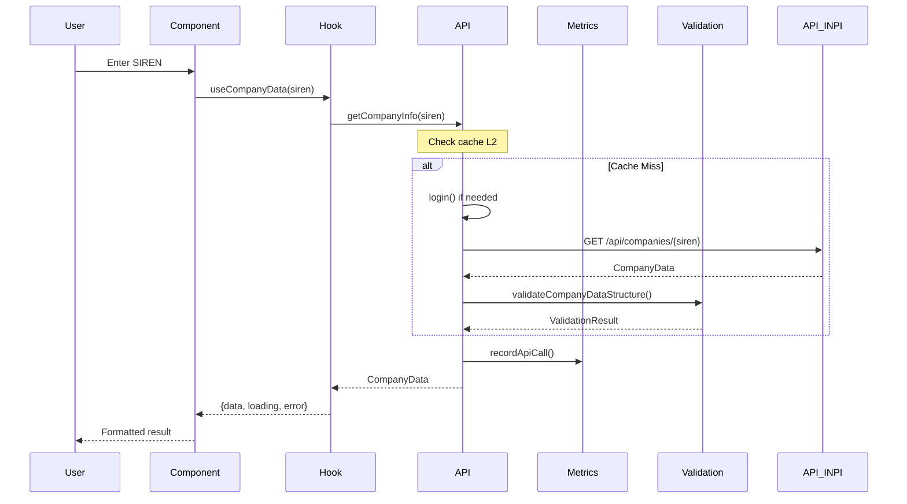
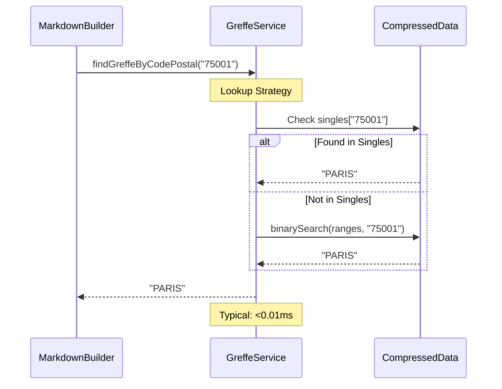

# Technical Architecture

## 🏗️ Overview

The French Company Search extension follows a modular architecture optimized for performance, reliability, and maintainability.

```
┌─────────────────┐    ┌─────────────────┐    ┌─────────────────┐
│   UI Components │    │    Services     │    │   Data Layer    │
│                 │    │                 │    │                 │
│ • SearchForm    │────│ • INPI API      │────│ • Cache         │
│ • CompanyDetail │    │ • Greffe Lookup │    │ • Greffe Data   │
│ • ErrorView     │    │ • Metrics       │    │ • Validation    │
│ • Metadata      │    │ • Validation    │    │ • Types         │
└─────────────────┘    └─────────────────┘    └─────────────────┘
         │                       │                       │
         └───────────────────────┼───────────────────────┘
                                 │
                    ┌─────────────────┐
                    │  Monitoring &   │
                    │   Observability │
                    │                 │
                    │ • Performance   │
                    │ • Health Checks │
                    │ • Error Tracking│
                    └─────────────────┘
```

## 📦 Project Structure

```
src/
├── components/           # React UI Components
│   ├── CompanyDetailsView.tsx
│   ├── CompanyMetadata.tsx
│   └── ErrorView.tsx
├── hooks/               # Custom React Hooks
│   └── useCompanyData.ts
├── services/           # Business Services
│   ├── inpi-api.ts     # INPI API Client
│   ├── greffe-lookup.ts # Optimized court registry lookup
│   ├── markdown-builder.ts # Legal text generation
│   ├── metrics.ts      # Metrics collection
│   └── api-validation.ts # API validation
├── utils/              # Utilities
│   └── formatting.ts   # French data formatting
├── types/              # TypeScript definitions
│   └── index.ts
└── __tests__/          # Tests
    ├── integration/    # Integration tests
    ├── performance/    # Performance tests
    └── services/       # Unit tests

assets/
├── greffes-index.json          # Original court registry data
├── greffes-index-compressed.json # Optimized data
└── role-mappings.json          # Legal role mappings

scripts/
└── compress-greffes.ts         # Data compression

transform/
└── build-greffes-index.ts      # Court registry index build

docs/
├── ARCHITECTURE.md
└── TROUBLESHOOTING.md
```

## 🔧 Key Components

### 1. UI Layer (React Components)

#### `SearchForm`
- **Responsibility:** Search interface with SIREN/SIRET validation
- **Validation:** Real-time 9/14 digit format checking
- **State:** Loading and error state management

#### `CompanyDetail`
- **Responsibility:** Results display orchestration
- **Hooks:** `useCompanyData` for state management
- **Actions:** Copy to clipboard (HTML/Plain text)

#### `CompanyDetailsView` / `CompanyMetadata`
- **Responsibility:** Formatted data rendering
- **Separation:** Content vs metadata display
- **Formatting:** Uses formatting utilities

### 2. Services Layer

#### `inpi-api.ts` - INPI API Client
```typescript
interface ApiClient {
  login(): Promise<string>              // Authentication with cache
  getCompanyInfo(siren: string): Promise<CompanyData>  // Company data
  clearCache(): void                    // Cache cleanup
}

Features:
• Authentication cache (10 min TTL)
• Company data cache (5 min TTL)  
• Automatic rate limiting (30 req/min)
• Retry with exponential backoff
• Automatic metrics
```

#### `greffe-lookup.ts` - Optimized Court Registry Lookup
```typescript
interface GreffeService {
  findGreffeByCodePostal(code: string): string | null  // O(1) or O(log n) lookup
  getCompressionStats(): CompressionStats             // Compression statistics
}

Performance:
• Average lookup: <0.01ms
• Compressed data: 251KB (84% reduction)
• Automatic fallback to original format
• Binary cache for ranges
```

#### `metrics.ts` - Metrics Collection
```typescript
interface MetricsSystem {
  recordApiCall(metric: ApiMetrics): void              // Automatic recording
  getStats(timeRange?: number): PerformanceStats      // Period statistics
  getHealthStatus(): HealthStatus                     // System health
}

Collected metrics:
• Response times (avg, P95, P99)
• Success rates per endpoint
• Errors by type
• Cache usage
```

#### `api-validation.ts` - API Structure Validation
```typescript
interface ValidationSystem {
  validateCompanyDataStructure(data: any): ValidationResult    // Structure validation
  detectApiChanges(current: any, baseline: any): ChangeDetection  // Change detection
  createApiBaseline(response: CompanyData): Baseline           // Baseline creation
}

Validation:
• PersonneMorale/PersonnePhysique structure
• Old/new API format compatibility
• Change detection with risk level
```

### 3. Data Layer

#### Multi-Level Cache System
```typescript
// Cache L1: Authentication (in-memory)
authToken: { token: string; expiresAt: number }

// Cache L2: Company data (in-memory, 5 min)
companyCache: Map<string, { data: CompanyData; timestamp: number }>

// Cache L3: Court registry data (on-disk, compressed)
greffeData: CompactGreffeData
```

#### Court Registry Data Optimization
```typescript
// Original format: 28,136 entries = 1.57MB
Record<string, string>  // "75001" → "PARIS"

// Compressed format: 6,337 entries = 251KB  
interface CompactGreffeData {
  ranges: GreffeRange[]     // Consecutive ranges
  singles: Record<string, string>  // Isolated codes
  metadata: CompressionMetadata
}

// Hybrid search algorithm:
// 1. Direct lookup in singles O(1)
// 2. Binary search in ranges O(log n)
// 3. Performance: <10ms guaranteed, <0.01ms typical
```

## ⚡ Performance Optimizations

### 1. Court Registry Data - 84% Compression

**Original Problem:**
- 28,136 postal code → court registry mappings
- 1.57MB file loaded at each startup
- O(1) lookup but high memory footprint

**Implemented Solution:**
```typescript
// Detection of consecutive ranges
// 75001, 75002, 75003 → "PARIS" becomes:
{ start: "75001", end: "75003", greffe: "PARIS" }

// Isolated codes remain in direct mapping
{ "20000": "AJACCIO" }  // Isolated Corsica code

// Result: 77% entry reduction, 84% size reduction
```

### 2. Strategic Multi-Layer Caching

**L1 - Token Cache (10 min):**
- Avoids excessive re-authentication
- Automatic expiration management
- Invalidation on 401 errors

**L2 - Company Cache (5 min):**
- Avoids repeated API calls for same SIREN
- TTL adapted to data change frequency
- Manual invalidation possible

**L3 - Court Registry Cache (permanent):**
- Static data, changes rarely
- Compressed format for memory economy
- Fallback to original format

### 3. Intelligent Rate Limiting

```typescript
class RateLimiter {
  private calls: number[] = []
  private readonly maxPerMinute = 30
  
  checkLimit(): void {
    const now = Date.now()
    // Sliding window: remove calls > 1 min
    this.calls = this.calls.filter(time => time > now - 60000)
    
    if (this.calls.length >= this.maxPerMinute) {
      throw new Error("Rate limit exceeded")
    }
    
    this.calls.push(now)
  }
}
```

## 🎯 Architectural Patterns

### 1. Error Handling Pattern

```typescript
// Structured error propagation
try {
  const data = await getCompanyInfo(siren)
  return formatCompanyData(data)
} catch (error) {
  if (error.status === 404) {
    return { error: "Company not found", fallback: "Check SIREN format" }
  }
  // Automatic log + metrics
  metrics.recordError(error)
  throw new UserFriendlyError("Service temporarily unavailable")
}
```

### 2. Retry with Backoff Pattern

```typescript
async function withRetry<T>(fn: () => Promise<T>, maxRetries = 3): Promise<T> {
  for (let i = 0; i < maxRetries; i++) {
    try {
      return await fn()
    } catch (error) {
      if (i === maxRetries - 1) throw error
      
      const delay = Math.min(1000 * Math.pow(2, i), 5000)  // Cap at 5s
      await new Promise(resolve => setTimeout(resolve, delay))
    }
  }
}
```

### 3. Observer Pattern for Metrics

```typescript
// Automatic collection without coupling
class ApiCall {
  async execute() {
    const startTime = Date.now()
    try {
      const result = await this.performCall()
      this.notifySuccess(Date.now() - startTime)
      return result
    } catch (error) {
      this.notifyError(error, Date.now() - startTime)
      throw error
    }
  }
  
  private notifySuccess(duration: number) {
    metrics.recordApiCall({
      endpoint: this.endpoint,
      responseTime: duration,
      success: true
    })
  }
}
```

## 🔄 Data Flow

### 1. Company Search (Main Flow)



### 2. Court Registry Lookup (Optimized)



## 📊 Monitoring and Observability

### 1. Automatic Metrics

```typescript
// Collected automatically on each API call
interface ApiMetrics {
  endpoint: string         // "/api/companies/123456789"
  method: string          // "GET"
  responseTime: number    // Time in ms
  statusCode: number      // 200, 404, 500, etc.
  success: boolean        // true/false
  errorType?: string      // "AxiosError", "NetworkError"
  retryCount?: number     // Number of attempts
  timestamp: number       // Recording timestamp
}
```

### 2. Health Checks

```typescript
// Automatic health verification
const healthCriteria = {
  minSuccessRate: 95,        // 95% minimum
  maxAvgResponseTime: 3000,  // 3s maximum
  maxP95ResponseTime: 5000   // 5s P95 maximum
}

// Continuous evaluation
PerformanceMonitor.isHealthy() // boolean
PerformanceMonitor.getHealthStatus() // details + recommendations
```

### 3. Alerting and Diagnostics

```typescript
// Automatic logs in development
if (responseTime > 5000) {
  console.warn(`[PERF] Slow API call: ${endpoint} took ${responseTime}ms`)
}

if (successRate < 80) {
  console.warn(`[PERF] High error rate: ${successRate}% over 5 minutes`)
}
```

## 🛡️ Security and Resilience

### 1. Credentials Management

```typescript
// Secure storage via Raycast
const preferences = getPreferenceValues<Preferences>()

// Client-side validation
function validateCredentials(username: string, password: string) {
  if (!username?.includes('@')) {
    throw new Error("Username should be an email")
  }
  // No complex password validation to avoid false positives
}
```

### 2. Rate Limiting Protection

```typescript
// API abuse prevention
const rateLimiter = new RateLimiter(30, 60000) // 30 req/min

// 429 error handling
if (error.status === 429) {
  const retryAfter = error.headers['retry-after'] || 60
  await sleep(retryAfter * 1000)
  return retry()
}
```

### 3. Data Validation

```typescript
// Strict API structure validation
const validation = validateCompanyDataStructure(response)
if (!validation.valid) {
  // Log errors for debugging
  console.error('API structure changed:', validation.errors)
  
  // Graceful fallback with partial data
  return buildMarkdownWithFallbacks(response)
}
```

## 🔮 Evolution and Extensibility

### 1. Plugin Architecture

The architecture allows easy addition of new services:

```typescript
// Common interface for legal data services
interface LegalDataService {
  validateInput(input: string): boolean
  fetchData(identifier: string): Promise<CompanyData>
  formatOutput(data: CompanyData): string
}

// Specific implementations
class InpiService implements LegalDataService { /* ... */ }
class GrenobleService implements LegalDataService { /* ... */ }
```

### 2. Monitoring Extensions

```typescript
// Custom metrics easily addable
metrics.recordCustomMetric({
  name: 'greffe_lookup_performance',
  value: lookupTime,
  tags: { postal_code: code, greffe: result }
})
```

### 3. API Adaptability

```typescript
// Validation system automatically detects changes
const changes = detectApiChanges(newResponse, baseline)
if (changes.riskLevel === 'high') {
  // Developer notification + automatic fallback
  notifyApiChange(changes)
  return handleDeprecatedFormat(newResponse)
}
```

This architecture ensures long-term performance, reliability, and maintainability while preserving simplicity for the end user.