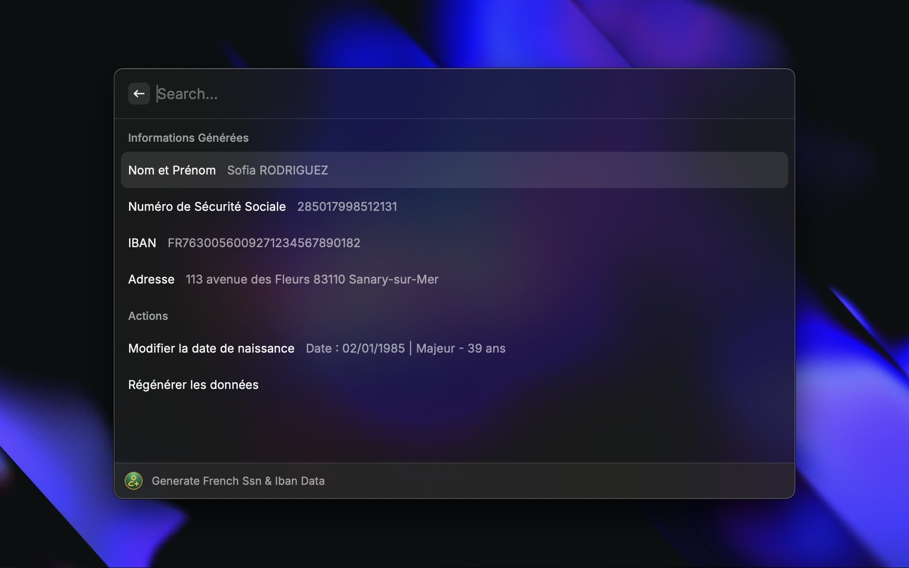
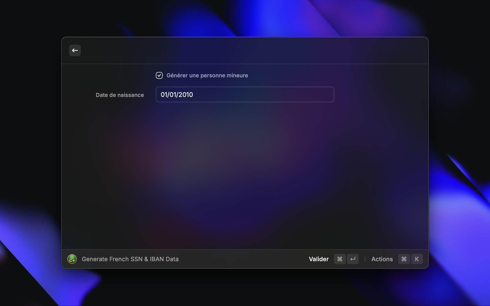

# French SSN & IBAN Generator

A Raycast extension specifically designed for generating realistic French fake data, including Social Security Numbers (SSNs), IBANs, BICs, and random names. Ideal for developers, testers, and others needing placeholder data with proper French formatting.

---

## 🚀 Features

- **Generate Random Data**:
  - **Social Security Numbers (SSNs)**: Generated with proper logic tied to the date of birth and place of birth (department and commune). This ensures realistic formatting for French SSNs.
  - **IBANs and BICs**: Based on predefined French bank samples.
  - **Random Names**: Male and female names, using common French first and last names.
- **Customizable Options**:
  - Specify a **date of birth**, which directly impacts the generated SSN.
  - Select gender for name generation (male/female).
  - Option to generate data for **minors** or **adults**.
- **Copy to Clipboard**: Quickly copy any generated data to your clipboard with a single click.
- **Menu Bar Integration**: View and regenerate data directly from your menu bar.

---

## 🔍 How the SSN Works

French Social Security Numbers (SSNs) follow a specific structure:

1. **Gender**: `1` for male, `2` for female.
2. **Year of Birth**: The last two digits of the year (`YY`).
3. **Month of Birth**: A two-digit month (`MM`).
4. **Place of Birth**: A five-digit code (`DDDCC`) indicating the department (`DDD`) and commune (`CC`).
5. **Order Number**: A three-digit unique number (`OOO`).
6. **Control Key**: A two-digit key (`KK`) calculated using modulo 97.

For example:

- **Date of Birth**: 27/07/1995.
- **Place of Birth**: Department `75` (Paris), Commune `101`.
- **SSN**: `19507510100123`.

Changing the **date of birth** or the **place of birth** will result in a completely different SSN.

---

## 📸 Screenshots

### Main Interface



### Edit Date of Birth



---

## 🛠 Installation

1. Clone the repository:

   ```bash
   git clone https://github.com/YoannDrx/FakeDataGenerator.git
   ```

   2. Navigate to the project directory if needed:

   ```bash
   cd fake-data-generator
   ```

2. Install dependencies:

   ```bash
   npm install
   ```

3. Run the extension in development mode:

   ```bash
   npm run dev
   ```

4. Add the extension to Raycast for testing.

### 📋 Usage

**Regenerate Data:** Use the "Regenerate Data" action to create new random data.
**Edit Date of Birth:** Modify the date of birth to generate an SSN tied to the new date.
**Toggle Minor/Adult:** Use the checkbox to generate data for minors or adults.
**Copy to Clipboard:** Click on any field to copy its value to your clipboard.
**Menu Bar Integration:** View and regenerate data directly from the Raycast menu bar.

Thx for using this extension! 🎉
