# Fuelix

Unofficial support to use Fuelix Platform from the comfort of Raycast

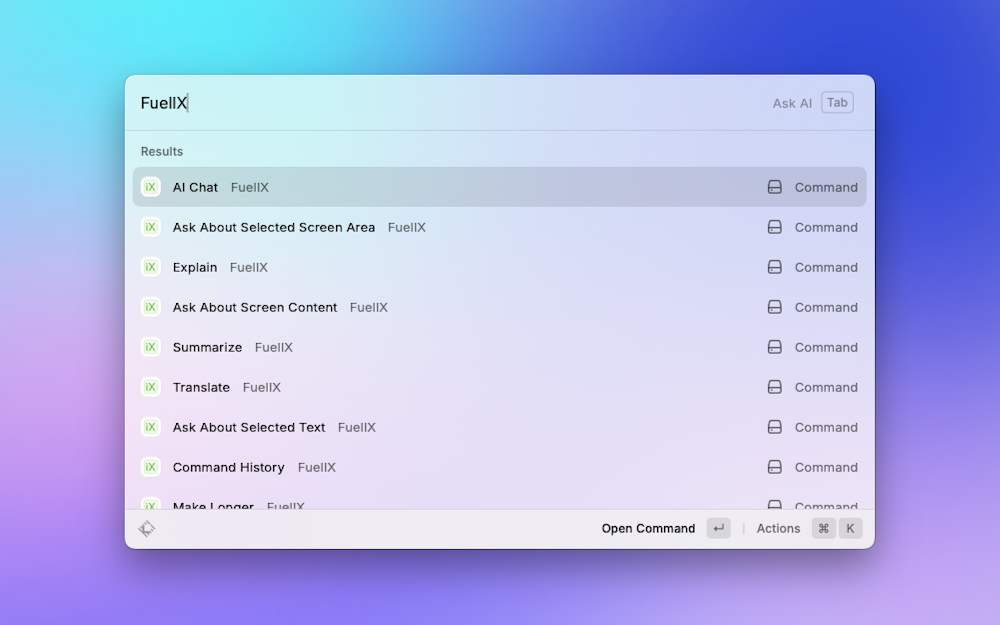

## Getting an API Key

1. Go to [Fuelix Dev Portal](https://dev.fuelix.ai)
2. Click on "Create New Project"
3. Enter project name, description and enable the Core API PR.
4. Click on "Create Project"
5. Open the new project
6. On API Keys section, create a new Key

You're all good to go!

## Features

### Core AI Commands

#### Ask AI

Straight from your command bar, ask anything that you wanted and get an AI-generated answer without any effort.

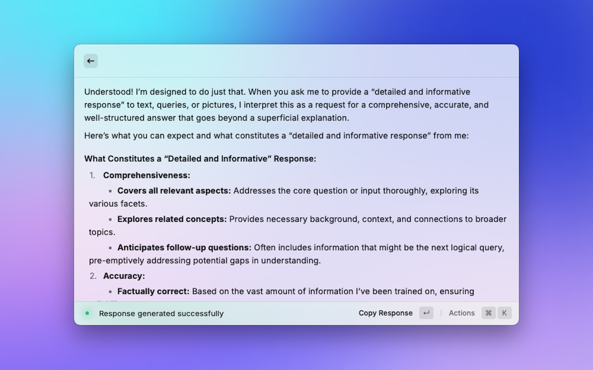

#### AI Chat

Continue talking about everything right where you left off. Have ongoing conversations with Fuelix AI.

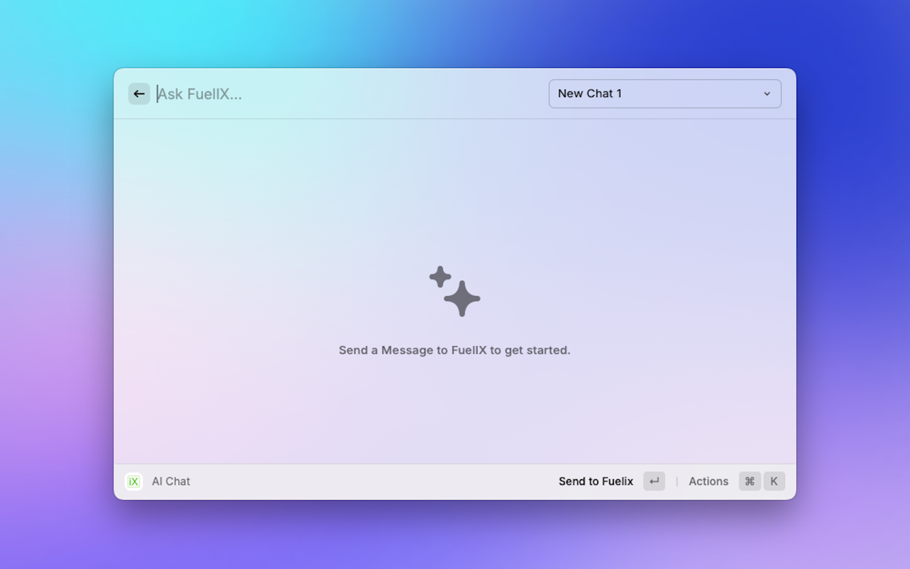

Create a new Chat

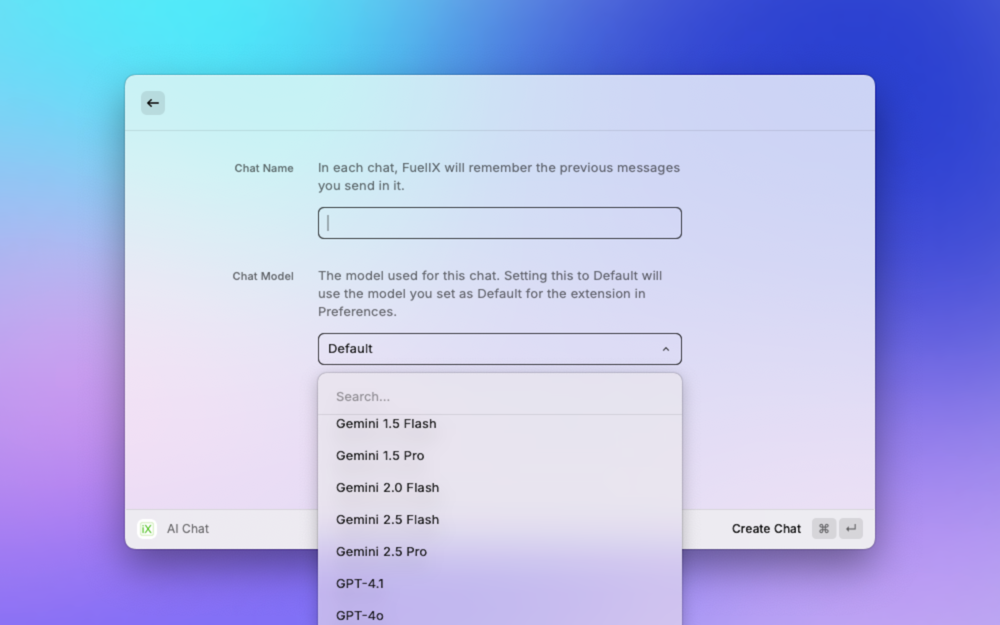

#### Command History

View your command history to keep track of your previous interactions.

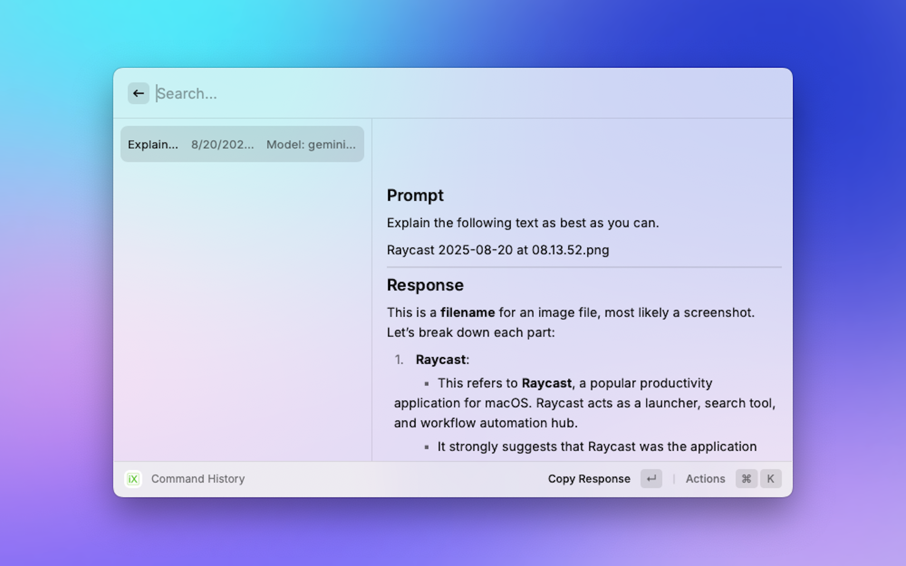

### Screen Analysis Commands

#### Ask About Screen Content

Capture a screenshot of your entire screen and ask Fuelix AI questions about what's displayed. Enter your query and the AI will analyze the screenshot to provide detailed answers about the content, layout, or any specific elements visible on your screen.

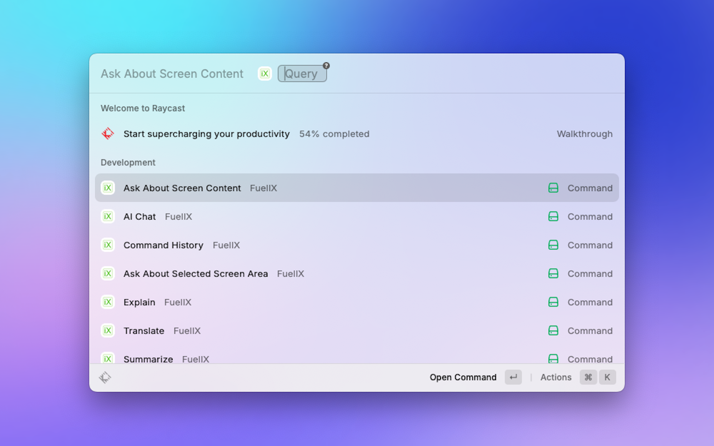

#### Ask About Selected Screen Area

Capture a screenshot of a specific selected area of your screen and ask Fuelix AI about that particular region. This allows for more focused analysis of specific parts of your screen - perfect for analyzing particular windows, sections, or UI elements.

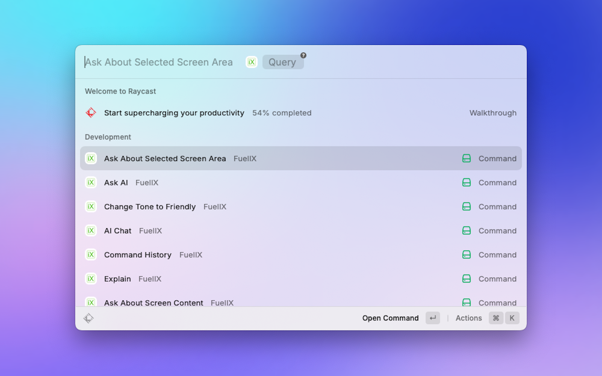

#### Ask About Selected Text

Ask Fuelix AI about your selected text for detailed explanations or analysis.

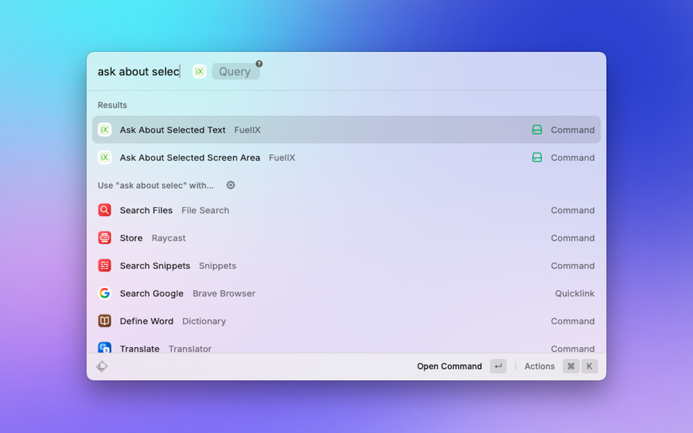

### Text Processing Commands

#### Summarize

Quickly summarize any text to get the key points and main ideas.

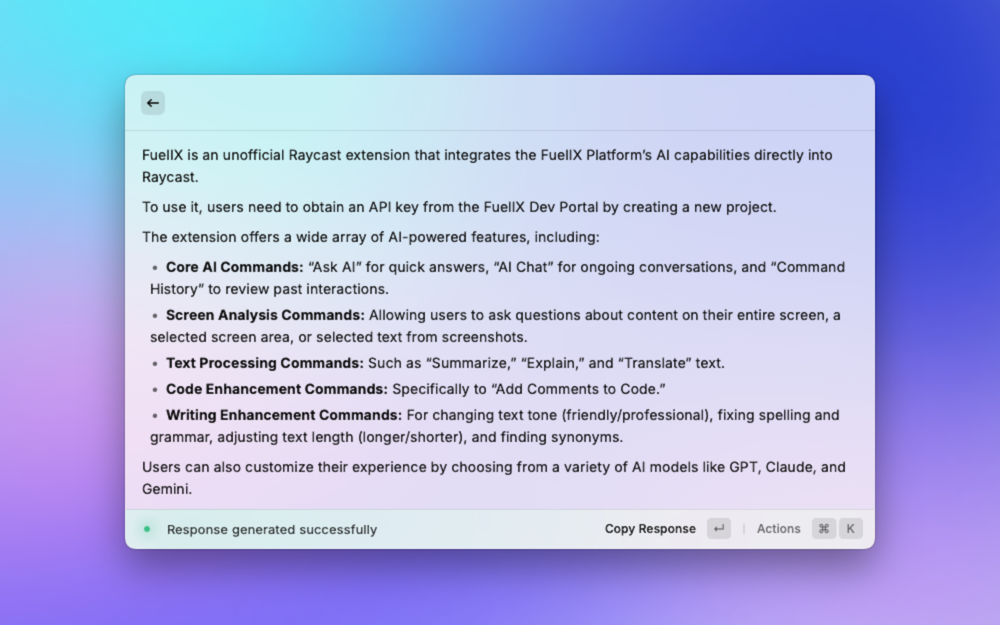

#### Explain

Get detailed explanations of complex text, concepts, or content.

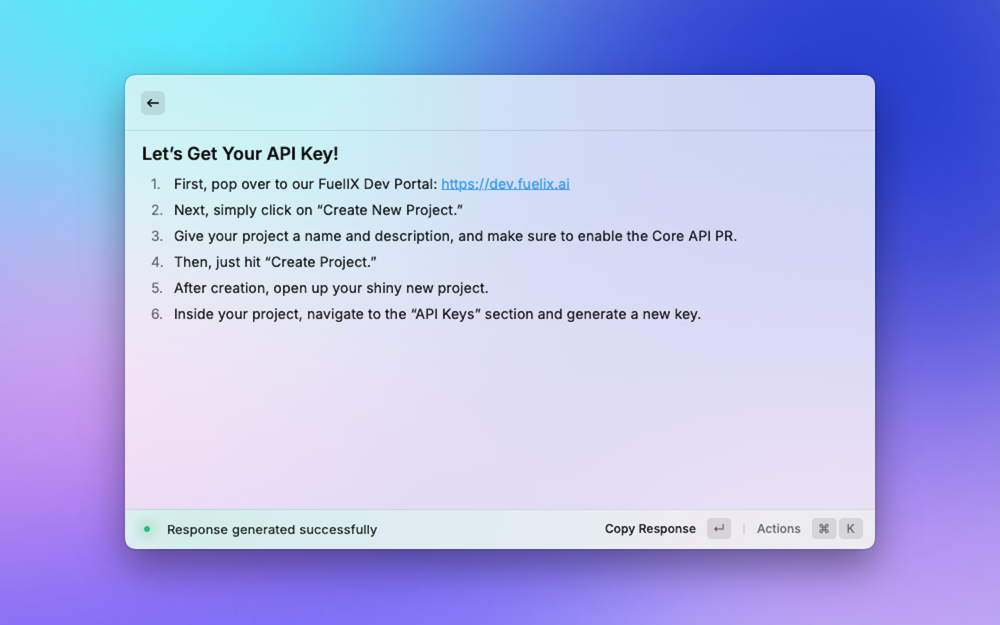

#### Translate

Translate text between different languages with customizable target languages.

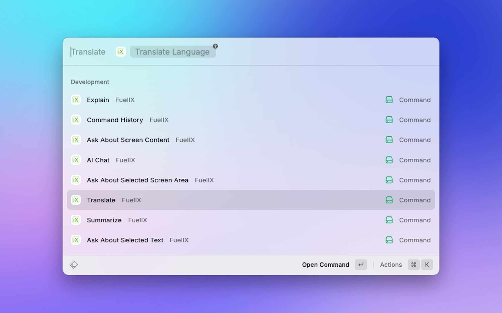

### Code Enhancement Commands

#### Add Comments to Code

Automatically add helpful comments to your code to improve readability and documentation.

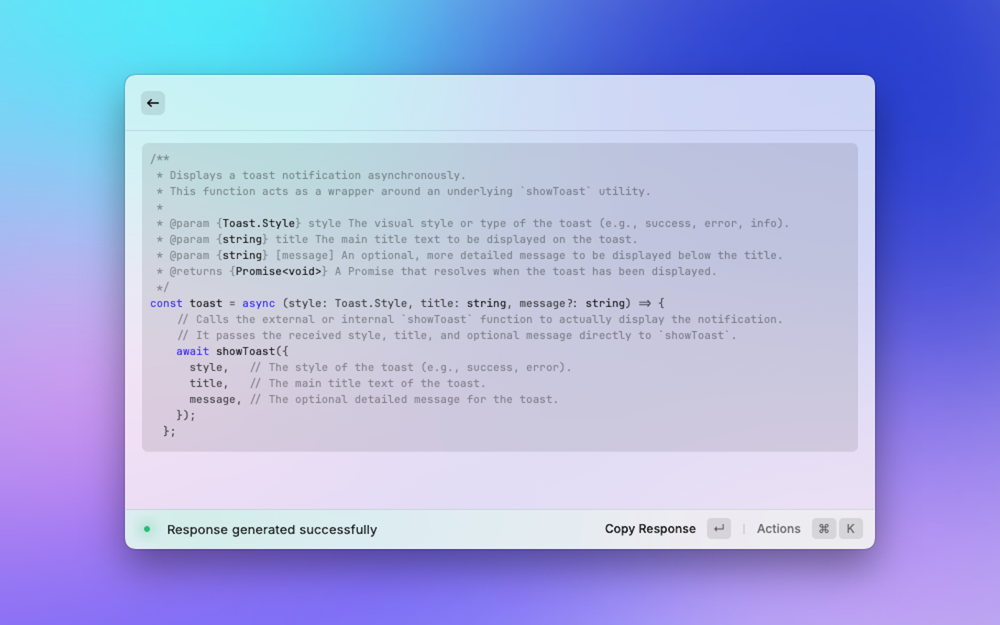

### Writing Enhancement Commands

#### Change Tone to Friendly

Transform your text to have a more friendly and approachable tone.

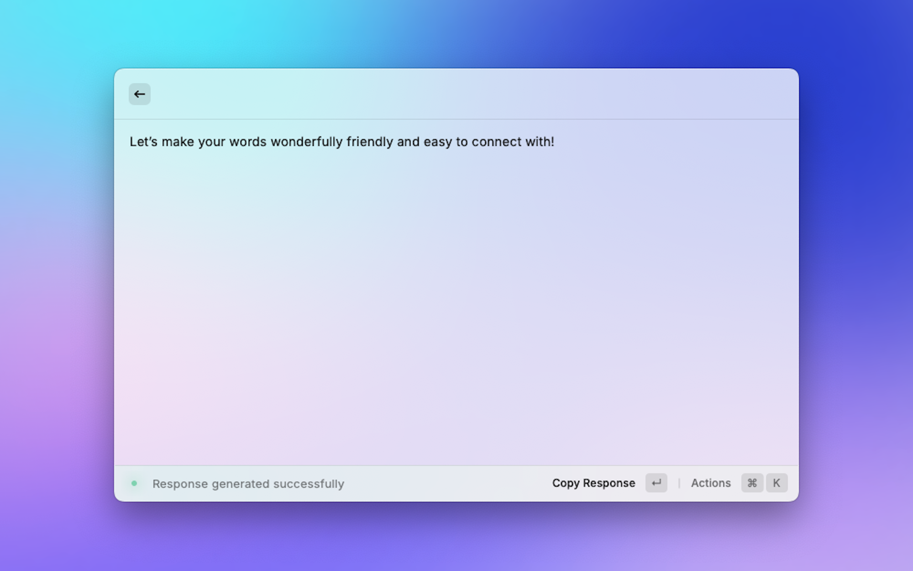

#### Change Tone to Professional

Convert your text to use professional language with advanced vocabulary and proper grammar.

#### Fix Spelling and Grammar

Correct spelling errors and grammar issues in your text while maintaining the original meaning.

#### Make Longer

Expand your text to be more detailed without adding extra information beyond what's given.

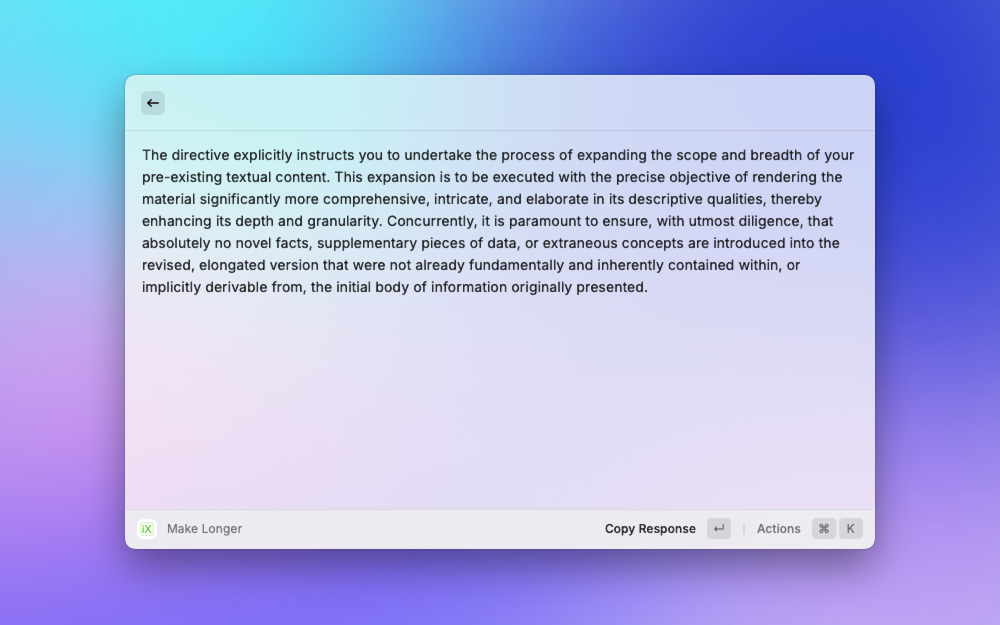

#### Make Shorter

Condense your text while keeping the core idea and essential information.

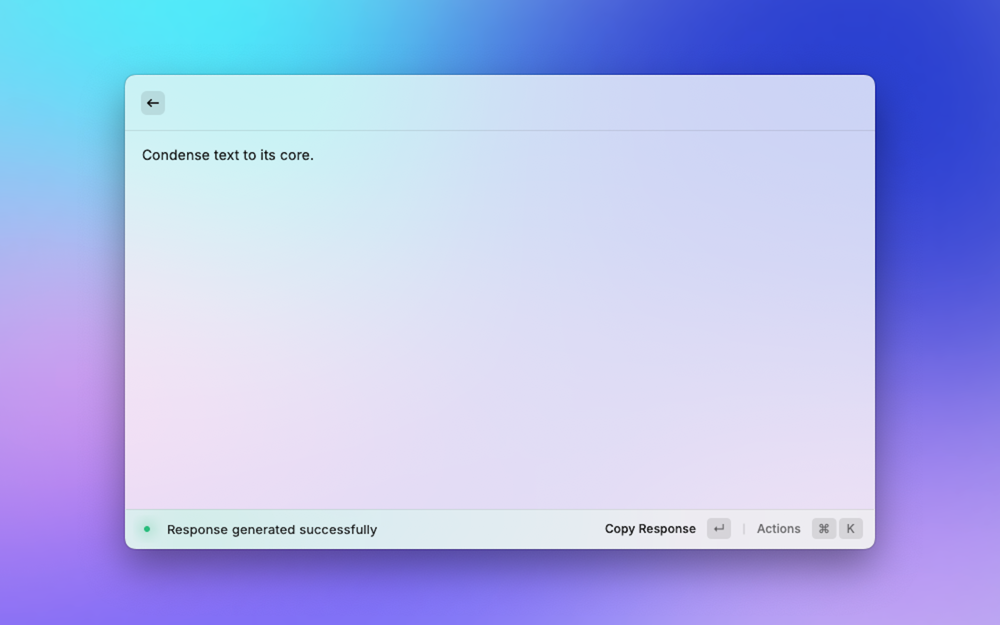

#### Find Synonym

Find appropriate synonyms for selected words to improve your writing variety.

### Personalized for you, really

Customize the model to your liking. Choose from a wide variety of AI models including GPT, Claude, Gemini, and more.

