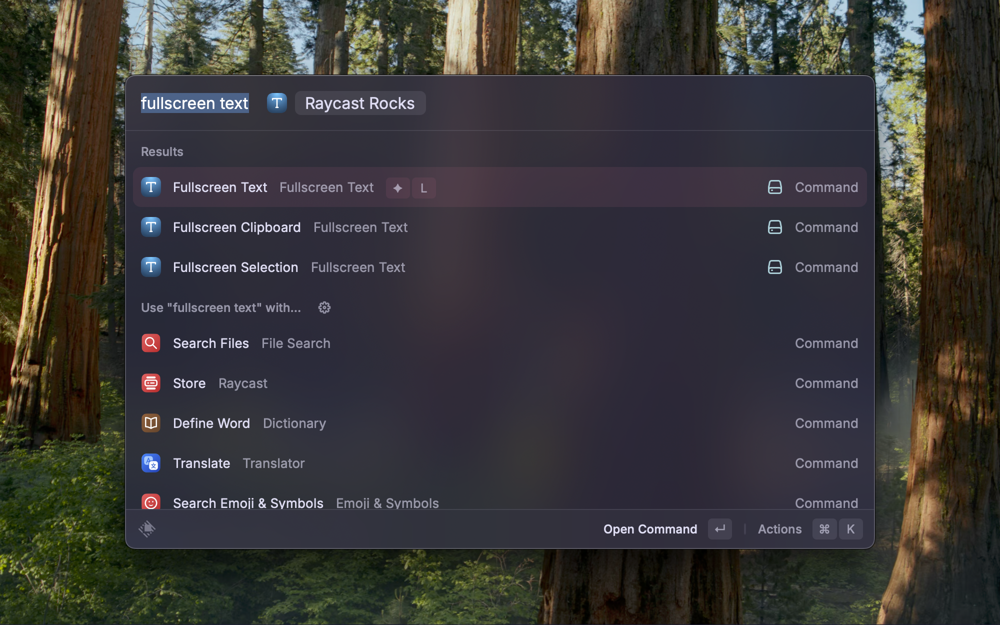

# Fullscreen Text

Display any text in a fullscreen overlay. This works with multiple displays: the text will on the display where the mouse is.

The overlay can be closed with a mouse click or when you press the ESC key.

## Commands

* Fullscreen Text [text]
  * Display any text fullscreen
* Fullscreen Selection
  * Display selected text fullscreen
* Fullscreen Clipboard
  * Display clipboard text fullscreen

## Screenshots

