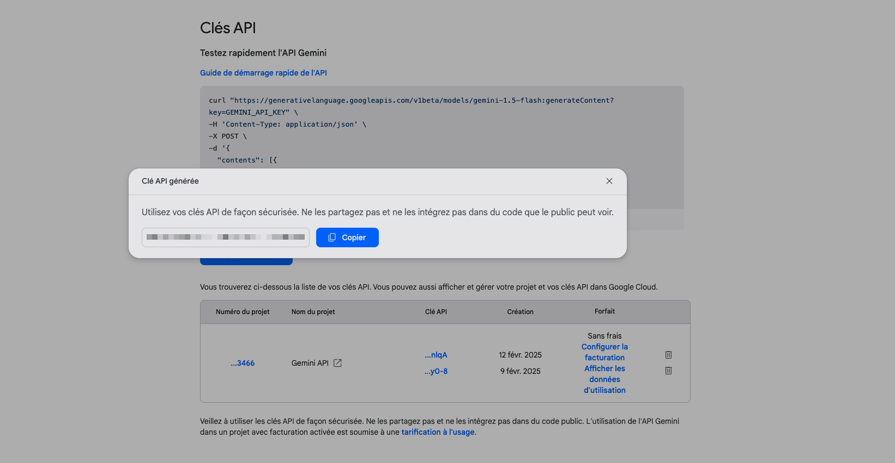

# Gemini Assistant

Gemini Assistant is a versatile extension for Raycast that harnesses the power of Google's Gemini API to enhance your productivity. Whether you need automated code reviews, intelligent suggestions, or quick answers to complex questions, Gemini Assistant is your go-to tool for AI-driven insights and support. The extension operates for free using your own Gemini API key, ensuring seamless integration and cost-effective usage.

## How to obtain a Google AI Studio API key

> ⭐ It is **free** and you get 15 request per minute to the model and 1500 requests a day.

1. First go to the [Google AI studio website](https://ai.google.dev/aistudio?hl=fr) and click the "Sign in to Google AI Studio" button.

2. Then click on the "Get API key" button

3. Click on the "Create API key" button and select one of your Google Cloud Project to generate the key (create a project if you don't have any).

4. The API key will then be generated. Now, all you have to do is copy and past this key inside the prompted extension field.

## Add the API key to the Raycast extension

### By launching the extension

When you will run the extension for the first time, you will prompted to
insert you API key in the dedicated field.

### By configuring the extension

Alternatively, you can add the Gemini API Key inside the configuration panel of the extension.

