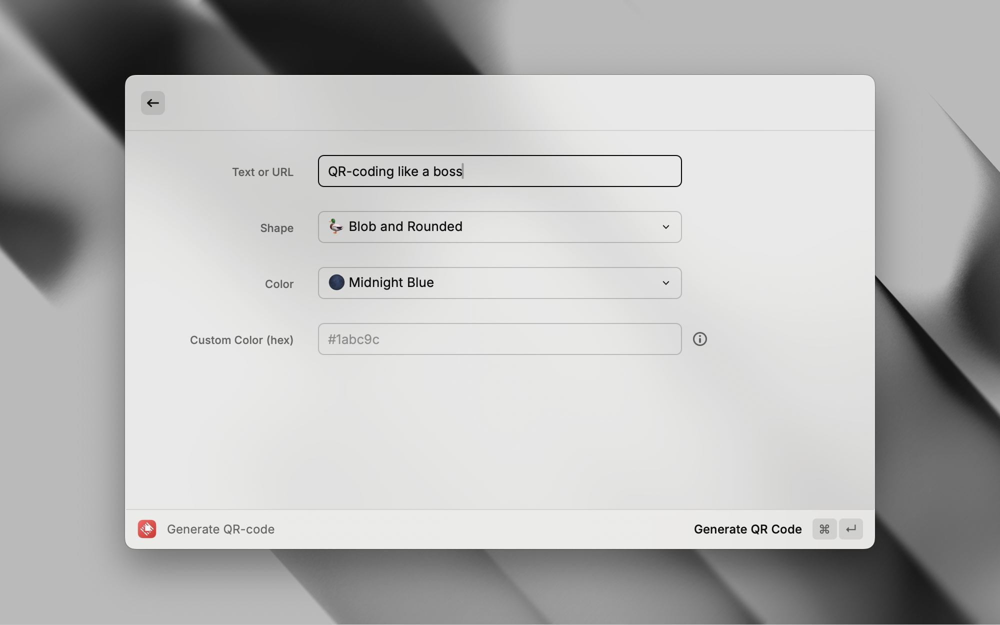
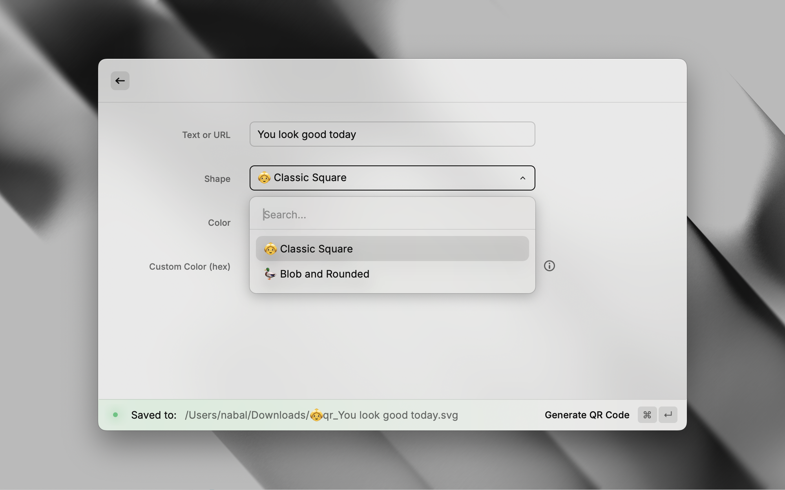
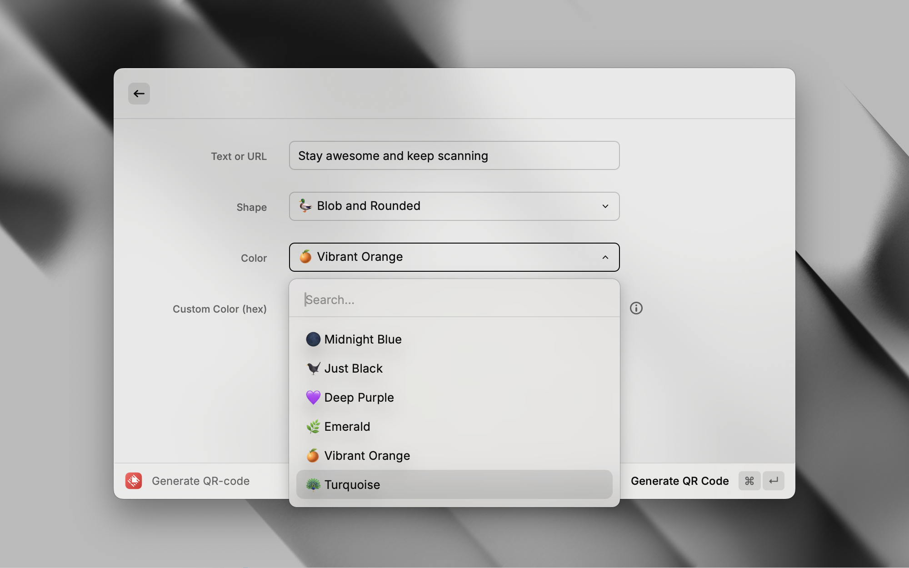

# QR Code Generator with Stylish

This Raycast extension allows you to generate QR codes with custom styling.

  
  
  

## Features

- Generate QR codes with custom styling
- Supports both classic and blob-style QR code shapes
- Customizable QR code colors
- Configurable save location
- Generate a QR code from your clipboard with a single shortcut

## Installation

1. Open the Raycast Store.
2. Search for "QR Code Generator with QR Code Styling".
3. Click the "Install" button.

## Usage

### Command: Generate QR Code

1. Open Raycast and type "Generate QR Code" or "gqr" to run the command.
2. If there is text in your clipboard, it will be used as the QR code content; otherwise, you can type text in the input field.
3. Choose the QR code type and color.
4. If you set a Custom QR Code color, it will take priority over the selected QR code color.
5. Click the "Generate" button.
6. The QR code will be saved in the specified folder (default: `~/Downloads`). The file name will be in the format `qr_{your_text}.svg`.
7. You can also specify the save folder in the command settings.

### Command: Generate QR Code from Clipboard

1. Open Raycast and type "QR Code from Clipboard" or "gcb" to generate a QR code from your clipboard content.
2. It is recommended that you assign a shortcut to this command in Raycast settings.
3. You can specify the QR code type, color, and save folder in the command settings.
4. The QR code will be saved in the specified folder (default: `~/Downloads`). The file name will be in the format `qr_{your_text}.svg`.

## Preferences

- **QR Code Type:** Choose between `👵 Classic Square` or `🦆 Blob and Rounded` shapes (Default: `🦆 Blob and Rounded`).
- **QR Code Color:** Select a color from the dropdown list (Default: `Midnight Blue`).
- **Custom Color:** Set a custom color in HEX format. If a custom color is specified, it will take priority over the selected QR code color.
- **Save Location:** Specify the folder path for saving QR codes (Default: `~/Downloads`). You can also set the save folder in the command settings.

## Contributing

Contributions to this project are very welcome! Here are some ideas on how you can help improve the QR Code Generator:

1. **Improve the Blob QR Code Generator:**  
   Currently, a workaround is used to avoid rounding errors by reapplying white modules over the generated QR code. Ideally, a more elegant solution should be implemented so that extra areas are not unnecessarily filled.

2. **Add New QR Code Shapes:**  
   Explore and implement new styles or shapes for QR codes beyond the classic and blob styles.

3. **Extend Output Formats:**  
   Consider adding options to export the final QR code in alternative formats such as PNG.

4. **Change Background Color:**  
   Implement features to allow changing the background color of the QR code.

5. **Customize Finder Patterns:**  
   Provide the ability to customize the finder patterns separately from the rest of the QR code.

6. **Embed a Custom Logo:**  
   Allow users to add their own logo or image inside the QR code for a personalized touch.

7. **Suggest Alternative QR Code Libraries:**  
   Raycast runs in a Node.js environment without a DOM, so if you know of any ready-made QR code generation libraries that work without relying on a DOM structure, please share your recommendations.

8. **Other Fresh Ideas:**  
   Feel free to propose and implement any other ideas that could enhance the project.

If you're interested in contributing, please open an issue or submit a pull request with your ideas and improvements. Your help is greatly appreciated!

## Author

Created by [Alexander Bedelev](https://github.com/na-bal)

## License

MIT