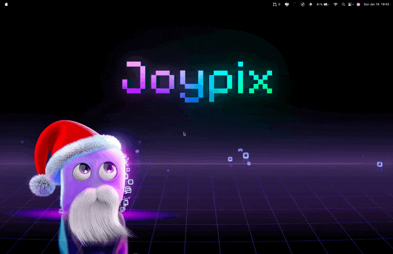

<h1 align="center">Generate Secret</h1>

A Raycast extension that generates secure random secrets of various lengths and copies them to your clipboard.

## Features

- 🔐 Generate cryptographically secure random secrets
- 📏 Multiple lengths: 16, 32, 64, and 128 characters
- 📋 Automatic clipboard copy
- ✨ Beautiful UI with visual feedback
- ⚡️ Instant generation
- 🎯 Default length configurable in preferences
- 🌐 Also available as a web version at [generate-secret.nyxb.nexus](https://generate-secret.nyxb.nexus)

## Web Version

This Raycast extension is based on the web version available at [generate-secret.nyxb.nexus](https://generate-secret.nyxb.nexus). If you need to generate secrets without Raycast, you can use the web interface which offers the same secure generation features.

## Installation

Install this extension from the [Raycast Store](https://raycast.com/nyxb/generate-secret).

## Usage

1. Open Raycast and search for "Generate Secret"
2. Select your desired secret length (16, 32, 64, or 128 characters)
3. The secret will be automatically generated and copied to your clipboard
4. A success notification will confirm the copy action

## Configuration

You can set your preferred default secret length in the extension preferences:

1. Open Raycast Settings (`⌘,`)
2. Go to Extensions > Generate Secret
3. Select your preferred default length from the dropdown

## Security

This extension uses Node.js's native `crypto` module to generate cryptographically secure random values, making it suitable for:

- API Keys
- Passwords
- Security Tokens
- Other secure credentials

## License

MIT License
