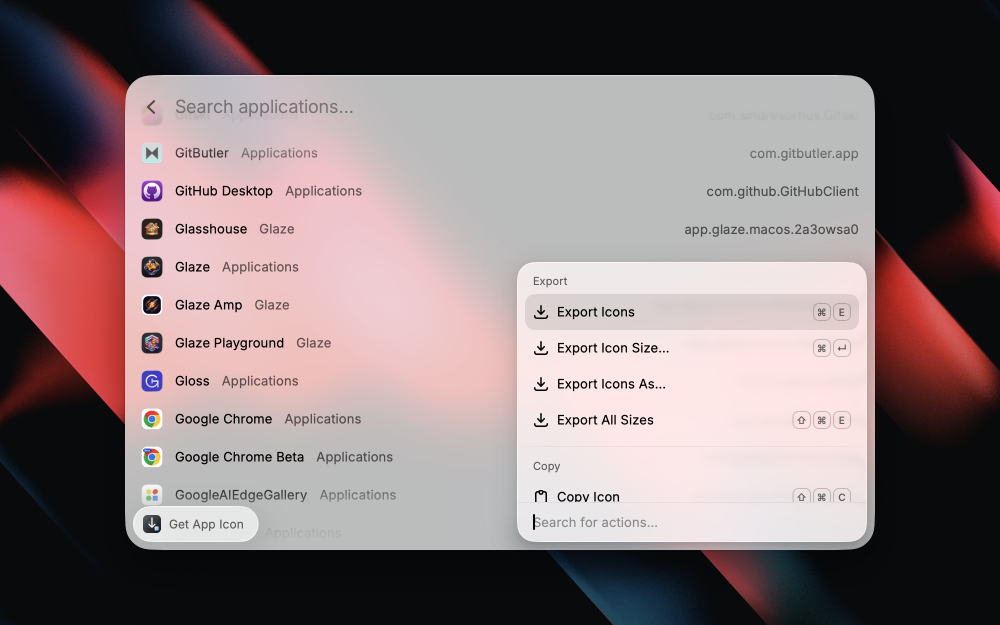
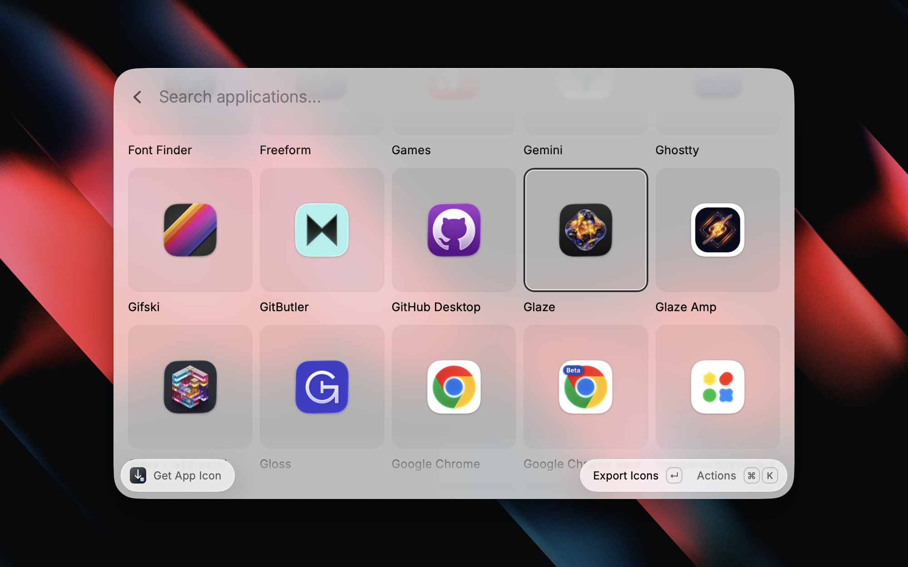

# Get App Icon

Quickly save or copy an app's icon in multiple sizes and formats.

  
  
  

## How It Works

The command lists all installed macOS applications (sorted alphabetically) in a list or grid view.

Icons are extracted using macOS `NSWorkspace`, which resolves the correct icon for every app — including those using Asset Catalogs — just like Finder does.

Each app gets its own folder under the configured output path, named with the app's version (e.g. `Bleep 3.4.0 App Icons`), with format-specific subdirectories (PNG, JPEG, ICNS). Because the version is part of the folder name, exporting again after an app updates keeps the older icons instead of replacing them.

## Preferences

- **Default View**: Choose whether to display applications as a list or grid. You can also toggle views on the fly with `⌘G` / `⌘L`.
- **Output Folder**: Where exported icons are saved. Each app gets its own subfolder. Defaults to `~/Downloads/`.
- **Default Size**: The size used by **Export Icons** (`⌘E`). Defaults to 512px. Use **Export Icon Size…** for a one-off size, or **Export All Sizes** (`⌘⇧E`) for every size.
- **Formats**: PNG (default), JPEG, and/or ICNS. Multiple formats can be enabled at once, and each gets its own subdirectory.

## Actions

### Export

- **Export Icons** (`⌘E`): Exports the configured **Default Size** to the app's folder in the enabled formats.
- **Export All Sizes** (`⌘⇧E`): Exports every size (16–1024) regardless of preferences, as a one-off.
- **Export Icon Size…**: Opens a submenu to pick a single size, then exports just that one. ICNS is skipped here, since an `.icns` file always contains every size.
- **Export Icons As…**: Opens a submenu to pick a single format (PNG, JPEG, or ICNS), then exports the **Default Size** in just that format — handy when your default is PNG but you occasionally want only the ICNS, without changing preferences.

Exports overwrite files of the same name. Since folders are versioned, that only affects re-exporting the *same* version of an app — which is what you want when repairing a partial export.

### Copy

- **Copy Icon** (`⌘⇧C`): Copies the app icon at the configured **Default Size** to the clipboard as an image. You can paste it directly into design tools, documents, or chat apps.
- **Copy Icon Size…**: Opens a submenu to pick a specific size, then copies that icon to the clipboard.
- **Copy App Path** (`⌘⌃C`): Copies the full path to the `.app` bundle.
- **Copy App Name** (`⌘⌥C`): Copies the app's display name.
- **Copy Bundle Identifier**: Copies the app's bundle ID (e.g. `com.apple.Safari`).

### View

- **View as Grid** (`⌘G`) / **View as List** (`⌘L`): Toggle between list and grid views. Your choice is remembered across sessions.

### App

- **Show in Finder**: Reveals the app in Finder.
- **Show Info in Finder** (`⌘I`): Opens the Finder info window for the app.
- **Show Export Folder in Finder** (`⌘F`): Opens the export folder for the installed version, falling back to an older unversioned export, then to your output folder if you haven't exported this app yet.

## Limitations

- **ICNS export is not available for all apps.** Some modern macOS apps use Asset Catalog icons (`Assets.car`) instead of traditional `.icns` files. PNG and JPEG export works for all apps, but ICNS export requires the original `.icns` file to be present in the app bundle.
- **Upscaling may occur.** When exporting at sizes larger than the app's native icon resolution, the extracted icon may appear blurry.
