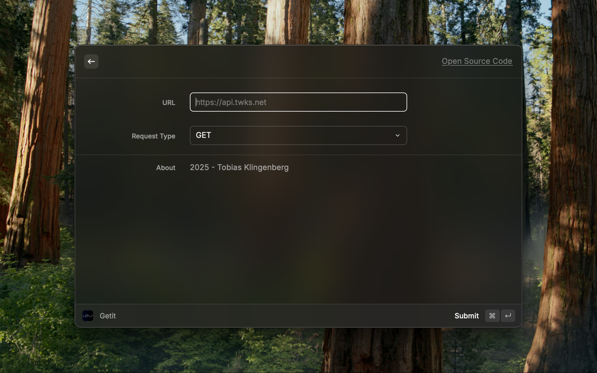
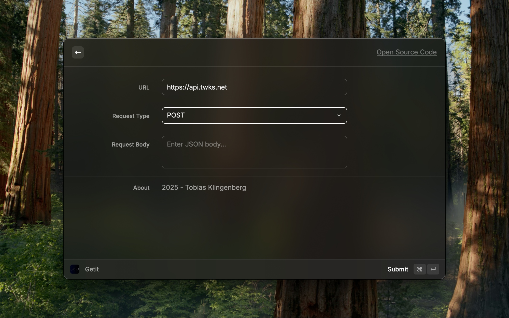
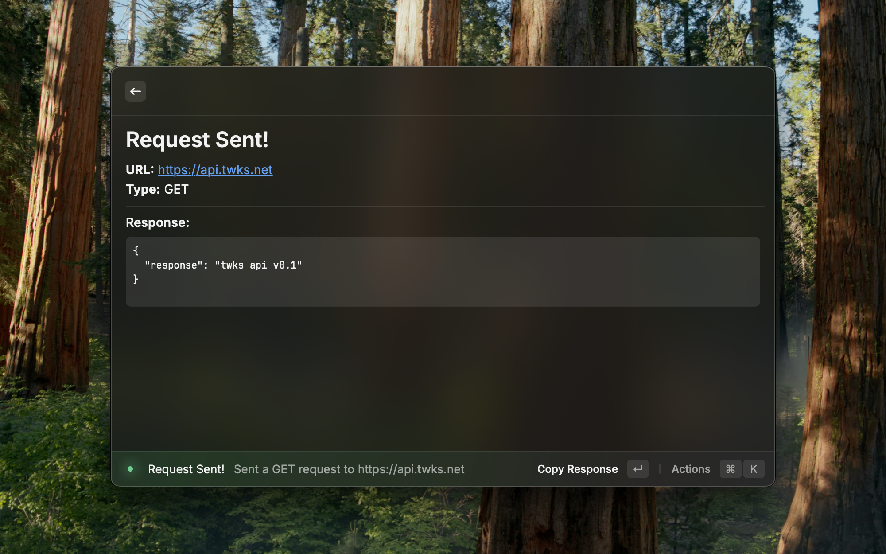

# Getit

Getit is an extension for Raycast, allowing users to easily and quickly send requests to API and any other services.
Simply paste in the URL and choose the request type.

The response can quickly be copied to the clipboard for easy usage.

# Installation

Install it via the Raycast Extensions Store

# Usage

1. Use command "getit" to open the menu.
2. Set your URL
3. Set the request type
4. If request uses a body, input it 
5. Use CMD + ENTER to send the request
6. See the response
7. Copy the response to your clipboard using ENTER

# Screenshots

