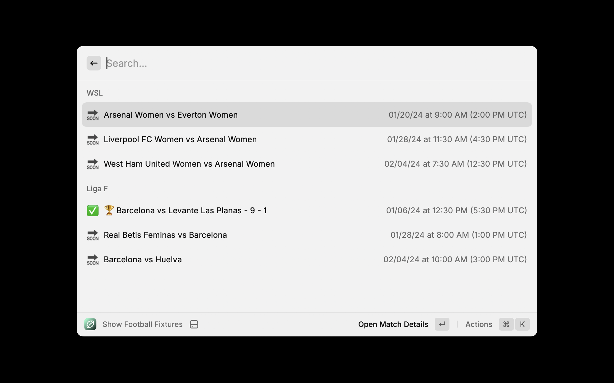

# FotMob Fixtures Extension for Raycast

This Raycast extension allows you to view upcoming and recent football matches from selected leagues and teams using the FotMob API.



## Features

- View matches for the next 30 days and the past 7 days.
- Highlight winning teams in the match list.
- Access detailed match information through clickable links.

## Prerequisites

Before you start using this extension, ensure you have Raycast installed on your system.

## Configuration

### Cache File

The extension uses a cache file to store match data. Follow these steps to create this file:

1. Navigate to the extension's configuration directory. On MacOS this:

```
/Users/username/.config/raycast/extensions/gfb/matchesCache.json
```

2. Create an empty file named `matchesCache.json`.

### Setting Up Interested Leagues and Teams

To configure the leagues and teams you are interested in:

1. Open the `fetchLeagueMatches` function in the extension's code.
2. Modify the `interestedLeagues` object. Use the format `"LeagueID": "TeamID"`. For example:

   ```javascript
   const interestedLeagues = {
     9134: "189397", // League: Team
     9907: "401657",
     9227: "258657",
   };
   ```

The extension currently supports selecting logic for only one team per league, i.e. "the team I support in that league". If you want to select multiple teams, you can modify the `fetchLeagueMatches` function to support this.

## Usage

After setting up, simply launch the Raycast extension. It will display the matches based on your configured preferences.

## Support

For any issues or feature requests, please submit an issue on the project's GitHub repository.

## Acknowledgements

- [FotMob](https://www.fotmob.com/) for providing the API used by this extension.
- [FotMob API wrapper](https://github.com/bgrnwd/fotmob) for providing the API wrapper used by this extension.
- [Raycast](https://raycast.com/) for creating the platform this extension runs on.

## License

MIT

## Copyright

© 2024- James Turnbull
