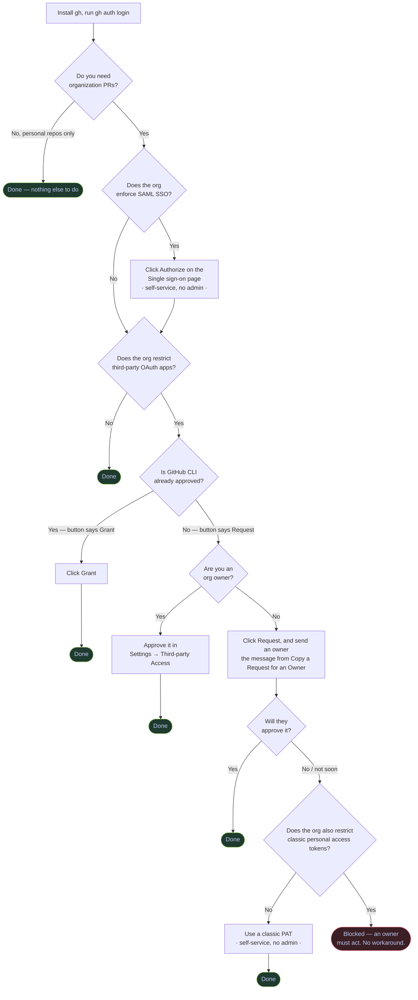
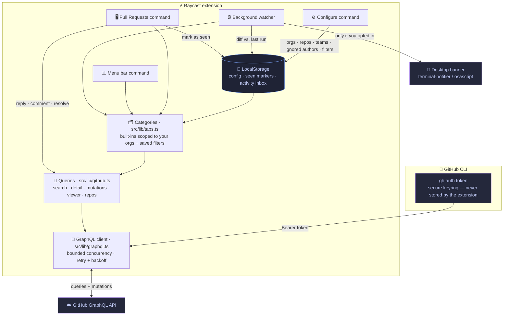

# gh-review-raycast

A Raycast extension for keeping an eye on the GitHub pull requests that matter
to **you** — PRs requesting your review, your team's review, your own open PRs,
and any threads **awaiting your reply**. Filters are fully customizable and
saved locally, and everything is powered by the GitHub GraphQL API.

This is the Raycast counterpart of
[flex-review](https://github.com/vitoraguila/flex-review), the terminal UI.
Same queries, same attention signals, same filter model — a different surface.
There's no web dashboard here: Raycast *is* the UI.

---

## Setup

The extension has **no login screen and stores no token**. It borrows one from
the [GitHub CLI](https://cli.github.com) every time it talks to GitHub. That
means the CLI has to be installed and authenticated first, and — if you want to
see your organization's pull requests — the token has to be authorized for that
organization.

**You can't skip this.** Every command checks the CLI before it does anything.
Until the check passes, each one shows a setup screen — with the exact command
to run, a button to copy it, and **Check Again** — instead of its normal UI. The
menu bar item switches to a warning, and the background watcher stops polling.
Nothing half-works and nothing fails silently.

Work through these steps in order. **Step 3 is the one people miss.**

### Step 1 — Install the GitHub CLI

```sh
brew install gh
```

Other platforms and installers are listed in the
[GitHub CLI installation guide](https://github.com/cli/cli#installation).
Verify it worked:

```sh
gh --version
```

> If you installed `gh` somewhere unusual, set the full path in the extension's
> **gh CLI Path** preference. Otherwise the extension finds it automatically in
> `/opt/homebrew/bin`, `/usr/local/bin`, and the other usual locations.

### Step 2 — Authenticate the CLI

```sh
gh auth login
```

Choose **GitHub.com** → **HTTPS** → **Login with a web browser**, and follow the
prompts. Full reference:
[`gh auth login`](https://cli.github.com/manual/gh_auth_login).

This creates an OAuth token for the **GitHub CLI** application and stores it in
your system keyring. The extension never sees your password and never writes
the token anywhere.

**You can also paste your own token instead.** Pick *Paste an authentication
token* at the prompt, using a
[personal access token (classic)](https://github.com/settings/tokens) created at
[Settings → Developer settings → Personal access tokens → Tokens (classic)](https://github.com/settings/tokens/new).
See
[Managing your personal access tokens](https://docs.github.com/en/authentication/keeping-your-account-secure/managing-your-personal-access-tokens)
for the full walkthrough.

#### Required scopes

| Scope | Why the extension needs it |
| --- | --- |
| [`repo`](https://docs.github.com/en/apps/oauth-apps/building-oauth-apps/scopes-for-oauth-apps) | Read pull requests, comments, and review threads — including in private repositories — and post replies |
| [`read:org`](https://docs.github.com/en/apps/oauth-apps/building-oauth-apps/scopes-for-oauth-apps) | Detect your organizations and team memberships, which power the org picker and the "My team's review" category |

`gh auth login` requests `repo` by default but **not** `read:org`. Add it:

```sh
gh auth refresh -s read:org
```

Confirm what you ended up with:

```sh
gh auth status
```

You should see something like
`Token scopes: 'gist', 'read:org', 'repo', 'workflow'`. If `read:org` is
missing, the org picker and the team category will be empty.

### Step 3 — Authorize the token for your organization

**This is the step that trips people up.** If your organization uses
[SAML single sign-on](https://docs.github.com/en/enterprise-cloud@latest/authentication/authenticating-with-saml-single-sign-on/about-authentication-with-saml-single-sign-on)
or
[restricts OAuth app access](https://docs.github.com/en/organizations/managing-oauth-access-to-your-organizations-data/about-oauth-app-access-restrictions),
a perfectly valid token will still return **zero** organization pull requests
until you explicitly authorize it for that org. Nothing errors — the lists just
come back empty, which looks like a bug in the extension.

> **This whole step is a `gh` matter, not an extension one.** GH Review has no
> login, no token setting, and no preference for one kind of credential over
> another — it reads whatever `gh auth token` returns and cannot tell how it
> got there. It's documented here because this is where the symptom appears,
> not because the extension is involved in fixing it.
>
> **Do you need an administrator for this?** Almost certainly not. Two
> different gates get confused here:
>
> | Gate | Who does it |
> | --- | --- |
> | **SAML single sign-on** — the *"Single sign-on to your organizations"* page you see during `gh auth login` | **You.** Authenticate with your company's identity provider and it's done. Per-user, no admin. |
> | **OAuth app access restrictions** — an org policy, [on by default for new orgs](https://docs.github.com/en/organizations/managing-oauth-access-to-your-organizations-data/about-oauth-app-access-restrictions) | **An owner**, once, for the whole org. After that every member self-serves. |
>
> You'll know instantly which one you're facing: the button next to the
> organization says **Grant** (you can do it) or **Request** (an owner must
> approve). Since the GitHub CLI is one of the most widely used developer
> tools, most organizations approved it long ago.
>
> If you do hit **Request**, the extension's setup screen and SAML banner both
> offer **Copy a Request for an Owner** — a ready-to-send message explaining
> what to approve, that it's GitHub's own official CLI, and that it can only
> ever act as you. Paste it to whoever owns the org.
>
> **And if no owner will approve it, you still aren't stuck.** OAuth app
> restrictions govern OAuth *apps* — a **classic personal access token isn't
> one**, so authorizing a PAT for the organization is self-service. Per
> [GitHub's docs](https://docs.github.com/en/organizations/managing-programmatic-access-to-your-organization/managing-requests-for-personal-access-tokens-in-your-organization),
> *"any personal access token (classic) can access organization resources
> without prior approval"* unless the org separately restricts classic PATs,
> and *"only fine-grained personal access tokens… are subject to approval"*.
>
> So: create a classic token (**Create a Token with the Right Scopes** opens
> the page with `repo` and `read:org` pre-selected), click **Configure SSO →
> Authorize** next to your org, then feed it to the CLI —
> `gh auth login --with-token < token.txt`, or `gh auth login` and choose
> *Paste an authentication token*.
>
> Note the last step. The PAT still has to reach the **keychain**; putting it
> in `~/.zshrc` as `GH_TOKEN` makes it work in your terminal and fail in
> Raycast, for the [reasons above](#do-i-need-a-personal-access-token-does-the-login-expire).

Which path you take depends on how you authenticated in step 2.

#### If you used `gh auth login` (an OAuth token)

The token belongs to the **GitHub CLI** OAuth application, so you authorize the
*application* for your org.

1. Open your authorized OAuth apps:
   **[github.com/settings/apps/authorizations](https://github.com/settings/apps/authorizations)**
2. Click **GitHub CLI** in the list.
3. Find the **Organization access** section. Next to each organization you'll
   see one of:
   - **Grant** — you're an owner, or the org allows it. Click it; done.
   - **Request** — the org restricts third-party apps. Click it and an owner
     gets an approval request.
   - A green check — already authorized, nothing to do.
4. If the org enforces SAML SSO, make sure you have an active SAML session
   first (open any page in the org and sign in), then authorize.

Reference:
[Authorizing OAuth apps](https://docs.github.com/en/apps/oauth-apps/using-oauth-apps/authorizing-oauth-apps).

If the button says **Request**, an organization owner has to approve it from
**Organization Settings → Third-party Access → OAuth app policy** —
`https://github.com/organizations/YOUR-ORG/settings/oauth_application_policy`.
See
[Approving OAuth apps for your organization](https://docs.github.com/en/organizations/managing-oauth-access-to-your-organizations-data/approving-oauth-apps-for-your-organization).

#### If you pasted a personal access token (classic)

Here you authorize the *token itself* for the organization.

1. Go to **[github.com/settings/tokens](https://github.com/settings/tokens)**
   (Settings → Developer settings → Personal access tokens → Tokens (classic)).
2. Find your token in the list and click **Configure SSO** next to it.
3. In the dropdown, click **Authorize** next to each organization you want
   access to.
4. GitHub walks you through the SAML handshake; the entry shows as authorized
   once it completes.

Reference:
[Authorizing a personal access token for use with SAML single sign-on](https://docs.github.com/en/enterprise-cloud@latest/authentication/authenticating-with-saml-single-sign-on/authorizing-a-personal-access-token-for-use-with-saml-single-sign-on).

> **Fine-grained tokens** live at
> [github.com/settings/personal-access-tokens](https://github.com/settings/personal-access-tokens)
> and work differently: the *organization* must first opt in to fine-grained
> tokens, and the token has to be scoped to that org's resources when you create
> it. Classic tokens or the `gh auth login` OAuth flow are the simpler path for
> this extension.

### Do I need a personal access token? Does the login expire?

**No, and effectively no.** Two questions worth answering directly, because
guessing wrong at them causes real confusion.

**You sign in once.** `gh auth login` is not a session login — it stores a
long-lived token in your macOS keychain, and it survives reboots and new
terminal sessions. The extension only ever *reads* it (`gh auth token`); it has
no code path that can start a login. You will not be asked to sign in again
during normal use.

**A PAT in your shell profile is the wrong tool here.** `export GH_TOKEN=…` in
`~/.zshrc` exists for CI runners, containers, and headless servers — machines
with no keychain and no browser. On a Mac it actively breaks this extension:
Raycast is launched by launchd and never sources your shell profile, so `gh`
in *your terminal* sees the variable and `gh` *inside Raycast* doesn't. Your
terminal keeps working while the extension reports "not authenticated", which
is about as confusing as it gets. If you genuinely need a PAT, feed it to the
keychain instead:

```sh
gh auth login --with-token < mytoken.txt
```

**When the token actually stops working.** Three cases, none of them a timer:

| Cause | How likely | What you'll see |
| --- | --- | --- |
| Unused for a full year — [GitHub auto-revokes](https://docs.github.com/en/authentication/keeping-your-account-and-data-secure/token-expiration-and-revocation) | Never, with the watcher polling every 10 minutes | "GitHub rejected the token" |
| **Organization SAML authorization lapses** | **Common on SAML orgs** | An orange "SAML" banner naming the org |
| You revoke it, change your password, or leave the org | Rare | "GitHub rejected the token" |

Every one of those is detected and named on screen, with the fix attached — see
[Feedback when something breaks](#feedback-when-something-breaks).

### Every setup, in one place

Which path applies depends on what your organization enforces. Find your row —
these are all of them.



| Your situation | What to do | Admin needed? |
| --- | --- | --- |
| **Personal repos only** | `gh auth login`, then `gh auth refresh -s read:org` if you're on any teams | No |
| **Org, no SAML, no OAuth restrictions** | Nothing extra — it just works after `gh auth login` | No |
| **Org enforces SAML SSO** | During login, click **Authorize** next to the org on the *Single sign-on to your organizations* page. Later, use the **Authorize now** link in the extension's SAML banner | **No** — this is per-user |
| **Org restricts OAuth apps, GitHub CLI already approved** | At [Authorized OAuth Apps](https://github.com/settings/apps/authorizations) → **GitHub CLI**, click **Grant** next to the org | No |
| **Org restricts OAuth apps, CLI not approved, you're an owner** | Approve it at *Org Settings → Third-party Access → OAuth app policy* | You are the admin |
| **Org restricts OAuth apps, CLI not approved, you're a member** | Click **Request**, then send an owner the text from **Copy a Request for an Owner** | Yes, once, org-wide |
| **…and no owner will approve** | Use a **classic PAT** — OAuth restrictions don't cover it. See below | **No** |
| **Org restricts classic PATs too** | Genuinely blocked; an owner has to act | Yes |
| **GitHub Enterprise Cloud** | Same as above, plus set the **GitHub Host** preference | Depends on org policy |
| **GitHub Enterprise Server** | `gh auth login --hostname your.github.host`, and set **GitHub Host** to match | Depends on org policy |
| **Several orgs with different policies** | Each is authorized independently. The extension names whichever one refused | Per-org |

#### The classic-PAT route, in full

Only needed for the "no owner will approve" row. It works because OAuth app
restrictions govern OAuth *apps*, and a classic PAT isn't one.

```sh
# 1. Create it — this link pre-selects the right scopes:
#    https://github.com/settings/tokens/new?scopes=repo,read:org
#    (the extension's "Create a Token with the Right Scopes" action opens it)

# 2. On https://github.com/settings/tokens, click Configure SSO → Authorize
#    next to your org. Self-service — no admin.

# 3. Hand it to gh so it lands in the keychain:
gh auth login --with-token < token.txt
#    …or: gh auth login, then choose "Paste an authentication token"

# 4. Confirm:
gh auth status
```

> **Step 3 is not optional.** The PAT has to reach the **keychain**. Exporting
> it as `GH_TOKEN` in `~/.zshrc` makes it work in your terminal and fail in
> Raycast — launchd never sources your shell profile. That mismatch is the most
> confusing failure available, so avoid it.

Fine-grained tokens are *not* a substitute here: unlike classic ones, they
[are subject to org approval](https://docs.github.com/en/organizations/managing-programmatic-access-to-your-organization/managing-requests-for-personal-access-tokens-in-your-organization),
so they run into the same wall.

### Step 4 — Point the extension at your orgs

Run **Configure GH Review** → **Organizations** and select the orgs you care
about. Selecting none searches everywhere you have access.

If that list is empty, go back to step 2 (`read:org` missing) or step 3 (token
not authorized for the org).

---

## Feedback when something breaks

The design rule is that **the extension never shows you an empty list without
saying why**. Every authentication and authorization failure is classified into
a named problem with the fix attached, rather than surfacing GitHub's raw text.

| What happened | What you see | One-click fix |
| --- | --- | --- |
| `gh` not installed | Setup screen: "GitHub CLI not installed" | Copy `brew install gh` |
| `gh` not signed in | Setup screen: "GitHub CLI not authenticated" | **Sign in to GitHub** opens Terminal with `gh auth login` already running |
| Token revoked or expired | "GitHub rejected the token" | Same one-click sign-in |
| **Org needs SAML authorization** | **Orange banner naming the org, above the results** | **Direct authorize link, taken from GitHub's own `X-GitHub-SSO` header** |
| Missing `repo` scope | Blocking setup screen | Copy `gh auth refresh -s repo` |
| Missing `read:org` scope | Yellow row in Settings (non-blocking) | Copy `gh auth refresh -s read:org` |
| Rate limited | Named as throttling, not an error | Suggests lowering Max Results |
| Network down | "Couldn't reach GitHub" | Diagnostic command |

### The SAML case is special

A search spanning several organizations comes back as **partial success**:
GitHub returns the orgs you can see, plus an error for the one enforcing SAML.
The list looks perfectly normal — it's just missing an entire organization,
with nothing anywhere saying so.

So the extension keeps the results it did get and pins an orange banner above
them naming the org that refused. When GitHub includes an `X-GitHub-SSO`
header, that banner gets a **direct authorize link** for that specific
organization, which is a single click rather than a hunt through settings.

This matters because the token isn't listed at
[github.com/settings/tokens](https://github.com/settings/tokens) — a
`gh auth login` credential is an OAuth app grant, so it lives under
[Authorized OAuth Apps](https://github.com/settings/apps/authorizations)
instead. That mismatch is the single most common reason people conclude the
tool is broken. ([cli/cli#2661](https://github.com/cli/cli/issues/2661))

---

## Troubleshooting

| Symptom | Cause | Fix |
| --- | --- | --- |
| "GitHub CLI not installed" on every command | Not installed, or in an unusual path | `brew install gh`, or set the **gh CLI Path** preference, then **Check Again** |
| "GitHub CLI not authenticated" on every command | No token in the keyring | `gh auth login`, then **Check Again** |
| "Can't reach GitHub" | Network, VPN, proxy, or wrong **GitHub Host** | Check `gh api graphql -f query='{ viewer { login } }'` |
| Blocked with "Missing token scopes" | No `repo` scope — nothing works without it | `gh auth refresh -s repo` |
| Yellow "Action needed" row in settings | No `read:org` scope — orgs and teams only | `gh auth refresh -s read:org` |
| Organizations list is empty | Missing `read:org` scope | `gh auth refresh -s read:org` |
| "My team's review" never appears | Missing `read:org`, or you're on no team in the selected orgs | `gh auth refresh -s read:org` |
| Orange "SAML" banner above the results | That org hasn't authorized the token | Click the authorize link in the banner |
| Terminal doesn't open on **Sign in to GitHub** | Rare LaunchServices failure | Copy the command and run it yourself |
| Private repo PRs missing | Missing `repo` scope | `gh auth refresh -s repo` |

Quick health check — if this prints your login, the extension can reach GitHub:

```sh
gh api graphql -f query='{ viewer { login } }'
```

And to confirm the org authorization actually took effect, this should come back
with a non-zero count:

```sh
gh api graphql -f query='{ search(query: "is:pr is:open org:YOUR-ORG", type: ISSUE, first: 1) { issueCount } }'
```

If the first command works and the second returns `0` for an org you know has
open pull requests, you're looking at a step 3 problem.

---

## Highlights

- **Colour-coded categories** in a single dropdown:
  - 🔴 **Needs my review** — `review-requested:@me`
  - 🟠 **My team's review** — auto-detected from your team memberships
  - 🟢 **My open PRs**
  - 💬 **Awaiting my reply** — anywhere someone had the last word and the ball
    is in your court: inline review threads **and** the PR conversation itself,
    on your own pull requests and on any discussion you joined. Opening one
    goes **straight to that comment**, not the top of the pull request
  - 👀 **Watching** — the repositories you explicitly track
  - 🔖 …plus any filter you save
- **Comment & reply visibility** — every row shows total comments, unresolved
  threads (`n!`), and an `↩ n` badge when threads await your reply.
- **New-since-last-look** — PRs with fresh activity since you last opened them
  are tagged `NEW`.
- **Reply and resolve from Raycast** — open a PR's review threads, post a reply,
  resolve or unresolve, or drop a conversation comment, without a browser.
- **Ignore bot authors** — Dependabot, Renovate, and friends are hidden out of
  the box.
- **Menu bar count** — a live badge for what's waiting on you.
- **Background watcher + Activity Inbox** — checks GitHub on a schedule and
  records every new review request, comment, and reply. Desktop banners are
  **off by default** and fully controllable; the inbox records either way.
- **Filterable timeline** — the web dashboard's timeline, as a Raycast list.

## Commands

| Command | Mode | What it does |
| --- | --- | --- |
| **Pull Requests** | view | The main list, with the category dropdown and every action |
| **Activity Inbox** | view | Comments and replies the watcher picked up, with the actual text |
| **Watch for Activity** | background | Checks GitHub every 10 minutes and records what's new |
| **PR Menu Bar** | menu bar | A live count of what's waiting on you, refreshed every 5 minutes |
| **Configure GH Review** | view | Orgs, watched repos and teams, ignored authors, saved filters |

### Preferences

| Preference | Default | Notes |
| --- | --- | --- |
| gh CLI Path | auto-detect | Set this if `gh` lives somewhere unusual |
| GitHub Host | `github.com` | Point it at a GitHub Enterprise hostname |
| Max Results per Category | `50` | Higher values cost more API quota |

The menu bar command adds three of its own: which category drives the count,
how many pull requests to list inline before the rest move into a **“N more”**
submenu (default 15), and whether to hide the icon entirely when there's
nothing to review.

## Ageing metrics

"Updated 3 days ago" tells you when something last moved. It doesn't tell you a
colleague's question has gone unanswered for three weeks. Every pull request
carries three separate numbers, and they mean different things:

| Metric | Question it answers |
| --- | --- |
| **Open for** | How long has this pull request existed? |
| **Untouched for** | How long since *anything* happened on it? |
| **Waiting on you for** | How long has someone been expecting an answer? |

That last one is the one that matters, and it's judged independently. A pull
request with activity an hour ago still counts as **stale** if the question
addressed to you is three weeks old — recent noise doesn't clear an old debt.

Each row gets a coloured band once it's worth acting on:

| Band | Threshold | Colour |
| --- | --- | --- |
| fresh | under 2 days | not shown |
| aging | 2–6 days | yellow |
| stale | 7–29 days | orange |
| stalled | 30 days or more | red |

The section header sums the category up — *3 open · median idle 18d · 2 stale ·
1 waiting on you*. Median rather than mean, so one abandoned pull request from
last year doesn't distort the picture.

Full numbers, with exact dates, live in the detail pane (`⇧⌘D`).

### Sorting

From the Action Panel (`⌘K`) → **Sort**. The choice sticks:

- **Most recent activity** (default)
- **Waiting on me longest** — anything owed a reply floats to the top, oldest
  debt first
- **Quiet the longest** — surfaces what's being forgotten
- **Oldest first**

## Knowing when it last checked

Three places tell you how fresh the data is:

- The **Pull Requests** window title reads `updated 2m ago`.
- The **menu bar** has a `Checked 2m ago` row — click it to re-check now.
- The **Activity Inbox** reports when the watcher last ran.

The two schedules are separate, and both are yours to change in Raycast's own
command settings: the menu bar refreshes every **5 minutes**, the background
watcher runs every **10**. Neither is a hard floor — set them longer to save
API quota, or disable a command outright. Anything in a Raycast window also
refetches when you open it, and `⌘R` forces it.

## How it works



**In words:**

1. **Token** — every request runs `gh auth token` (cached for five minutes) and
   uses it as a Bearer credential.
2. **Categories** — each one is a scoped GitHub `search`. The same query also
   pulls review threads, so comment/reply signals are computed client-side
   rather than costing extra round trips.
3. **Attention** — something "awaits your reply" when the last word isn't
   yours and you're involved (you took part, or it's your PR). Two places
   count, and both are checked:
   - **inline review threads**, if unresolved
   - **the PR conversation** — top-level comments and review bodies

   Counting only inline threads would make the whole signal invisible to teams
   that discuss in the PR body rather than on diff lines. Comments from
   [ignored authors](#step-4--point-the-extension-at-your-orgs) are skipped, so
   a Linear or CI bot posting a link never makes a pull request look like it
   needs an answer.

   Whichever message is waiting, its **deep link** is captured alongside it
   (`…/pull/12#issuecomment-345`, `#discussion_r678`, `#pullrequestreview-90`).
   Opening from the list, the menu bar, the Activity Inbox, or a notification
   banner lands you on that comment — scrolling a long pull request to find
   what someone asked you defeats the point of being told about it.
4. **Seen markers** — opening a PR records its latest activity timestamp. Later
   activity flips the `NEW` tag on. First sight of a PR never counts as new.
5. **Writes** — replies, comments, and resolve/unresolve run GraphQL mutations
   straight against GitHub.

## Notifications

Nothing interrupts you until you say so. The **Watch for Activity** command runs
in the background, diffs what it finds against the previous run, and records
every change in the **Activity Inbox**. Desktop banners are a separate, opt-in
layer on top of that.

The first run never notifies: it only establishes a baseline, so installing the
extension doesn't fire a wall of banners about pull requests that were already
sitting there.

### Controls

All of it lives under **Configure GH Review → Desktop Notifications**:

| Control | Default | What it does |
| --- | --- | --- |
| **Desktop Notifications** | **Off** | The master switch. Off means the inbox still fills up, silently |
| **Notify me about** | review requests, replies, my PRs | Per-kind switches; "new PRs in watched repos" is off |
| **Quiet hours** | Off | A daily do-not-disturb window; may wrap past midnight (18:00 → 09:00) |
| **Max banners per check** | 5 | Extras fold into one summary, so a busy morning can't storm Notification Center |
| **Sound** | Silent | Whether banners make a noise |
| **Check interval** | 10 minutes | Raycast's own setting on the command — change it, or disable the command entirely |

Two more escape hatches: **Send a Test Banner** shows exactly what an
interruption looks like before you commit to it, and **Reset the Baseline**
makes the next check start fresh without notifying about anything it finds.

Banners are grouped per pull request, so a chatty thread replaces its own banner
instead of stacking up.

### Clickable banners

Install [terminal-notifier](https://github.com/julienXX/terminal-notifier) and
banners open the pull request when clicked:

```sh
brew install terminal-notifier
```

Without it the extension falls back to `osascript`, which ships with macOS but
produces banners that can't be clicked through. The notification settings screen
tells you which one is in use.

### The Activity Inbox

The inbox is the durable record — a rolling 72-hour window, capped at 500
entries. Each entry shows what happened and who did it, and the detail pane
loads **the actual comments** so you can read the conversation without opening
GitHub. From there you can jump straight to the review threads to reply, or open
the timeline.

## Timeline

`⌘L` on any pull request opens its full history, the Raycast counterpart of the
web dashboard's timeline modal:

- **Search** narrows by event kind, label, actor, or body text
- **The dropdown** narrows by date range (24 hours through 90 days, or all)
- Events are **grouped by calendar day**, newest first, with a running
  "X of Y events" count
- The **detail pane** shows the full text of a comment or review, with exact
  timestamps and a link to that specific event on GitHub

## Saved filters

A saved filter becomes another entry in the category dropdown. Build it from the
fields — role, subject, state, scopes, extra qualifiers — or paste a raw
[GitHub search string](https://docs.github.com/en/search-github/searching-on-github/searching-issues-and-pull-requests)
when the fields aren't enough. The form shows a live preview of the query it
will send.

```
Role:     review-requested
Subject:  team:acme/backend      → team-review-requested:acme/backend
State:    open
Scopes:   org:acme
Extra:    draft:false
```

…compiles to `is:pr is:open team-review-requested:acme/backend org:acme draft:false`.

## Keyboard shortcuts

| Shortcut | Action |
| --- | --- |
| `↵` | Show details |
| `⌘↵` | Open in browser |
| `⌘T` | Review threads |
| `⌘L` | Timeline |
| `⌘N` | Add comment (in a PR's detail) |
| `⇧⌘R` | Resolve / unresolve a thread |
| `⌘M` / `⇧⌘M` | Mark one / all as seen (or read, in the inbox) |
| `⇧⌘I` | Ignore this PR's author |
| `⇧⌘D` | Toggle the detail pane (pull request list and timeline) |
| `⌘K` → Sort | Reorder the pull request list |
| `⌘R` | Refresh |

## Development

```sh
npm install
npm run dev        # opens Raycast in development mode with live reload
npm run lint       # ESLint + Prettier + manifest validation
npm run typecheck  # tsc --noEmit
npm run build      # production build
```

### Testing locally

1. Make sure the CLI is ready: `gh auth status` should show you're logged in
   with `repo` and `read:org`.
2. Run `npm run dev`. Raycast opens with the extension loaded from source; the
   commands appear under **GH Review**. Leave the terminal running — it live
   reloads on save and prints runtime errors.
3. Run **Configure GH Review** first: pick your organizations, then (optional)
   watched repos and teams.
4. Run **Pull Requests** and switch categories with the dropdown in the search
   bar.
5. To test the write path, open a PR with an inline review thread (`⌘T`), reply
   to it, and confirm the comment lands on GitHub.
6. Press `⌘L` on any pull request to check the timeline, then try the search box
   and the date-range dropdown.
7. For the watcher: open **Configure GH Review → Desktop Notifications** and hit
   **Send a Test Banner** to confirm banners reach your screen. Then run **Watch
   for Activity** manually once (it only records a baseline), and again after
   some real activity — the second run is what notifies.
8. `⌃C` in the terminal ends the dev session and unloads the development build.

Background commands only run on their schedule once the extension is installed;
while developing, trigger **Watch for Activity** by hand, or use **Check GitHub
Now** from the Activity Inbox.

### Screenshots without exposing real data

Store screenshots shouldn't contain your organizations, colleagues, or private
repository titles — and your real account can't be made to display a stalled
pull request, a three-week-old unanswered question, and a SAML banner on
demand anyway.

**Demo mode** solves both. It serves invented data — a fictional `northwind`
org, made-up logins — through every view, without a single request to GitHub.

```
npm run dev
→ Configure GH Review → Development → Screenshot Demo Mode → turn it on
→ reopen each command and capture
```

It's **double-gated**: it needs `environment.isDevelopment` *and* an explicit
opt-in flag, checked in that order. A published build can't enter it even if
the flag is somehow set, so there's no risk of shipping fake data to users.

The fixtures are built to cover the states worth showing:

| Category | What it demonstrates |
| --- | --- |
| Needs my review | fresh + `NEW` tag, an `aging` one, a `stalled` one with changes requested |
| Awaiting my reply | 18 days owed, 41 days owed, deep links, unresolved counts |
| My open PRs | approved, and a draft |
| Team review / Watching | team qualifier and watched-repo results |
| Detail pane / Timeline | labels, reviewers, ageing block, a full event history |

Timestamps are relative to now, so the ageing bands stay correct however long
from now you retake them.

Then use Raycast's built-in **Window Capture** (available while `npm run dev`
is running) to produce correctly-sized store images into `metadata/`.

### Publishing to the Raycast store

Everything needed is in place — `npm run lint` passes all four checks
(manifest, icons, ESLint, Prettier), which is what the store gates on. When
you're ready:

```sh
npm run lint      # must exit 0
npm run build     # must succeed
npm run publish
```

`npm run publish` opens a browser to authorize, then submits the extension for
review. Raycast's team reviews manually; expect a few days and possibly change
requests.

Worth checking before you submit:

- [ ] `author` is your **Raycast** username (`vitoraguila`), not your GitHub
      one — `ray lint` verifies it against Raycast's API
- [ ] `CHANGELOG.md` — replace `{PR_MERGE_DATE}` only if you want a fixed date;
      Raycast substitutes it automatically otherwise
- [ ] Screenshots in `metadata/` — see below
- [ ] The `description` in `package.json` is your store blurb — re-read it as a
      stranger would

Note that publishing submits the **extension**, not this git repository. They
are separate; making the repo public is your own decision.

## Layout

```
src/
├── pull-requests.tsx           # main list command
├── activity.tsx                # Activity Inbox command
├── watch.ts                    # background watcher (no-view, scheduled)
├── menu-bar.tsx                # menu bar command
├── settings.tsx                # configure command
├── hooks.ts                    # shared data hooks + category fetching
├── components/
│   ├── pr-detail.tsx           # full-screen PR view and write actions
│   ├── timeline.tsx            # filterable PR history
│   ├── review-threads.tsx      # inline threads: reply / resolve
│   ├── comment-form.tsx        # shared markdown composer
│   ├── require-gh.tsx          # the setup gate every command sits behind
│   ├── setup-required.tsx      # the blocking setup screen
│   └── settings/               # org, repo, team, ignore-list, filter, notification pickers
└── lib/
    ├── gh-cli.ts               # locating and shelling out to gh
    ├── gh-status.ts            # the readiness check (binary → token → API → scopes)
    ├── gh-readiness.ts         # what "ready" means and what blocks (pure)
    ├── binaries.ts             # finding CLI tools under Raycast's minimal PATH
    ├── graphql.ts              # GraphQL client: concurrency, retry, backoff
    ├── github.ts               # the queries and mutations
    ├── config.ts               # persisted config + filter → query compilation
    ├── tabs.ts                 # category assembly
    ├── activity.ts             # inbox storage + change fingerprinting
    ├── quiet-hours.ts          # do-not-disturb window arithmetic (pure)
    ├── notify.ts               # desktop banners via terminal-notifier / osascript
    ├── seen.ts                 # new-since-last-look tracking
    ├── format.ts               # presentation helpers
    ├── preferences.ts          # typed preference access
    └── types.ts                # shared data shapes
```

## License

MIT
