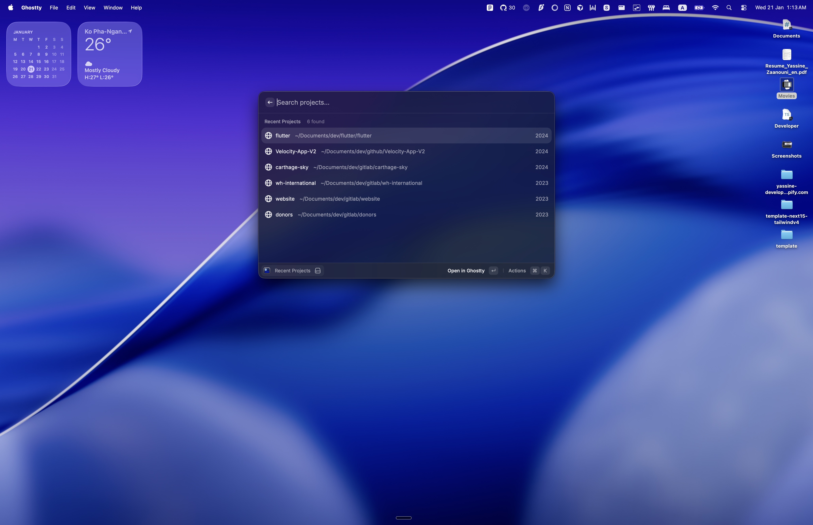
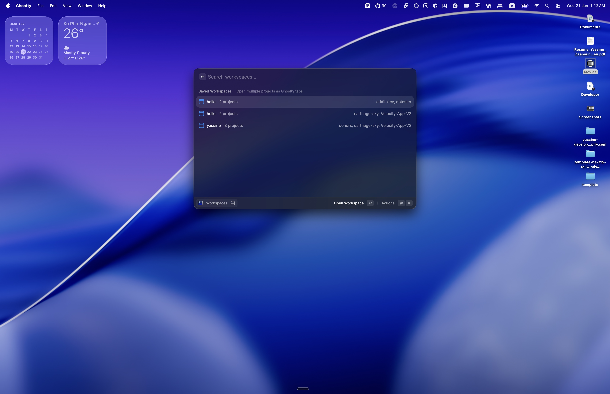
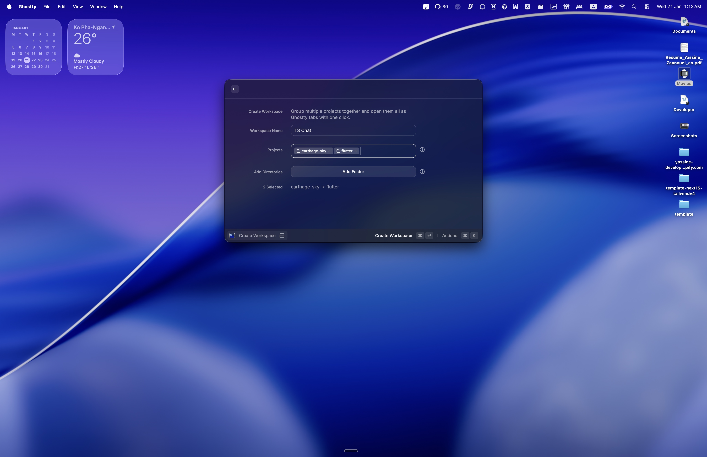

# Ghostty Launcher

Launch projects and workspaces in Ghostty terminal.

## Features

### Recent Projects

Discover projects from your development directories. The extension scans folders you specify and finds projects by detecting markers like `.git`, `package.json`, `Cargo.toml`, `go.mod`, and `pyproject.toml`. It can also parse your shell history (`cd` commands) to find additional directories you've worked in.

#### Configuration

- **Project Directories**: Directories to scan for projects (default: `~/Projects,~/Code,~/Development,~/Documents/dev`)
- **Scan Depth**: How deep to scan (1-3 levels recommended)
- **Shell History**: Parse shell history for additional directories

### Workspaces

Save groups of projects and open them all as Ghostty tabs with one click. Perfect for switching between different work contexts.

- Create workspaces by selecting from discovered projects or adding custom directories
- Open a workspace to launch all projects as tabs in Ghostty
- Edit or delete workspaces as needed

### Create Workspace

### New Window

Open a new Ghostty window in any directory.

### Open Config

Open your Ghostty configuration file in your preferred editor.

## Requirements

- [Ghostty](https://ghostty.org/) terminal must be installed
