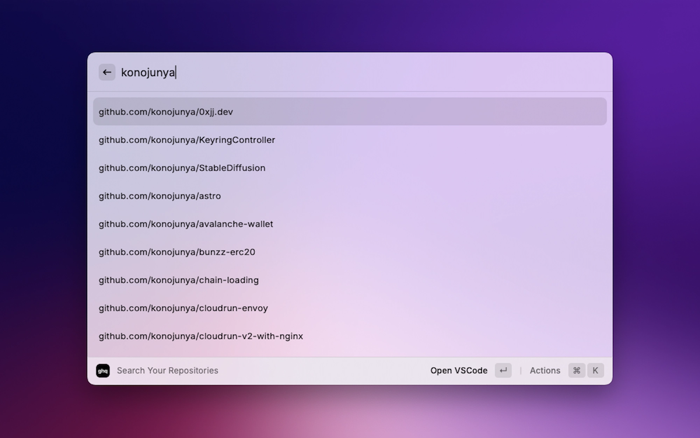

# ghq Extension for Raycast

Raycast Extension for [ghq](https://github.com/x-motemen/ghq) `list` and `get`.

ghq extension is currently no plans to implement `create`, `rm`, and `root` because there are few situations where you want to use Raycast to perform these functions.

## Feature Support

| Command      | Support            |
| :----------- | :----------------- |
| `ghq list`   | ✅                 |
| `ghq get`    | Planned            |
| `ghq create` | No support planned |
| `ghq rm`     | No support planned |
| `ghq root`   | No support planned |

## Preferences

All preferences properties list that can be customize through `Raycast Settings > Extensions > ghq`

|   Properties    |      Label      |  Value   | Required |   Default   |                         Description                         |
| :-------------: | :-------------: | :------: | :------: | :---------: | :---------------------------------------------------------: |
| `GHQ_ROOT_PATH` | `ghq root path` | `string` |  `true`  | `~/ghq/src` | Your ghq root path. use `ghq root` command to get the path. |
