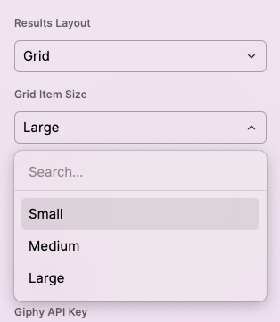

# GIF Search

This extension searches for animated GIFs from the internet using [giphy.com](https://giphy.com), [tenor.com](https://tenor.com), or [thefinergifs.club](https://thefinergifs.club). Switch between the various services using the search bar dropdown.

## Issues or Feature Requests

Find a bug? Want to see something new in this extension? Let me know by [submitting a feature request](https://github.com/raycast/extensions/issues/new?body=%23%20Extension%20–%20%5BGIF%20Search%5D(https://github.com/raycast/extensions/tree/cf8ba2cb37e703024a506584bc1f853a2de3c16c/extensions/gif-search/)%0AAuthor:%20@josephschmitt%0A%0A%3C!--%0A%20%20Please%20provide%20a%20clear%20and%20concise%20description%20for%20your%20idea.%0A--%3E%0A%0A**Describe%20the%20feature%20and%20the%20current%20behavior/state.**%0A%0A**Who%20will%20benefit%20with%20this%20feature?**%0A%0A**Any%20Other%20info.**%0A&title=%5BGIF%20Search%5D%20...&template=extension_feature_request.md&labels=extension,feature+request)! Make sure to either mention `@josephschmitt` in your ticket or set me as the assignee so I get notified.

## Preferences

### Changing the Layout Style

In Raycast 1.36.0, Raycast added support for extensions to use their new Grid layout style. The GIF search extension defaults to using the old List style by default, but you can change it to use the new Grid style in the preferences.

When using the Grid layout, you can also control the size of the individual Grid items. It defaults to "Medium", but provides options for "Small" and "Large" as well.

### Changing the Default Action

You can change what the default action on a GIF is in order to customize what happens when you hit ENTER. This setting allows you to change the behavior to one of several options:

1. Copy GIF (Default): Copies the GIF file itself to your Clipboard
1. Copy GIF Link: Copies the URL to the GIF file to your Clipboard
1. Add or Remove from Favorites
1. View GIF Details: Opens the GIF Details view with extra metadata about the GIF
1. Copy Page Link: Copies the URL to the page the GIF is hosted on to your Clipboard
1. Open in Browser: Opens the URL to the page the GIF is hosted on in your browser

Whichever setting is chosen will be moved to the top of the list, making it the default action when you hit ENTER on the GIF list item.

### Customizing the Number of Results

By default, only 10 results are returned for any GIF search (with no option to load more, currently). If you wish to see more results, you can change the "Max Results" preference to any integer you like. Note that the more results you choose to return the slower that searches will be.

### Custom API Keys

By default, this extension will download shared API keys for both services. If you wish to use your own API keys, you can sign up for a free developer account for Giphy at [https://developers.giphy.com](https://developers.giphy.com), or Tenor at [https://tenor.com/developer/keyregistration](https://tenor.com/developer/keyregistration), and provide those keys in the Command Preferences.
