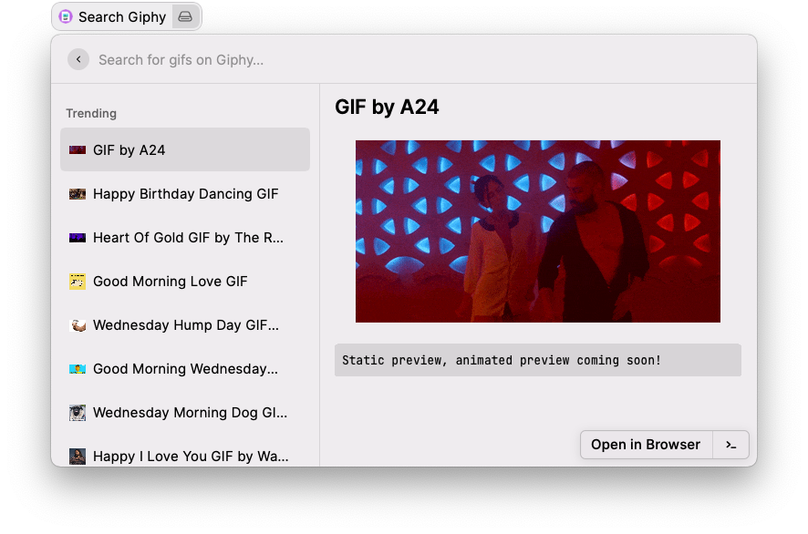

# GIF Search

This extension searches for animated GIFs from the internet using [giphy.com](https://giphy.com) or [tenor.com](https://tenor.com). In order to use any of the GIF search API's, you'll have to sign up for a free developer account and obtain an API key. You'll be asked to supply that API key when first loading up the GIF Search extension.

You can sign up for a free developer account for Giphy at [https://developers.giphy.com](https://developers.giphy.com), or Tenor at [https://tenor.com/developer/keyregistration](https://tenor.com/developer/keyregistration).

## GIF Preview

If you go into the extension's settings, you can enable the GIF Preview feature (disabled by default).

The GIF Preview is currently limited to showing just the first frame of the GIF due to limitations in Raycast. Once Raycast is able to render animated GIFs in Detail views, this setting will become enabled by default.
