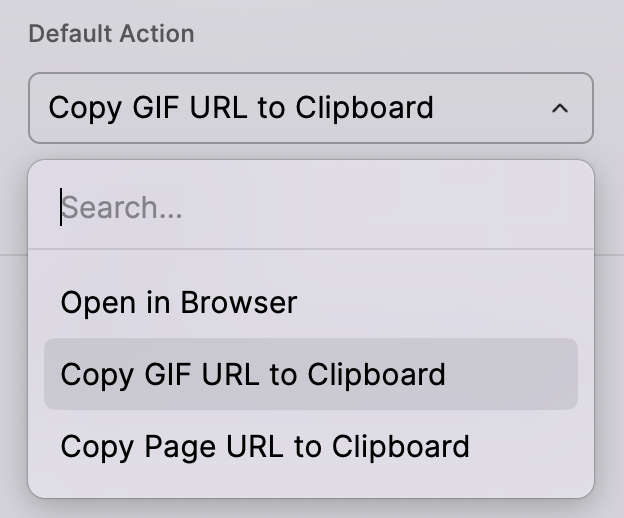

Elevat your Mac workflow with the GIF Search extension. This extension searches for animated GIFs from the internet using [Giphy](https://giphy.com), [Tenor](https://tenor.com), or [The Finer Gifs Club](https://thefinergifs.club). Switch between the various services using the search bar dropdown.

## **Discover the Perfect GIF in Seconds**

* **Multi-Source Search**: Effortlessly switch between Giphy.com, Tenor.com, and TheFinerGifs.club using the search bar dropdown.  
* **Smart Keyword Recognition**: Find the ideal GIF for any situation, whether you're looking for a reaction, meme, or emoji\-style animation.  
* **Mac\-Optimized Performance**: Lightning-fast results, perfect for power users who demand speed and efficiency.

## **Customizable Actions for Every Workflow**

Tailor the GIF Search to your needs with customizable default actions:

1. Copy GIF
2. Copy GIF Link
3. Copy GIF Markdown
4. Paste GIF Markdown
5. Manage Favorites
6. View GIF Details
7. Copy Page Link
8. Open in Browser
9. Download GIF

Set your preferred action as the default for seamless integration into your workflow.

## Issues or Feature Requests

Find a bug? Want to see something new in this extension? Let me know by [submitting a feature request](https://github.com/raycast/extensions/issues/new?template=extension_feature_request.yml&extension-url=https%3A%2F%2Fraycast.com%2Fjosephschmitt%2Fgif-search&title=%5BGif%20Search%5D+...)!

## Preferences

### Changing the Default Action

You can change the default action on a GIF to customize what happens when you press ⏎. This setting allows you to select from several options.

1. Copy GIF (Default): Copies the GIF file itself to your Clipboard
2. Copy GIF Link: Copies the URL to the GIF file to your Clipboard
3. Copy GIF Markdown: Copies a Markdown-formatted link to the GIF to your Clipboard
4. Paste GIF Markdown: Pastes a Markdown-formatted link to the GIF into the front-most application
5. Add or Remove from Favorites
6. View GIF Details: Opens the GIF Details view with extra metadata about the GIF
7. Copy Page Link: Copies the URL to the page the GIF is hosted on to your Clipboard
8. Open in Browser: Opens the URL to the page the GIF is hosted on in your browser
9. Download GIF: Downloads the GIF in your Downloads folder

Whichever setting is chosen will be moved to the top of the list, making it the default action when you hit ⏎ on the GIF list item.

## **FAQs**

### **How can I find a specific GIF?**

Use descriptive keywords in the search bar. Combine terms like emotions, actions, or popular references for best results.

### **How do I find out what a GIF is from?** 

Select "View GIF Details" to access metadata, including source information when available.

### **Can I use Google to search for GIFs?** 

While Google offers GIF search, Raycast's GIF Search provides a more streamlined experience directly within your Mac workflow.