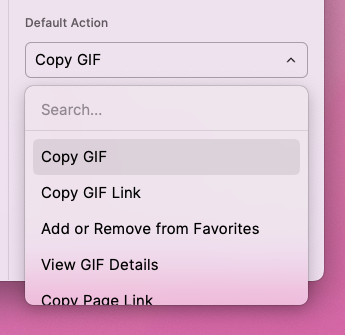

# GIF Search

This extension searches for animated GIFs from the internet using [giphy.com](https://giphy.com), [tenor.com](https://tenor.com), or [thefinergifs.club](https://thefinergifs.club). Each GIF search service has its own command, or you can use the unified GIF Search command and switch between them using the search bar dropdown.

## Preferences

By default, this extension will download shared API keys for both services. If you wish to use your own API keys, you can sign up for a free developer account for Giphy at [https://developers.giphy.com](https://developers.giphy.com), or Tenor at [https://tenor.com/developer/keyregistration](https://tenor.com/developer/keyregistration), and provide those keys in the Command Preferences.

### Changing the Default Action

By default, the default action on a GIF (what happens when you hit ENTER) is to open the GIF service's webpage in the browser. This setting allows you to customize this behavior to one of three options

1. Open in Browser (Default)
2. Copy GIF URL to Clipboard
3. Copy Page URL to Clipboard

Whichever setting is chosen will be moved to the top of the list, making it the default action when you hit ENTER on the GIF list item.
