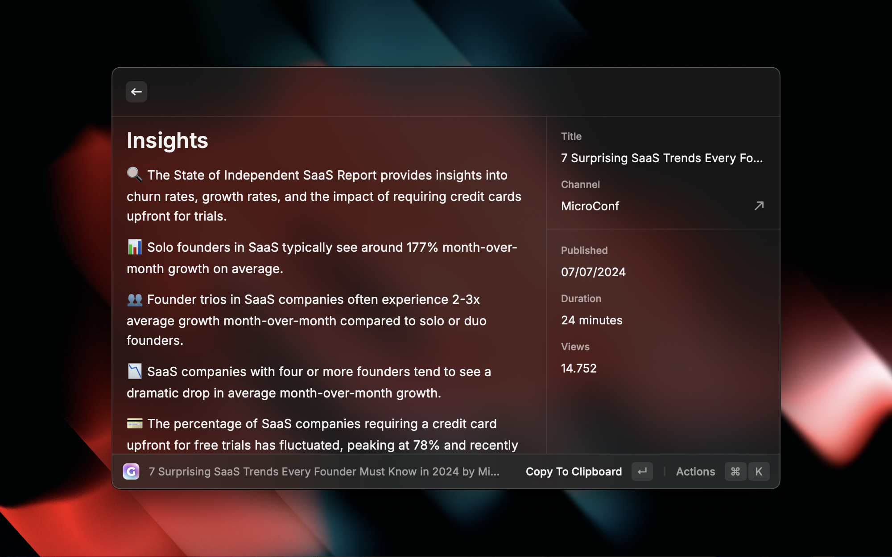
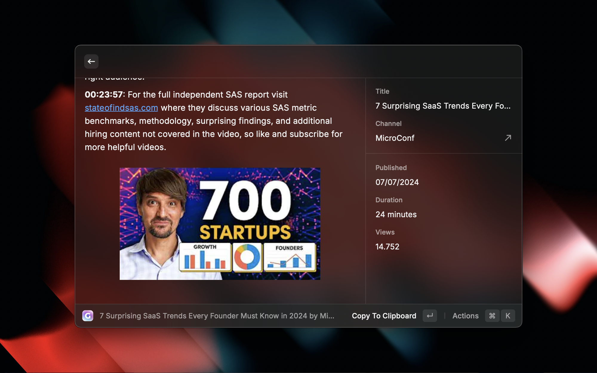
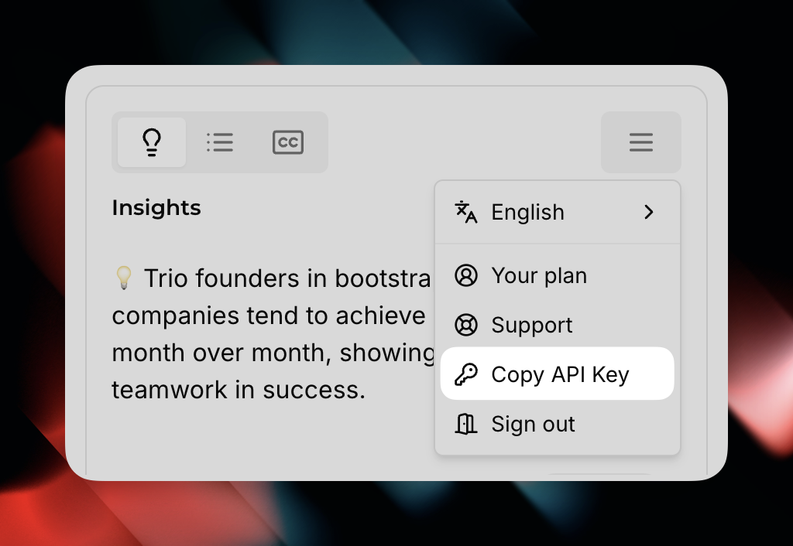

# Gistly

Summarize YouTube videos for free. Save time on long content. Get insights with AI, instantly and on point - right in your command bar.

 

  
 

 <h1 align="center">Gistly YouTube Summarizer</h1>

 <h3 align="center">
 Save time on long videos, get instant insights with AI.
 </h3>

# Features

### Key Insights

Get the pivotal points and key ideas from the video.

### TLDR Summaries

Grasp the gist of any video in seconds with our YouTube summary AI.

### Transcripts

Get raw transcripts ready to copy into your notes or AI assistant.

# How to use

This extension offers **freemium access** to [Gistly](https://gist.ly) app. Simply enter YouTube URL or video ID and get the summary, transcript or key insights.

The free version has a daily limit of 5 videos. If you have Gistly+ you can add your API key in the extension settings for unlimited access. The API key can be found in the Gistly browser extension main menu. The extension is available for Chrome, Edge, and Brave and can be installed from [Chrome Web Store](https://gist.ly/chrome).

This extension **does not require** OpenAI API key nor access to Raycast AI.

# Preferences

> All the preferences value will be stored locally using the [Raycast Preferences API](https://developers.raycast.com/api-reference/preferences)

All preferences properties list that can be customized through `Raycast Settings > Extensions > Gistly`

| Properties | Label   | Value    | Required | Default | Description         |
| ---------- | ------- | -------- | -------- | ------- | ------------------- |
| `apiKey`   | API key | `string` | `false`  | `empty` | Your Gistly API key |

# Author

Created by [Rafal Zawadzki](https://github.com/rafalzawadzki)
