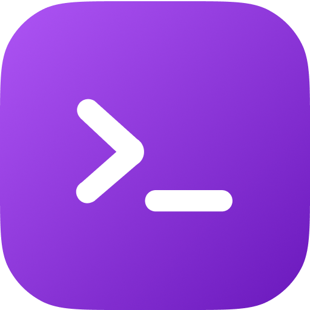
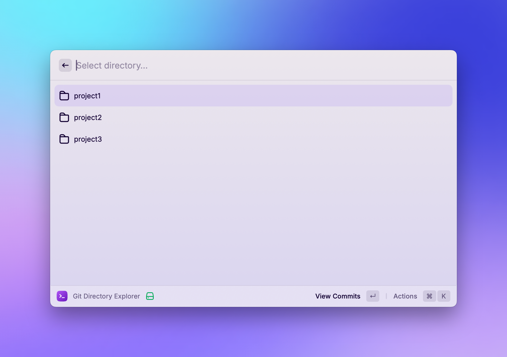
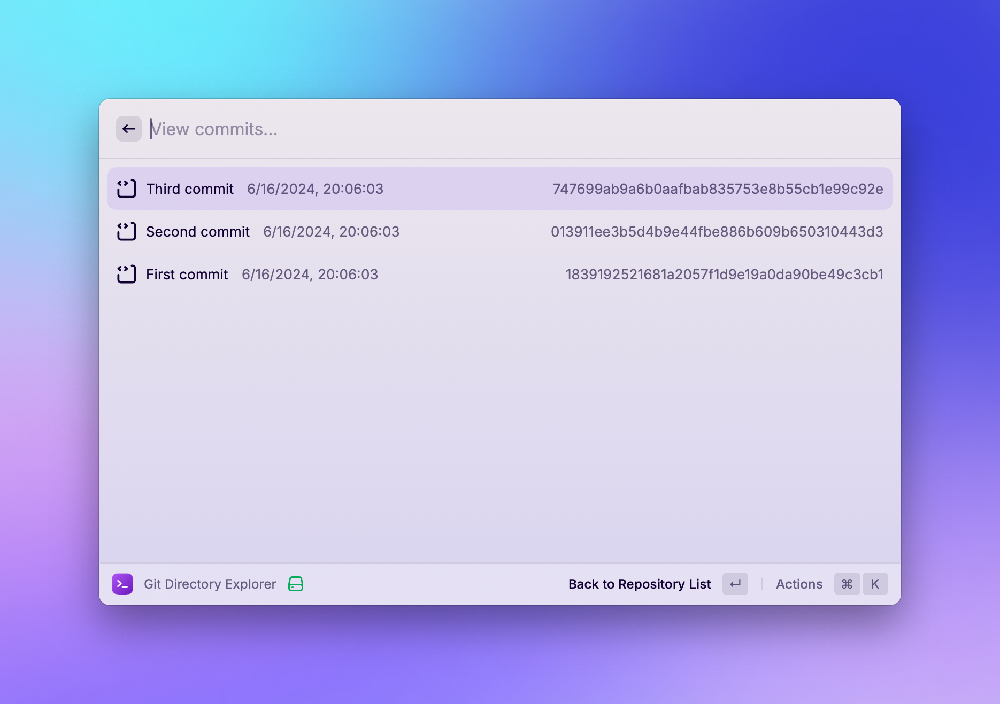

# Git Directory Explorer

[](https://www.raycast.com/guides/create-extension)

Effortlessly navigate through your Git repositories and view commit history with Codemaster. Seamlessly open directories in your preferred code editor and streamline your development workflow.



## Features

-  **Explore Git Repositories:** Easily navigate through directories containing Git repositories.
-  **View Commit History:** Access the commit history of the selected repositories.
-  **Open in Code Editor:** Open directories in your preferred code editor.

## Install

1. Clone this repository or download the zip file.
2. Open Raycast and go to `Settings`.
3. Navigate to `Extensions` and click on the `+` button to add a new extension.
4. Select the cloned or downloaded repository.

## Preferences

-  **Directory:** Specify the root directory where your Git project folders are located.
-  **Code Editor:** Select your preferred code editor from the list of installed applications.

## How to Use

1. Open Raycast and trigger the Codemaster extension.
2. Browse and select the desired directory containing a Git repository.
3. View commit history or open the directory with your preferred code editor.

## Screenshots

### Directory Explorer


### View Commits


## Dependencies

-  [simple-git](https://github.com/steveukx/git-js) - Simple JavaScript interface for Git.

## Development

### Prerequisites

-  Node.js
-  Raycast

### Setup

1. Install dependencies:
```
npm install
```
