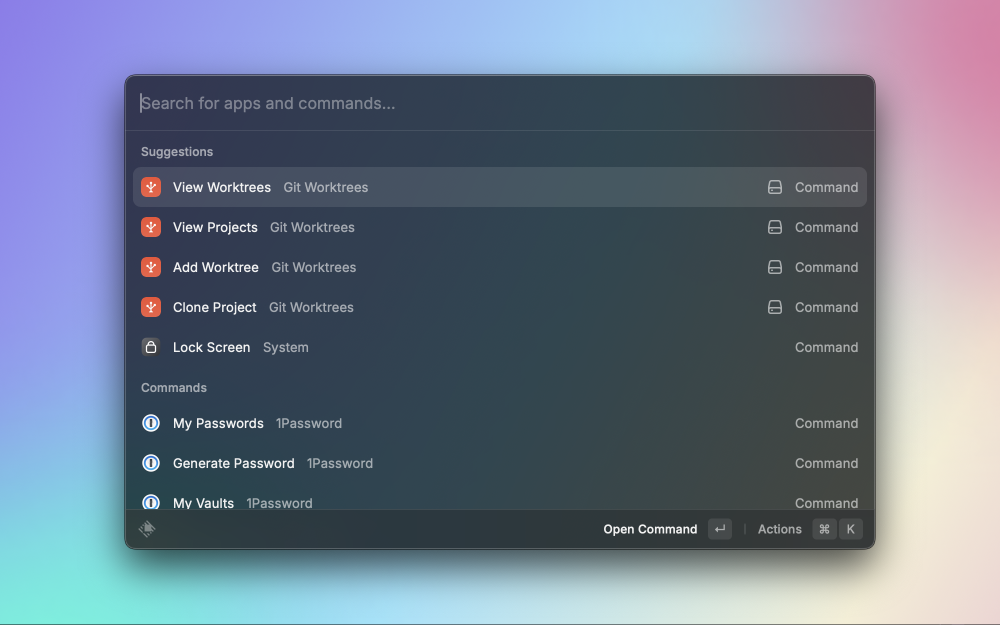

# Git Worktrees for Raycast

A powerful Raycast extension for efficiently managing Git worktrees with a streamlined interface. This extension helps developers work with multiple branches simultaneously by creating and managing Git worktrees through an intuitive Raycast interface.

## Features

- **Clone Projects**: Easily clone repositories as bare repos, ready for worktree management
- **View Projects**: Browse all your Git projects with frecency-based sorting
- **View Worktrees**: See all worktrees across projects or filter by specific project
- **Add Worktrees**: Create new worktrees from branches or create new branches
- **Rename Worktrees**: Easily rename existing worktrees
- **Remove Worktrees**: Delete worktrees you no longer need
- **Intelligent Caching**: Optional caching system for faster performance
- **Project Grouping**: Group worktrees by project for better organization
- **Frecency Sorting**: Sort projects and worktrees based on frequency of use
- **Editor Integration**: Open worktrees in your preferred editor
- **Terminal Integration**: Open worktrees in your preferred terminal
- **Window Management**: Automatically resize editor windows after launch

## Installation

### Requirements

- Raycast 1.94.3 or higher
- Node.js 22.14.0 or higher
- Git

### Install from Raycast Store

1. Open Raycast
2. Search for "Extensions"
3. Click "Store"
4. Search for "Git Worktrees"
5. Click "Install"

### Install from Source

1. Clone this repository
2. Navigate to the project directory
3. Run `npm install`
4. Run `npm run dev` to start development mode in Raycast

## Configuration

The extension offers several preferences to customize your workflow:

### Required Settings

- **Projects Path**: Directory containing your Git projects
- **Preferred Editor**: Your code editor of choice
- **Preferred Terminal**: Your terminal application of choice

### Optional Settings

- **Enable Worktree Caching**: Cache worktrees to avoid scanning directories every time
- **Enable Worktree Grouping**: Group worktrees by project
- **Enable Projects Frecency Sorting**: Sort projects by frequency of use
- **Enable Worktrees Frecency Sorting**: Sort worktrees by frequency of use
- **Max Scanning Levels**: Control directory recursion depth when scanning for projects
- **Automatically Push Worktree**: Push branches after adding or renaming worktrees
- **Skip Git Hooks When Pushing**: Skip Git hooks when pushing new branches
- **Automatically Open Worktree**: Open worktrees after creation
- **Resize Editor Window After Launch**: Automatically resize editor windows
- **Window Resize Mode**: Choose how to resize editor windows
- **Branch Prefixes to Remove**: Automatically clean branch names when pasting

## Usage

### Clone Project

1. Launch Raycast and search for "Clone Project"
2. Enter the repository URL
3. Configure clone options
4. Click "Clone"

### View Projects

1. Launch Raycast and search for "View Projects"
2. Browse your Git projects
3. Select a project to view its worktrees or perform actions

### View Worktrees

1. Launch Raycast and search for "View Worktrees"
2. Browse all worktrees or filter by project using the dropdown
3. Select a worktree to perform actions

### Add Worktree

1. Launch Raycast and search for "Add Worktree"
2. Select a project
3. Enter branch name or select an existing branch
4. Configure worktree options
5. Click "Add Worktree"

## Why Git Worktrees?

Git worktrees allow you to check out multiple branches simultaneously without creating separate clones of your repository. This extension simplifies the management of worktrees, making it easier to:

- Work on multiple features simultaneously
- Review pull requests while continuing development
- Switch between tasks without stashing changes
- Compare implementations across different branches

## Contributing

Contributions are welcome! Please feel free to submit a Pull Request.

## License

This project is licensed under the MIT License - see the LICENSE file for details.
