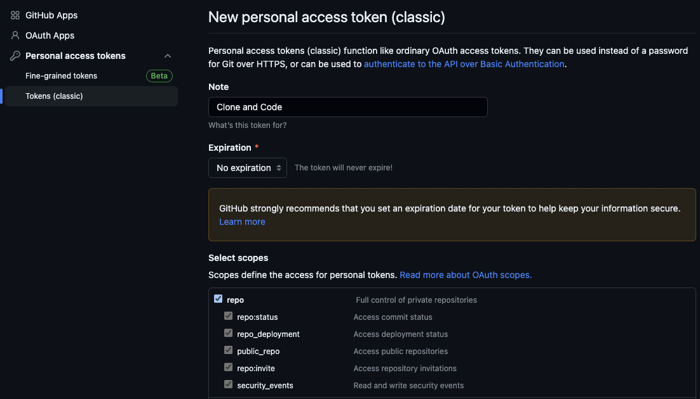

# GitHub Clone & Code

Open a GitHub repository in VS Code, cloning it if not present locally.

## Preferences

### Clone Path

Path in which clone the repositories. The default is `~/GitHub`. Repositories will be cloned in `$clonePath/$owner/$repoName`.

### Editor Command

The command to open the repository in the editor. The default is `code`, which is the command line alias for VS Code.

The code editor will be launched with `$editor /path/to/cloned/repo`.

### Personal Access Token

A [GitHub token](https://github.com/settings/tokens/new) with `repo` scope. We suggest not setting an expiration.

