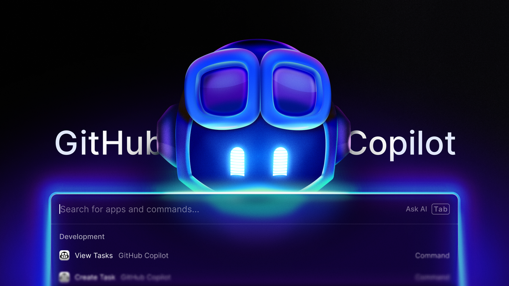

Start and track [GitHub Copilot coding agent](https://docs.github.com/en/enterprise-cloud@latest/copilot/concepts/coding-agent/coding-agent) tasks from Raycast 🤖

### How it works

- **Create Task**: Kick off a Copilot coding agent job for a chosen repository and base branch using your prompt. The agent works in the background, opens a pull request and tags you for review.
- **View Tasks**: Track the progress of tasks you've given to Copilot, and jump to the PR or session logs in GitHub.
- **AI Assistant**: Use the AI tools to help create tasks, search repositories, and get repository information through natural language.

### AI Tools

This extension provides AI tools that can be used through Raycast AI to interact with GitHub Copilot:

#### `create-task`
Creates a GitHub Copilot coding task with a prompt, repository, and optional branch. If no branch is provided, uses the default branch of the repository.

**Example usage:**
```
@github-copilot Create a task to add dark mode support for raycast/extensions
```

#### `search-repositories`
Searches for GitHub repositories. Can search recent repositories, repositories by owner, or use a query filter.

**Example usage:**
```
@github-copilot Search for repositories in the raycast organization
```

#### `get-repository-default-branch`
Gets the default branch name for a GitHub repository.

**Example usage:**
```
@github-copilot What's the default branch for raycast/extensions?
```

### Requirements

- **Access to [GitHub Copilot coding agent](https://docs.github.com/en/enterprise-cloud@latest/copilot/concepts/coding-agent/coding-agent)**, available for Copilot Pro, Pro+, Business and Enterprise users. If you're a Business or Enterprise subscriber, an administrator will have to [enable](https://docs.github.com/en/enterprise-cloud@latest/copilot/concepts/coding-agent/enable-coding-agent) the feature.
- **Authentication with your GitHub account with OAuth**: The first time you use the extension, you'll be asked to connect your account, providing `repo`, `workflow` and `read:org` permissions.

*Copilot coding agent and this extension are in public preview and subject to change. During the preview, use of the feature is subject to the [GitHub Pre-release License Terms](https://docs.github.com/en/site-policy/github-terms/github-pre-release-license-terms).*
