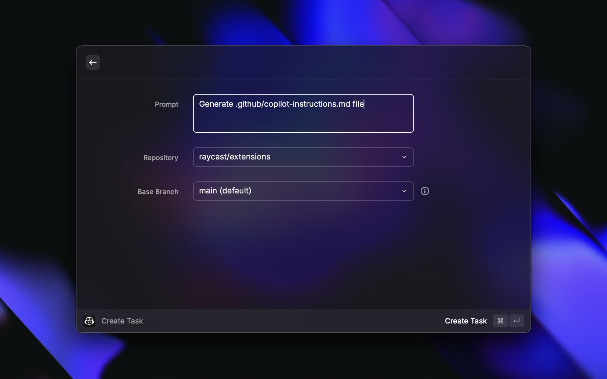
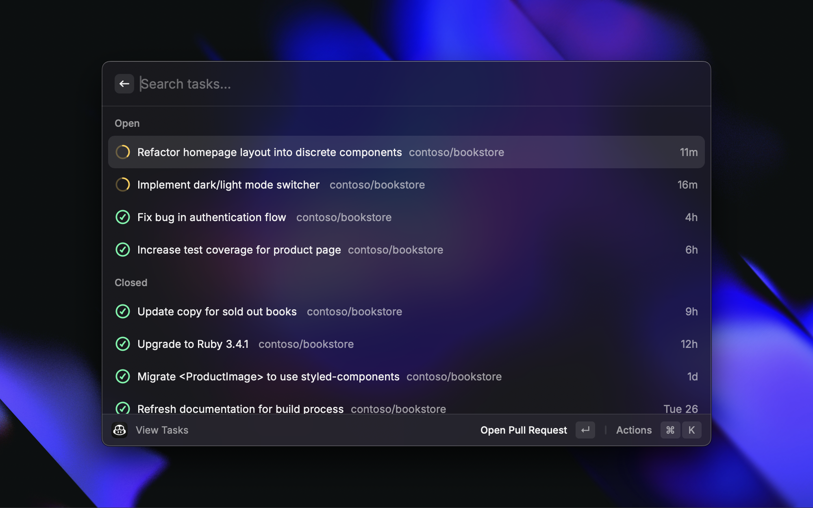

Start and track [GitHub Copilot coding agent](https://docs.github.com/en/enterprise-cloud@latest/copilot/concepts/coding-agent/coding-agent) tasks from Raycast 🤖

### How it works

- **Create Task**: Kick off a Copilot coding agent job for a chosen repository and base branch using your prompt. The agent works in the background, opens a pull request and tags you for review.
- **View Tasks**: Track the progress of tasks you've given to Copilot, and jump to the PR or session logs in GitHub.

### Requirements

- **Access to [GitHub Copilot coding agent](https://docs.github.com/en/enterprise-cloud@latest/copilot/concepts/coding-agent/coding-agent)**, available for Copilot Pro, Pro+, Business and Enterpise users. If you're a Business or Enterprise subscriber, an administrator will have to [enable](https://docs.github.com/en/enterprise-cloud@latest/copilot/concepts/coding-agent/enable-coding-agent) the feature.
- **Authentication with your GitHub account with OAuth**: The first time you use the extension, you'll be asked to connect your account, providing `repo`, `workflow` and `read:org` permissions.

### Screenshots

*Copilot coding agent and this extension are in public preview and subject to change. During the preview, use of the feature is subject to the [GitHub Pre-release License Terms](https://docs.github.com/en/site-policy/github-terms/github-pre-release-license-terms).*
