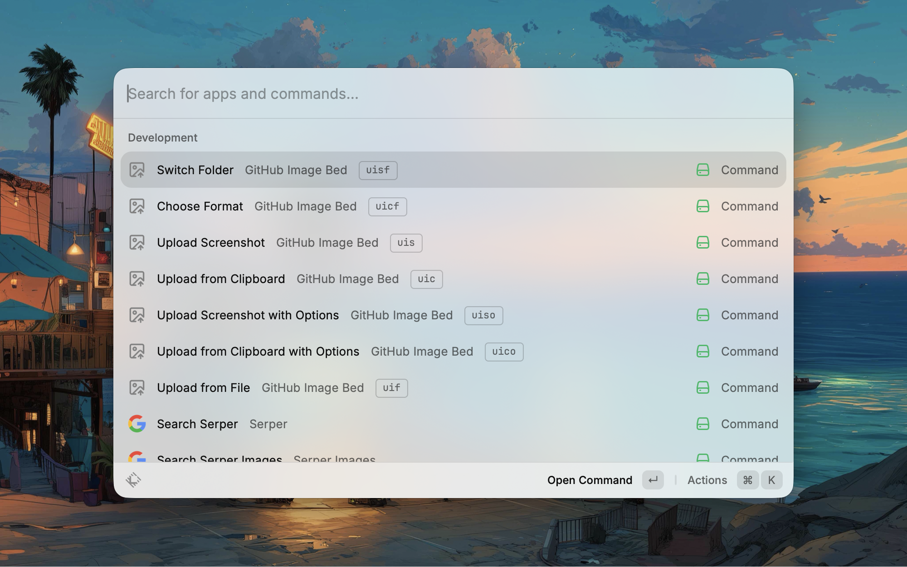
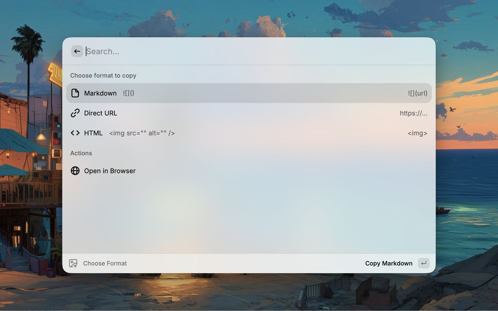
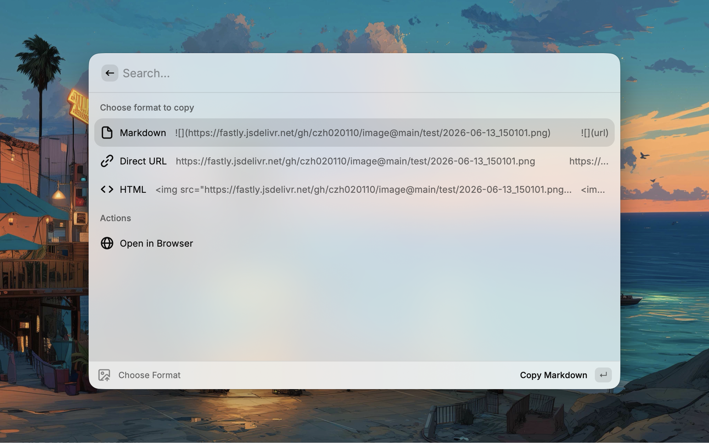
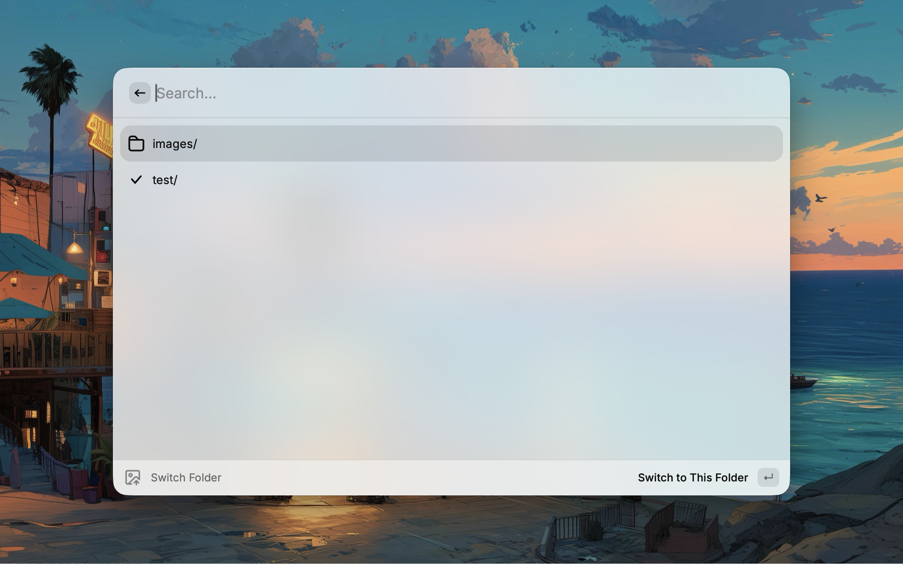

# GitHub Image Bed

[中文](README-zh.md)

A powerful Raycast extension for uploading images to GitHub as an image hosting service with CDN acceleration support.



## Features

- 📋 **Clipboard Upload** - Upload images directly from your clipboard (screenshots or copied files)
- 📸 **Screenshot Upload** - Trigger system screenshot tool and upload immediately upon capture
- 📂 **File Upload** - Select an image file from your computer to upload
- ⚡ **CDN Acceleration** - Support for jsDelivr or custom CDN templates for fast image loading
- 🏷️ **Custom Filenames** - Set image names via command argument or configurable templates with time/date placeholders





- 🎨 **Multiple Formats** - Copy result as Markdown, HTML, or direct URL
- ⚙️ **Configurable** - Customize repository, branch, path, CDN templates, and filename patterns



- 📁 **Folder Switching** - Configure multiple upload folders and quickly switch between them

## Commands

| Command                                | Mode    | Description                                                   |
| -------------------------------------- | ------- | ------------------------------------------------------------- |
| **Upload from Clipboard**              | No View | Upload current clipboard image immediately and copy the link  |
| **Upload from Clipboard with Options** | View    | Upload clipboard image and choose output format (MD/URL/HTML) |
| **Upload Screenshot**                  | No View | Capture a screenshot and upload it immediately                |
| **Upload Screenshot with Options**     | View    | Capture a screenshot, upload it, and choose output format     |
| **Upload from File**                   | View    | Open file picker to select and upload an image                |
| **Switch Folder**                      | View    | Switch the active upload folder                               |

## Configuration

Before using, configure the extension preferences in Raycast:

| Preference        | Description                                                       | Required |
| ----------------- | ----------------------------------------------------------------- | -------- |
| GitHub Token      | Personal Access Token with `repo` scope                           | ✅       |
| Repository Owner  | Your GitHub username or organization                              | ✅       |
| Repository Name   | The repository to upload images to                                | ✅       |
| Branch            | Branch name (default: `main`)                                     | ❌       |
| Upload Path       | Folder paths, separated by commas (e.g., `images/, screenshots/`) | ❌       |
| Committer Email   | Email for commit messages                                         | ✅       |
| CDN URL Template  | Custom CDN URL (default: jsDelivr)                                | ❌       |
| Default Format    | Default output format (Markdown/URL/HTML)                         | ❌       |
| Filename Template | Template for naming uploaded images                               | ❌       |

### Filename Template

Customize how uploaded files are named using the **Filename Template** preference.

**Default:** `{yyyy}-{MM}-{dd}_{hh}{mm}{ss}_{name}`

**Supported Placeholders:**

- `{yyyy}`: Year (4 digits, e.g., 2024)
- `{yy}`: Year (2 digits, e.g., 24)
- `{MM}`: Month (01-12)
- `{dd}`: Day (01-31)
- `{hh}`: Hour (00-23)
- `{mm}`: Minute (00-59)
- `{ss}`: Second (00-59)
- `{sss}`: Millisecond (000-999)
- `{name}`: The custom name entered in the command argument (if any)
- `{random}`: A random alphanumeric string (6 chars)

**Example:**
If template is `{yy}{MM}{dd}-{name}` and you enter "logo" in the command argument on Jan 1st 2024:
Result: `240101-logo.png`

### CDN URL Template

The default CDN URL template uses jsDelivr:

```
https://fastly.jsdelivr.net/gh/{owner}/{repo}@{branch}/{path}
```

Available placeholders:

- `{owner}` - Repository owner
- `{repo}` - Repository name
- `{branch}` - Branch name
- `{path}` - Full file path including filename

### Getting a GitHub Token

1. Go to [GitHub Settings > Developer settings > Personal access tokens](https://github.com/settings/tokens)
2. Click "Generate new token (classic)"
3. Give it a descriptive name (e.g., "Raycast Image Bed")
4. Select the `repo` scope
5. Click "Generate token"
6. Copy the token and paste it in the extension preferences

## Usage

### 1. From Clipboard

1. Copy an image to your clipboard (or a file from Finder).
2. Run **Upload from Clipboard**.
3. The image is uploaded, and the link is automatically copied.

### 2. Screenshot

1. Run **Upload Screenshot**.
2. Raycast will hide, and the system screenshot tool will open.
3. Capture your area.
4. Raycast will reappear, upload the image, and copy the link.
   - Use **Upload Screenshot with Options** if you want to select the link format manually.

### 3. From File

1. Run **Upload from File**.
2. A file picker dialog will appear.
3. Select your image file.
4. The image is uploaded, and you can choose the link format to copy.

### 4. Switch Folder

1. Configure multiple folder paths in **Upload Path** preference, separated by commas (e.g., `images/, screenshots/, avatars/`).
2. Run **Switch Folder**.
3. Select the folder you want to upload to. The active folder is remembered across sessions.
4. All upload commands will use the selected folder.

## License

MIT
